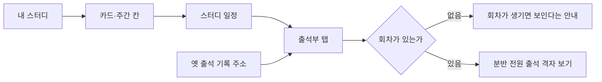
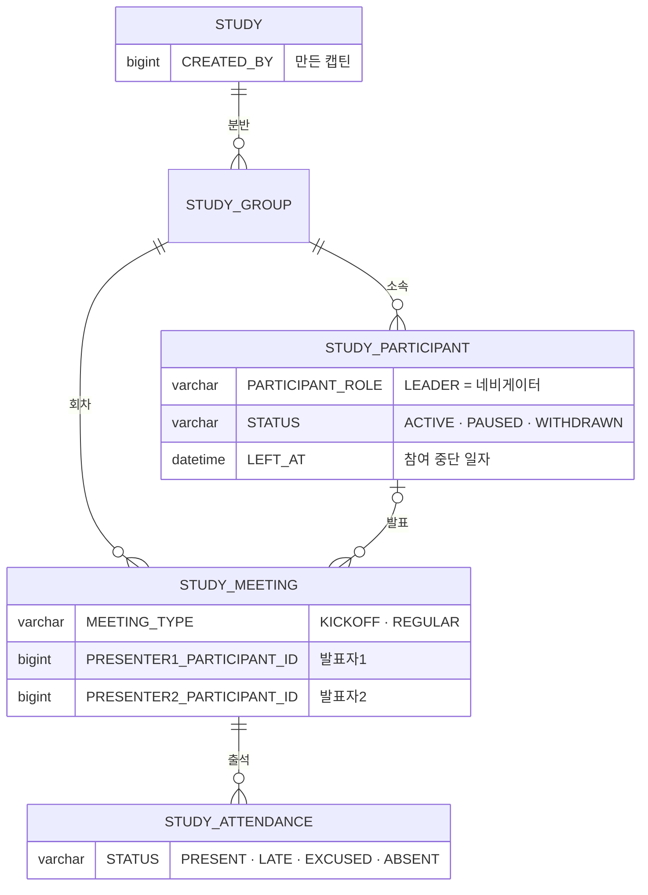

# 크루로서, 스터디별 출석 기록을 볼 수 있다.

기준 프로토타입: 스터디 일정 — 출석부 탭, 크루로 볼 때 (playground 사용자 사이트 · 내 스터디 → 스터디 일정 → 출석부)

화면 캡처 (2026-10-06): [크루 출석부](../navigator-register-sessions/screens/5-crew-attendance.jpg)

## 1. 기본설명

· **배경**

지금까지 크루는 스터디마다 구글 시트를 열어 자기 출석과 발표 순서를 확인했다. 시트는 링크를 아는 사람만 보고, 고칠 수 있는 사람이 정해져 있지 않아 기록이 흔들린다. 출석부를 스터디 일정 화면의 탭으로 옮기고, 크루에게는 보기만 연다.

· **하는 일**

- 내 분반의 출석부를 시트처럼 한 격자로 본다 (참여자 × 회차)
- 내 출석률과 발표 횟수를 다른 크루와 같은 기준으로 확인한다
- 누가 언제 발표했는지, 누가 참여를 중단했는지 본다
- 고치지 않는다. 출석은 네비게이터·캡틴이 고친다 ([navigator-edit-attendance](../navigator-edit-attendance/PRD.md))

· **진입·사용 흐름**

· **완료 기준**

1. 참여 중인 스터디의 스터디 일정 → 출석부 탭에서 내 분반 전원의 회차별 출석을 본다
2. 칸은 출석 · 지각 · 결석 · 휴가 · 미체크 중 하나로 보인다. 크루가 눌러도 바뀌지 않는다
3. 발표자로 맡은 회차의 칸에 발표 표시가 붙고, 이름 옆에 발표 횟수가 보인다
4. 참여자마다 출석률이 보인다. 킥오프는 출석률에 들어가지 않는다
5. 이름 옆 칩으로 캡틴 · 네비게이터를 구분한다
6. 참여를 중단한 사람은 흐린 이름과 「참여 중단」 칩으로 맨 아래에 남는다
7. 회차가 없으면 출석부 대신 안내를 본다
8. 다른 분반·다른 스터디의 출석부는 볼 수 없다

## 2. 화면명세

> **화면**: 스터디 일정 — 출석부 탭 (크루)

스터디 정보 카드(스터디 시간 · 네비게이터 · 디스코드 · 자료실 · 규칙)와 탭은 [회차 등록 PRD](../navigator-register-sessions/PRD.md) 11·12와 같다. 이 문서는 크루가 보는 출석부만 다룬다.

### 1. 출석부

- **내용**
  - 참여자 × 회차 격자. 한 칸이 한 사람의 한 회차
  - 첫 열은 「킥오프」, 다음 열부터 「1회」 「2회」 …. 회차 머리 아래에 일자 `M/dd`
  - 이름 열 → 발표 횟수 열 → 회차 칸들 → 출석률 열
  - 머리 줄(반 · 인원 · 기준 시간대) · 진행 기간 · 조작 안내 · 저장 바 · 회차 추가 버튼은 두지 않는다
- **동작**
  - 칸에 마우스를 올리면 상태 이름만 보인다 (예: 「출석 · 발표」)
  - 칸을 눌러도 아무 일도 일어나지 않는다
- **정책**
  - 분반 전원을 본다. 내 줄만 보는 화면을 따로 두지 않는다 — 시트도 전원이 함께 봤다
  - 내 줄이 맨 위다. 그 아래는 명부 순서, 참여 중단자는 맨 아래
  - 이름이 같은 사람이 있으면 디스코드 닉네임을 괄호로 붙인다
  - 크루에게 빈 칸(미체크)은 **실선** 테두리로 그린다. 점선은 「눌러서 채우는 칸」으로 읽혀 고칠 수 있어 보인다
  - 칸은 버튼이 아니다. 키보드 탭이 칸마다 멈추지 않고, 스크린리더는 「출석 · 발표」처럼 읽는다
  - 휴가도 그대로 보인다 — 시트와 같다
  - 표가 넓으면 가로로 넘긴다. 이름 열은 고정한다
- **데이터**: `STUDY_ATTENDANCE.STATUS` — 내 분반의 회차 × 참여자

### 1-1. 발표 표시 · 발표 횟수

- **내용**: 발표자로 맡은 회차의 칸 왼쪽 위에 마이크 표시. 이름 옆 「발표 횟수」 열
- **정책**
  - 발표자는 일정 탭의 발표자1·2에서 계산한다. 출석부에서 따로 입력하지 않는다
  - 발표 횟수는 발표자로 맡은 회차 수다. 아직 열리지 않은 예정 회차의 배정도 센다 (시트와 같다)
  - 킥오프에는 발표자가 없다
- **데이터**: `STUDY_MEETING.PRESENTER1_PARTICIPANT_ID` · `PRESENTER2_PARTICIPANT_ID`

### 1-2. 출석률

- **내용**: 줄 끝에 정수 %. 체크한 정규 회차가 없으면 「—」
- **정책**
  - 계산은 아래 「계산 규칙」 하나만 쓴다. 내 스터디 카드·백오피스 출석부와 같은 값이다
  - 열 너비는 고정한다. 숫자 길이에 따라 표가 흔들리지 않게
- **데이터**: 서버가 계산한 `attendanceRate`

### 1-3. 역할 칩

- **내용**: 이름 옆에 「캡틴」 · 「네비게이터」 칩. 크루는 칩이 없다
- **정책**: 캡틴은 그 스터디를 **만든** 캡틴뿐이다. 다른 캡틴(ADMIN)이 신청해 참여했으면 크루로 보인다
- **데이터**: `STUDY.CREATED_BY` · `STUDY_PARTICIPANT.PARTICIPANT_ROLE = LEADER`

### 1-4. 참여를 중단한 사람

- **내용**: 흐린 이름 + 「참여 중단」 칩. 중단 일자 뒤 회차 칸은 「—」
- **정책**
  - 하차·제명을 가르지 않는다. 사유는 보이지도 저장하지도 않는다
  - 맨 아래 줄로 내린다. 줄을 지우지 않는다 — 중단 전 출석은 그대로 남는다
  - 출석률은 중단 일자까지의 회차만 센다. 숫자는 회색 · 보통 굵기
- **데이터**: `STUDY_PARTICIPANT.STATUS = WITHDRAWN` · `LEFT_AT`

### 2. 회차 없음

- **내용**: 「아직 회차가 없습니다.」 · 「회차가 생기면 출석부가 보입니다.」
- **동작**: 없음. 크루에게는 「일정으로 가기」 버튼을 두지 않는다 — 만들 수 없다
- **조건**: 분반에 회차가 하나도 없을 때

### 상태별 화면

| 상태 | 화면 | 카피 |
| --- | --- | --- |
| 기본 | 출석부 격자 (보기만) | — |
| 회차 없음 | 격자 대신 안내 | `아직 회차가 없습니다.` · `회차가 생기면 출석부가 보입니다.` |
| 불러오는 중 | 격자 자리 로딩 | — |
| 불러오기 실패 | 격자 자리 안내 · 다시 시도 | `출석부를 불러오지 못했습니다.` |
| 볼 수 없음 | 안내만 | `이 스터디의 일정을 볼 수 없습니다` |

### 데이터 관계

### 비고

- 범위 밖: 출석 고치기([navigator-edit-attendance](../navigator-edit-attendance/PRD.md)), 휴가 신청·취소, 디스코드 출석 체크, 스터디 전체 참여자 출석부(백오피스 — [captain-view-attendance-roster](../captain-view-attendance-roster/PRD.md))
- 내 스터디 카드의 완주 점수판(참여 횟수 / 총 횟수)은 [crew-joined-studies](../crew-joined-studies/PRD.md) 4-4. 같은 출석 기록을 쓴다
- 옛 출석 기록 주소 `/my/joined/{id}/attendance` 는 이 탭(`/my/joined/{id}/schedule/attendance`)으로 보낸다
- 미구현: 프로토타입은 브라우저 저장 값을 읽는다

## 3. 시스템 요건

### 데이터

| 대상 | 필드 | 크루 |
| --- | --- | --- |
| 출석 | `STUDY_ATTENDANCE.STATUS` | 읽기만. null 이면 미체크 |
| 회차 | `MEETING_TYPE` · 발표자1·2 · `SCHEDULED_AT` | 읽기만 |
| 참여자 | `PARTICIPANT_ROLE` · `STATUS` · `LEFT_AT` | 읽기만 |

### 계산 규칙 (단일 정의)

- 출석률 = (출석 × 1 + 지각 × 0.5) / 체크한 정규 회차. 휴가·미체크는 분모에서 뺀다. 분모가 0 이면 「—」
- 킥오프(`MEETING_TYPE = KICKOFF`)는 칸은 보이되 출석률에 넣지 않는다
- 참여 중단자는 `LEFT_AT` 까지의 회차만 센다
- 발표 횟수 = 그 참여자가 발표자1 또는 발표자2인 회차 수 (예정 회차 포함)
- 정본: [출석 스펙](../../../specs/attendance/spec.md)

### API

| 메서드 | 경로 | 권한 |
| --- | --- | --- |
| GET | `/api/studies/{studyId}/attendances` 분반 출석부 | 그 분반 활성 참여자(조회) · 네비게이터 · 캡틴 |
| GET | `/api/studies/{studyId}/meetings` 회차 · 발표자 | 그 분반 활성 참여자 · 네비게이터 · 캡틴 |

출석부 응답 `participants[]` 에 `participantRole` · `captain` · `participantStatus` · `leftAt` 이 있어야 칩·참여 중단 표시를 그린다. 계약은 [출석 스펙](../../../specs/attendance/spec.md) · [회차 스펙](../../../specs/study-meeting/spec.md).

### 권한

- 보기: 그 분반의 활성 참여자(`ACTIVE` · `PAUSED`). 다른 분반·다른 스터디는 403
- 쓰기: 없음. 크루가 `POST /attendances` 를 보내면 403
- 서버에서 검증한다. 화면에서 칸을 막는 것은 편의일 뿐이다

### 외부 연동

- 없음

### 현재 백엔드와 차이 (2026-10-06 `beta`)

- 출석부 GET 이 `@RequireCaptainOrNavigator(GROUP)` 라 크루는 403 — 분반 참여자 조회를 열어야 한다
- 응답에 역할 · 캡틴 · 참여 상태 · 중단 일자가 없다
- 출석률이 킥오프를 빼지 않는다 (`MEETING_TYPE` 컬럼이 아직 없다)
- 노션 작업: #63 `[BE] 출석부 조회 권한·응답 확장`, `[FE] 유저서비스 출석부 UI`

## 4. 미확정

- 참여를 중단한 사람이 자기 지난 출석부를 계속 볼 수 있을지 — 지금은 활성 참여자만 본다. 내 스터디의 참여 중단 카드는 링크가 없다
- 내 줄을 색으로도 강조할지 — 지금은 맨 위에 둘 뿐이다
- 불러오는 중 · 불러오기 실패 화면은 프로토타입에 없다(브라우저 저장이라 실패가 없다). 위 표의 문구는 구현 때 확정
