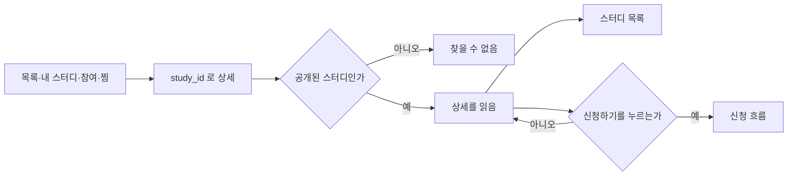
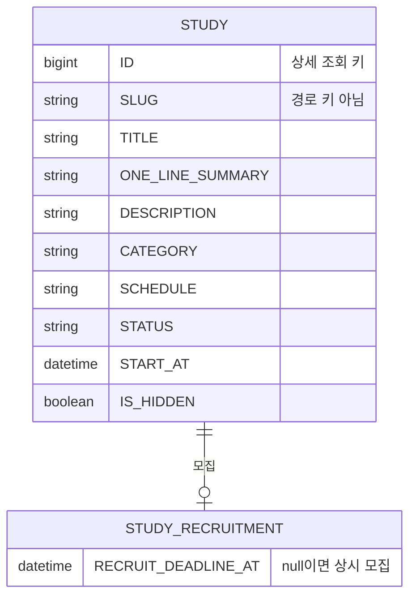

# 크루로서, 스터디 상세를 볼 수 있다.

기준 프로토타입: 스터디 상세 (playground 사용자 사이트 · 스터디 상세)

## 1. 기본설명

· **진입·사용 흐름**

· **완료 기준**

1. 공개된 스터디를 `study_id`로 열어 제목·한 줄 소개·분야·모집 상태·일정 또는 시간대·시작 예정일을 읽을 수 있다
2. 상세 소개가 있으면 본문에서 읽을 수 있다. 없으면 그 절은 나오지 않는다
3. 주소 키가 정수가 아니거나, 그 `study_id`의 공개 스터디가 없으면 상세가 열리지 않는다
4. 목록·내 스터디·참여 중·찜에서 상세로 들어갈 때 주소 키는 `study_id`다
5. 모집 상태 문구는 목록과 같다
6. 시작 예정일 값이 없으면 `미정`으로 보인다
7. 스터디 목록으로 돌아갈 수 있다
8. 모집중이면 `신청하기`로 신청 흐름을 시작할 수 있다. 마감이거나 이미 신청했으면 그 흐름이 시작되지 않는다

## 2. 화면명세

> **화면**: 스터디 상세

### 1. 스터디 목록

- **내용**: `스터디 목록`
- **동작**: 누르면 스터디 목록으로 간다
- **데이터**: 없음

### 2. 모집 상태

- **내용**
  - 모집 중이고 마감일이 있으면 `모집중 (D-N)`. 마감 당일은 `모집중 (D-DAY)`
  - 마감일이 없으면 `상시 모집`
  - 진행 중이면 `진행중`
  - 모집이 끝났으면 `모집 마감`
- **정책**
  - 문구는 `recruitBadge(study, locale)` 한 곳이다. 목록과 여기서 따로 계산하지 않는다
  - `D-N`은 마감일에서 오늘을 뺀 일수다. 0 이하면 `D-DAY`
  - 마감까지 3일 이하면 마감 임박으로 구분한다. 구분 값은 `D-N` 숫자다. 색만으로 구분하지 않는다
  - 마감 임박 기준은 3일이다
- **데이터**: `study.status`, `study.recruitment.deadline`

### 3. 분야

- **내용**: 스터디 분야 이름
- **데이터**: `study.category`

### 4. 제목

- **내용**: 스터디 제목. 보는 언어의 문구
- **데이터**: `study.title`

### 5. 한 줄 소개

- **내용**: 한 줄 소개. 보는 언어의 문구
- **데이터**: `study.summary`

### 6. 일정·시간대

- **내용**
  - 일정이 있으면 일정 문구와 시간대를 함께 알려 준다
  - 일정이 없으면 시간대만 알려 준다
  - 시간대 문구는 `KST`, `PST`, 표기가 없으면 `동시 모집(KST·PST)`
- **정책**: 시간대는 `studyTimezone(study)` 한 곳이다. 목록 필터·목록·상세가 같은 함수를 쓴다
- **데이터**: `study.schedule`, `study.recruitment.kickoff`

### 7. 스터디 소개

- **내용**: 제목 `스터디 소개`. 본문은 상세 소개 원문. 줄바꿈을 유지한다
- **정책**: `study.description`이 있을 때만 보인다
- **데이터**: `study.description`
- **조건**: 상세 소개가 있을 때

### 8. 시작 예정일

- **내용**: `시작 예정일 {날짜}`. 값이 없으면 `시작 예정일 미정`
- **정책**
  - 표시 값은 `studyStartValue(study, locale)` 한 곳이다. 목록과 여기서 따로 계산하지 않는다
  - 모집 마감일은 여기 두지 않는다. 모집 상태(2)가 이미 `D-N`·`상시 모집`·`모집 마감`으로 말한다
- **데이터**: `study.start_at`

### 9. 신청

- **내용**
  - 모집중이면 `신청하기`
  - 이미 신청했으면 `신청 완료`
  - 마감이면 `모집 마감`
- **동작**: `신청하기`만 누를 수 있다. 누르면 신청 흐름이 시작된다
- **정책**
  - 마감일 판정은 `recruitState(study)`다. `status`가 모집 중이 아니거나, 마감일이 지났거나, 모집을 닫았으면 마감이다
  - 마감일이 없으면 상시 모집이다. `신청하기`를 보여 준다
  - `신청 완료`와 `모집 마감`은 누르지 못한다
  - 누른 뒤의 로그인·디스코드·폼은 [crew-submit-application](../crew-submit-application/PRD.md)이 정한다
- **데이터**: `recruitState(study)`, 이 스터디의 신청 여부

### 상태별 화면

| 상태 | 화면 | 카피 |
| --- | --- | --- |
| 기본 | 상세 | 제목·한 줄 소개·분야·모집 상태·시작 예정일 |
| 소개 없음 | 소개 절 없음 | — |
| 시작일 없음 | 시작 예정일 | `시작 예정일 미정` |
| 모집 마감 | 신청 | `모집 마감` |
| 이미 신청 | 신청 | `신청 완료` |
| 없는 주소 | 찾을 수 없음 | `This page could not be found.` |

### 데이터 관계

### 비고

- 범위 밖: 신청 폼 작성·제출, 찜, 목표·주제·대상·주차 커리큘럼·멤버·후기·통계·정원
- 미구현: 프로토 조회는 목 데이터다. 화면은 아직 `GET /api/studies/{studyId}`를 호출하지 않는다

## 3. 시스템 요건

### 데이터

| 대상 | 필드 | 의미 |
| --- | --- | --- |
| 스터디 | ID | 상세 경로·조회 키. 정수 |
| 스터디 | SLUG | 저장용 식별자. 상세 경로·조회 키로 쓰지 않는다 |
| 스터디 | TITLE, ONE_LINE_SUMMARY, DESCRIPTION, CATEGORY, SCHEDULE, STATUS, START_AT | 화면에 읽는 값 |
| 스터디 | IS_HIDDEN, PUBLISH_AT, STATUS | 공개가 아니면 상세를 열지 않는다 |
| 모집 | RECRUIT_DEADLINE_AT | null이면 상시 모집. 지나면 마감 |

### 처리

- 조회 키는 `STUDY.ID`다. `SLUG`와 비교하지 않는다
- 키가 정수가 아니면 상세를 열지 않는다
- 그 ID의 스터디가 없거나, 숨김이거나, 공개 전(`STATUS=DRAFT` 또는 공개일 미도래)이면 상세를 열지 않는다
- 목록·내 스터디·참여 중·찜의 상세 링크도 같은 ID를 쓴다

### 계산 규칙 (단일 정의)

- 모집 열림: `recruitState(study)` — [study-recruit-status/spec.md](../../../specs/study-recruit-status/spec.md#판정-규칙)
- 모집 상태 문구: `recruitBadge(study, locale)` — 목록과 같다
- 시작일 표시: `studyStartValue(study, locale)` — `START_AT`가 없으면 `미정`
- 시간대: `studyTimezone(study)` — 일정·킥오프 문구의 `KST` / `PST`·`PDT`. 없으면 동시 모집

### API

| 메서드 | 경로 | 권한 |
| --- | --- | --- |
| GET | `/api/studies/{studyId}` | 불필요 (공개) |

`studyId`는 `STUDY.ID`다. 응답의 `slug`로 다시 조회하지 않는다. 계약은 [study/spec.md](../../../specs/study/spec.md) 상세 조회.

### 권한

- 조회: 누구나. 로그인하지 않아도 된다
- 신청하기를 누른 뒤의 로그인 확인은 [crew-submit-application](../crew-submit-application/PRD.md)

### 외부 연동

- 없음

## 4. 미확정

- 없는 스터디 안내를 한국어 문장으로 바꿀지. 지금은 `This page could not be found.`
- `START_AT`를 등록·수정 입력으로 받을지 — [crew-browse-studies](../crew-browse-studies/PRD.md)와 같다
