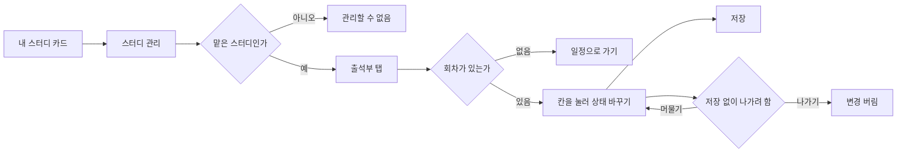
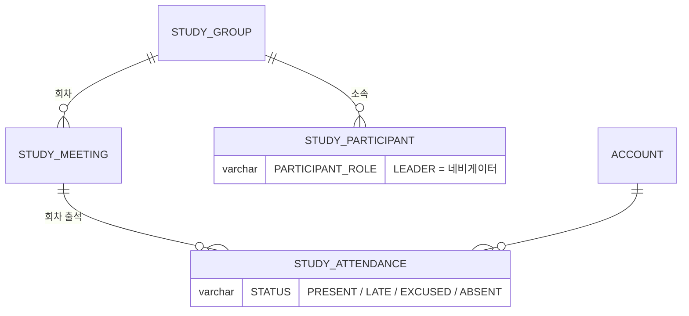

# 네비게이터로서, 스터디별 출석 상태를 수정할 수 있다.

기준 프로토타입: 스터디 관리 — 출석부 (playground 사용자 사이트 · 내 스터디 → 스터디 관리)

## 1. 기본설명

· **진입·사용 흐름**

· **완료 기준**

1. 맡은 분반의 참여자 × 회차 출석 상태를 한 화면에서 볼 수 있다
2. 칸을 눌러 출석 · 지각 · 결석 · 휴가 · 미체크 사이를 바꿀 수 있다
3. 바꾼 칸은 저장을 눌러야 반영된다. 저장 전에는 어느 칸이 바뀌었는지 안다
4. 저장 전 변경을 한 번에 되돌릴 수 있다
5. 저장하지 않은 변경이 있는 채로 나가려 하면 한 번 더 묻는다
6. 크루별 출석률을 볼 수 있고, 칸을 바꾸면 바로 다시 계산된다
7. 맡은 분반 참여자만 보인다
8. 회차가 없으면 그 사실과 일정으로 가는 길을 본다
9. 맡지 않은 스터디의 출석부는 열리지 않는다

## 2. 화면명세

> **화면**: 스터디 관리 — 출석부 탭

### 1. 범위 안내

- **내용**: 「{분반} 참여자만 보입니다. 스터디 전체 참여자는 백오피스 출석부에서 봅니다」

### 2. 백오피스 출석부

- **내용**: 「백오피스 출석부 (전체 참여자)」
- **동작**: 백오피스에서 그 스터디의 출석 탭으로 간다
- **정책**: 캡틴에게만 보인다. 네비게이터는 백오피스에 들어갈 수 없다
- **조건**: 캡틴일 때

### 3. 출석부

- **내용**
  - 참여자 × 회차. 한 칸이 한 사람의 한 회차
  - 회차 머리는 회차 번호와 날짜
  - 칸 값은 출석 · 지각 · 결석 · 휴가 중 하나, 아직 체크하지 않았으면 비어 있다
  - 참여자별 출석률. 정수 %, 체크된 회차가 없으면 「—」
  - 저장 전이면 「저장 필요 · N칸」과 「저장되지 않은 변경 N칸. 저장을 눌러야 반영됩니다.」
- **동작**
  - 칸을 누를 때마다 출석 → 지각 → 결석 → 휴가 → 미체크 순으로 바뀐다
  - 눌러도 저장하지 않는다. 저장된 값과 다른 칸은 구분되어 보인다
  - 저장 → 바뀐 칸을 한 번에 반영하고 「저장되었습니다.」
  - 「변경 취소」 → 저장 전 값으로 되돌린다
  - 저장 중에는 저장과 칸이 잠긴다
  - 저장하지 않은 변경이 있는 채로 탭·링크를 누르면 「저장하지 않은 변경이 있습니다」 · 「저장하지 않고 나가기」 · 「이 화면에 머물기」
  - 「회차 추가」는 일정 탭으로 보낸다
- **정책**
  - 한 바퀴 돌면 미체크로 돌아온다. 잘못 누른 것을 되돌릴 수 있다
  - 바뀐 칸은 색만으로 구분하지 않는다. 「저장되지 않음」 문구를 함께 둔다
  - 바뀐 칸이 없으면 저장을 누를 수 없다
  - 출석률 분모는 체크된 회차뿐이다. 휴가는 분모에서 뺀다
  - 지각은 0.5 로 센다
  - 새로고침·창 닫기는 브라우저 기본 안내를 쓴다
  - 반 선택은 없다. 맡은 분반 하나만 보인다
- **데이터**: `STUDY_ATTENDANCE` — 맡은 분반의 회차 × 참여자
- **조건**: 회차가 하나 이상일 때

### 4. 회차 없음

- **내용**: 「아직 회차가 없습니다」 · 일정으로 가기
- **동작**: 누르면 일정 탭으로 간다
- **조건**: 회차가 하나도 없을 때

### 상태별 화면

| 상태 | 화면 | 카피 |
| --- | --- | --- |
| 기본 | 범위 안내 · 출석부 | `{분반} 참여자만 보입니다. …` |
| 회차 없음 | 안내 · 일정으로 가기 | `아직 회차가 없습니다` |
| 저장 전 | 바뀐 칸 표시 · 변경 취소 | `저장되지 않은 변경 N칸. 저장을 눌러야 반영됩니다.` |
| 처리중 | 저장·칸 잠김 | — |
| 완료 | 저장 결과 | `저장되었습니다.` |
| 이탈 확인 | 확인 창 | `저장하지 않은 변경이 있습니다` |
| 권한 없음 | 안내만 | `이 스터디를 관리할 수 없습니다` |

### 데이터 관계

### 비고

- 범위 밖: 회차 추가·수정, 스터디 전체 참여자 출석부(백오피스 — [captain-view-attendance-roster](../captain-view-attendance-roster/PRD.md)), 디스코드 출석 체크
- 미구현: 저장은 브라우저에만 남는다
- 구현 지시: 칸 값·순환·저장 방식은 백오피스 출석부와 같다. 다른 점은 보이는 참여자 범위뿐이다

## 3. 시스템 요건

### 데이터

| 필드 | 값 |
| --- | --- |
| STUDY_ATTENDANCE.STATUS | `PRESENT` 출석 · `LATE` 지각 · `ABSENT` 결석 · `EXCUSED` 휴가. 읽을 때 null 이면 미체크 |

### 처리

- 저장은 바뀐 칸만 모아 한 요청으로 보낸다 (`updates[]`)
- 행이 없으면 만들고, 있으면 고친다
- 한 요청 전체를 한 트랜잭션으로 반영한다. 한 칸이라도 거절되면 아무것도 반영하지 않는다
- 서버는 각 칸의 회차·참여자가 그 스터디에 속하는지 검증한다. 아니면 400
- 같은 칸이 한 요청에 두 번 오면 400. 동시 쓰기 충돌은 409

### 계산 규칙 (단일 정의)

- 출석률 = (출석 + 지각 × 0.5) / (체크된 회차 − 휴가). 분모가 0 이면 「—」
- 백오피스 출석부·내 스터디 출석률과 같은 식이다 — [attendance/spec.md](../../../specs/attendance/spec.md)

### API

| 메서드 | 경로 | 권한 |
| --- | --- | --- |
| GET | `/api/studies/{studyId}/attendances` | 로그인 — 범위는 attendance 스펙 |
| POST | `/api/studies/{studyId}/attendances` | 그 스터디 LEADER · CO_LEADER |

계약은 [attendance/spec.md](../../../specs/attendance/spec.md).

### 권한

- 허용: 그 스터디의 `PARTICIPANT_ROLE = LEADER` 또는 `CO_LEADER`. 아니면 403
- 서버에서 검증한다

### 외부 연동

- 없음

## 4. 미확정

- 미체크로 되돌린 칸을 저장하는 방법 — 쓰기 API 는 네 값만 받는다
- 네비게이터 쓰기를 맡은 분반 칸으로 좁힐지. 지금 서버 검증은 스터디 단위다
- 캡틴(`SYSTEM_ROLE = ADMIN`)이 사용자 사이트에서 쓸 때의 권한 판정
