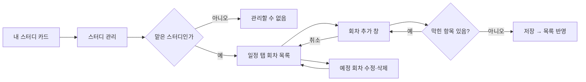
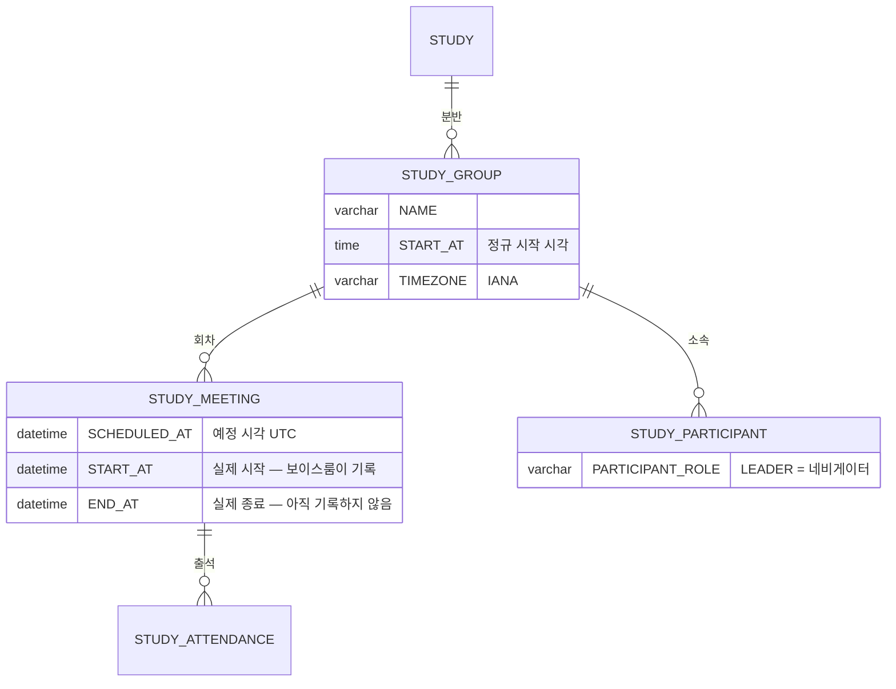

# 네비게이터로서, 스터디 회차를 등록할 수 있다.

기준 프로토타입: 스터디 관리 — 일정 (playground 사용자 사이트 · 내 스터디 → 스터디 관리)

## 1. 기본설명

· **진입·사용 흐름**

· **완료 기준**

1. 내가 네비게이터인 스터디 카드에서 스터디 관리로 들어갈 수 있다. 시작 전·참여 중인 스터디만 해당한다
2. 맡지 않은 스터디의 관리 주소로 들어오면 「이 스터디를 관리할 수 없습니다」만 보인다
3. 맡은 분반의 회차를 일정순으로, 지난 회차까지 함께 볼 수 있다. 일정은 처음엔 분반 시간대로 보이고, KST · PDT 탭으로 바꿔 볼 수 있다. 탭을 바꿔도 추가·수정 입력은 분반 시간대로 받는다
4. 회차를 한 번만, 또는 매일·매주 반복으로 한꺼번에 추가할 수 있다
5. 추가하기 전에 몇 회차가 어느 날짜에 생기는지, 건너뛰는 날과 번호가 밀리는 기존 회차를 미리 알 수 있다
6. 시작 전 회차의 일자·시작 시각·제목을 고칠 수 있다
7. 시작 전 회차를 지울 수 있다. 반복으로 만든 회차도 한 회차씩 지운다 — 「이후 반복 모두」 삭제는 할 수 없다
8. 종료된 회차는 고치거나 지울 수 없다
9. 추가·수정·삭제 결과가 내 스터디의 일정·출석 칸과 출석부에 곧바로 반영된다

## 2. 화면명세

> **화면**: 스터디 관리 — 일정 탭

### 1. 회차 개수

- **내용**: 「회차 · 전체 n · 예정 n」

### 2. 회차 추가

- **동작**: 누르면 회차 추가 창(7)이 열린다

### 3. 회차 목록

- **내용**: 회차 번호 · 일정 · 제목 · 상태 · 관리. 제목이 없으면 「—」
- **정책**
  - 일정순이다. 지난 회차도 함께 보인다
  - 일정은 `yyyy-MM-dd HH:mm`(24시간)이다. 시간대 탭(8)에서 고른 시간대로 보인다
  - 회차 번호는 일정순으로 매긴다
- **데이터**: `STUDY_MEETING` — 맡은 분반(`STUDY_GROUP`)의 회차

### 3-1. 반복 표시

> 2026-10-02: 반복 묶음을 저장하지 않기로 해서(아래 4) 서버가 이 표시를 줄 수 없다. 뺄지 남길지 미확정 — [회차 스펙 미확정](../../../specs/study-meeting/spec.md#미확정)

- **내용**: 반복으로 한꺼번에 만든 회차임을 알려 준다
- **조건**: 반복으로 만든 회차가 있을 때

### 3-2. 상태

- **내용**: 「예정」 · 「종료」
- **정책**
  - 예정 시각이 지났거나 디스코드가 먼저 열었으면 「종료」다. 지금 하고 있는 회차도 「종료」로 보인다
  - 「진행중」은 두지 않는다. `END_AT` 은 아직 기록하는 곳이 없어 끝났는지 판정할 수 없고, 이 화면의 결정(고칠 수 있는가)은 시작 여부로 이미 갈린다
  - 종료 회차는 고치거나 지울 수 없다 — 출석이 기록돼 있다

### 3-3. 수정

- **동작**: 누르면 그 줄이 수정 칸(6)으로 바뀐다
- **조건**: 예정 회차

### 3-4. 삭제

- **동작**: 누르면 그 줄 아래에 삭제 확인(3-5)이 펼쳐진다. 다시 누르면 접힌다
- **조건**: 예정 회차

### 3-5. 삭제 확인

- **내용**: 「N회차를 지울까요? 뒤 회차 번호는 하나씩 당겨집니다.」
- **동작**
  - 「삭제」 — 반복으로 만든 회차도 한 회차씩 지운다
  - 취소하면 접힌다
- **정책**: 「이후 반복 모두」 는 두지 않는다 (2026-10-02, 반복 묶음을 저장하지 않음 — 아래 4)
- **조건**: 삭제를 눌렀을 때

### 4. 안내

- **내용**: 종료된 회차는 고치거나 지울 수 없다 · 번호는 일정순으로 다시 매겨진다

### 5. 완료 안내

- **내용**: 추가 · 수정 · 삭제 결과 한 줄
- **조건**: 추가 · 수정 · 삭제 직후

### 6. 회차 수정

- **내용**
  - 일자 · 시작 시각 · 제목. 취소 · 저장
  - 안내: 「일자 및 시작 시간을 수정하면 일정 순서대로 회차가 다시 매겨질 수 있습니다.」
- **정책**
  - 한 번에 한 회차만 고친다
  - 다른 회차와 같은 날이면 막는다
  - 지난 시각이면 막는다
  - 분반 시간대로 받는다. 시작 시각 라벨에 「(KST)」처럼 시간대를 붙인다. 시간대 탭(8)과 상관없다
  - 회차 식별자는 바뀌지 않는다
- **조건**: 수정을 눌렀을 때

### 7. 회차 추가 창

- **내용**: 제목 「회차 추가」, 분반 이름과 시각 기준 시간대
- **동작**: 취소 · 배경 클릭 · Esc → 저장하지 않고 닫힌다
- **조건**: 「회차 추가」를 눌렀을 때

### 7-1. 일자 (반복이면 시작 일자)

- **내용**: 필수. 처음 값은 마지막 회차의 다음 주 같은 요일. 그 날이 지났으면 오늘 이후 첫 같은 요일
- **정책**: 한 번만 만들 때 같은 날에 이미 회차가 있으면 막는다

### 7-2. 시작 시각

- **내용**: 필수. 처음 값은 분반 정규 시작 시각
- **정책**
  - 분반 시간대의 현지 시각으로 받는다. 라벨에 「(KST)」처럼 시간대를 붙인다. 서버에는 UTC 로 보낸다
  - 첫 회차가 지금보다 이르면 막는다
- **데이터**: `STUDY_GROUP.START_AT` · `STUDY_GROUP.TIMEZONE`

### 7-3. 반복

- **내용**: 반복 안 함 · 매일 · 매주
- **동작**
  - 매일·매주를 고르면 종료일(7-4)이 나오고 기본값이 채워진다: 매주는 4주 뒤, 매일은 2주 뒤
  - 매주를 고르면 반복 요일(7-8)이 나온다

### 7-4. 종료일

- **내용**: 필수. 「이 날까지 · 시작부터 최대 31일」
- **정책**
  - 시작 일자를 포함해 31일 안에서만 고른다. 넘으면 막는다
  - 종료일 당일도 반복 대상이면 포함한다
- **조건**: 반복이 매일 또는 매주일 때

### 7-5. 제목

- **내용**: 선택. 글자 수 n/50
- **정책**
  - 50자를 넘으면 막는다
  - 반복이면 모든 회차에 같은 제목이 붙는다

### 7-6. 미리보기

- **내용**
  - 한 번: 몇 회차로 들어가는지
  - 반복: 회차 n개 · a~b회차 · 첫 날 ~ 마지막 날
  - 첫 회차의 KST · PDT 일정 (`yyyy-MM-dd HH:mm`)
  - 건너뛰는 날과 이유 · 번호가 밀리는 기존 회차 수 · 늘어나는 기간
- **정책**
  - 반복 중 이미 회차가 있는 날은 막지 않고 건너뛴다
  - 모든 날이 겹치면 막는다

### 7-7. 추가

- **내용**: 한 번이면 「추가」, 반복이면 「회차 n개 추가」
- **동작**
  - 막힌 항목이 있으면 그 칸 아래에 이유를 적고 저장하지 않는다
  - 통과하면 저장하고 창을 닫는다

### 7-8. 반복 요일

- **내용**: 월 ~ 일. 여러 개를 고를 수 있다
- **동작**
  - 매주를 처음 고르면 시작 일자의 요일이 켜져 있다
  - 누를 때마다 켜고 끈다
- **정책**
  - 하나도 고르지 않으면 막는다 — 「반복할 요일을 하나 이상 골라 주세요」
  - 고른 기간에 그 요일이 하루도 없으면 막는다
  - 시작 일자가 고른 요일이 아니어도 된다. 첫 회차는 시작 일자 이후 첫 해당 요일이다
- **조건**: 반복이 매주일 때

### 8. 시간대 탭

- **내용**: KST · PDT. 처음 값은 분반 시간대
- **동작**: 누르면 회차 목록(3)의 일정이 그 시간대로 바뀐다
- **정책**
  - 보기만 바꾼다. 회차 추가·수정 입력은 언제나 분반 시간대로 받는다
  - 내 스터디 주간 일정의 KST · PDT 탭과 같은 모양이다
- **데이터**: `STUDY_GROUP.TIMEZONE`

### 상태별 화면

| 상태 | 화면 | 카피 |
| --- | --- | --- |
| 기본 | 회차 개수 · 시간대 탭 · 목록 · 안내 | `회차 · 전체 n · 예정 n` |
| 권한 없음 | 안내만 | `이 스터디를 관리할 수 없습니다` |
| 검증 실패 | 막힌 칸 아래 이유 | `반복할 요일을 하나 이상 골라 주세요` 등 |
| 삭제 확인 | 줄 아래 확인 | `N회차를 지울까요?` |
| 완료 | 목록 위 결과 한 줄 | 추가 · 수정 · 삭제 결과 |

### 데이터 관계

### 비고

- 범위 밖: 출석부 편집, 반복 묶음 전체 수정, 회차 변경 알림
- 미구현: 추가·수정·삭제는 브라우저에만 저장된다
- 구현 지시: 관리 지면 머리에는 「내 스터디」로 돌아가는 링크 · 스터디 이름 · 역할(네비게이터·캡틴) · 맡은 분반 · 시각 기준 시간대가 보인다. 탭(일정 · 출석부)은 탭마다 주소가 다르다

## 3. 시스템 요건

### 데이터

| 대상 | 필드 | 쓰기 |
| --- | --- | --- |
| 회차 | STUDY_GROUP_ID · SCHEDULED_AT(UTC) | 추가·수정 |
| 회차 | 제목(`TITLE`) | 추가·수정. 반복 묶음은 저장하지 않는다 |
| 회차 | START_AT · END_AT | 쓰지 않는다. 보이스룸이 기록한다 |
| 출석 | 새 회차 × 분반 참여자 | 추가 시 `ABSENT` 로 만든다 |

### 처리

- 서버가 같은 날 중복 · 31일 상한 · 지난 시각 · 제목 50자를 다시 검증한다
- 시작한 회차(`SCHEDULED_AT` 경과, 또는 디스코드가 먼저 열어 `START_AT` 이 있음)의 수정·삭제는 서버가 거절한다
- 회차 삭제 시 그 회차의 출석·휴가 신청도 삭제한다
- 회차 번호는 저장하지 않고 일정순으로 계산한다

### 계산 규칙 (단일 정의)

- 회차 번호: 분반 회차를 `SCHEDULED_AT` 오름차순으로 센 순번
- 예정 / 종료: 현재 시각이 `SCHEDULED_AT` 이전이고 `START_AT` 이 비어 있으면 예정, 아니면 종료

### API

| 메서드 | 경로 | 권한 |
| --- | --- | --- |
| GET | `/api/studies/{studyId}/meetings` 분반 회차 목록 | 그 분반 네비게이터 · 캡틴 |
| POST | `/api/studies/{studyId}/meetings` 회차 추가 | 그 분반 네비게이터 · 캡틴 |
| PUT | `/api/studies/{studyId}/meetings/{meetingId}` 회차 수정 | 그 분반 네비게이터 · 캡틴 |
| DELETE | `/api/studies/{studyId}/meetings/{meetingId}` 회차 삭제 | 그 분반 네비게이터 · 캡틴 |

계약 정본: [회차 스펙](../../../specs/study-meeting/spec.md)

### 권한

- 허용: 그 분반의 `STUDY_PARTICIPANT.PARTICIPANT_ROLE = LEADER` 인 사람, 캡틴(`ACCOUNT.SYSTEM_ROLE = ADMIN`)
- 서버에서 검증한다. 관리 입구를 숨기는 것은 편의일 뿐이다

### 외부 연동

- 없음

## 4. 미확정

2026-10-02 에 아래로 닫았다. 근거는 [회차 스펙 「결정 사항」](../../../specs/study-meeting/spec.md#결정-사항).

- ~~회차 API 경로와 스펙 위치~~ → `/api/studies/{studyId}/meetings`, `specs/study-meeting/spec.md`
- ~~반복을 규칙으로 보낼지, 날짜 목록으로 풀어 보낼지~~ → 날짜 목록
- ~~`STUDY_MEETING` 에 제목·반복 묶음 ID 컬럼을 둘지~~ → 제목만 둔다. 반복 묶음은 저장하지 않고 삭제는 한 회차씩
- ~~회차 관리 권한~~ → POL-0001 에 「회차 관리」 행을 따로 뒀다
- ~~회차를 고치거나 지울 때 크루에게 알릴지~~ → 범위 밖
- ~~클럽에서도 같은 화면을 쓸지~~ → 범위 밖

남은 것:

- 3-1 반복 표시를 뺄지 (반복 묶음을 저장하지 않아 서버가 줄 수 없다)
- 캡틴에게도 「담당 반에 한해」 가 걸리는지 — 지금은 캡틴은 모든 분반 허용
