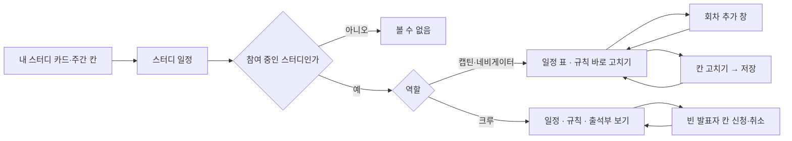
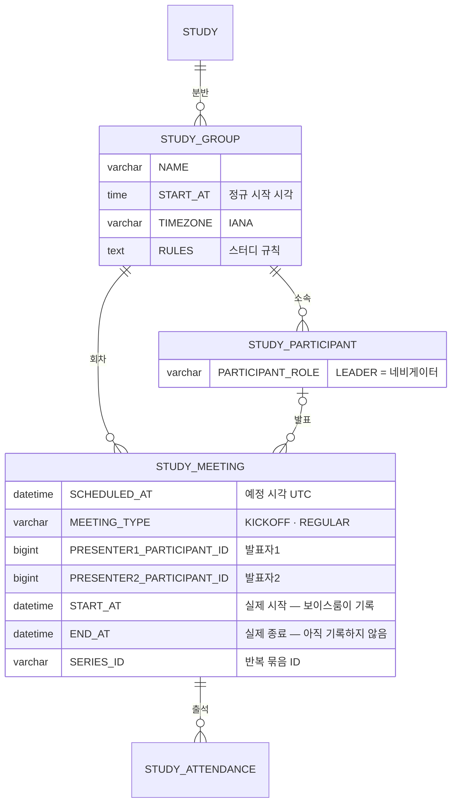

# 네비게이터로서, 스터디 회차를 등록할 수 있다.

기준 프로토타입: 스터디 일정 — 일정 · 출석부 (playground 사용자 사이트 · 내 스터디 → 스터디 일정)

지금까지 스터디마다 구글 시트로 쓰던 출석부(스터디 시간 · 네비게이터 · 일정표 · 출석 체크 · 스터디 규칙)를 웹으로 옮긴다.
일정을 고치는 사람은 캡틴·네비게이터이고, 보는 사람은 그 분반 참가자 전원이다.

## 1. 기본설명

· **진입·사용 흐름**

· **완료 기준**

1. 내 스터디의 스터디 카드나 주간 칸을 누르면 이 화면(일정 탭)으로 온다 — 역할과 상관없이 같은 곳. 참여를 중단한 스터디의 카드는 누를 수 없다
2. 참여하지 않은 스터디의 주소로 들어오면 「이 스터디의 일정을 볼 수 없습니다」만 보인다
3. 내 분반의 회차를 킥오프부터 일정순으로, 지난 회차까지 함께 볼 수 있다. 일정은 처음엔 분반 시간대로 보이고, KST · PDT 탭으로 바꿔 볼 수 있다
4. 캡틴·네비게이터는 회차를 한 번만, 또는 매일·매주 반복으로 한꺼번에 추가할 수 있다. 추가하기 전에 몇 회차가 어느 날짜에 생기는지, 건너뛰는 날과 번호가 밀리는 회차 수까지 미리보기에 보인다
5. 캡틴·네비게이터는 예정 회차의 일자·시각·제목·발표자1·발표자2를 표에서 바로 고치고, 여러 줄을 한 번에 저장할 수 있다
6. 캡틴·네비게이터는 예정 회차를 지울 수 있다. 반복으로 만든 회차도 한 회차씩 지운다 — 「이후 반복 모두」 삭제는 할 수 없다
7. 크루는 일정·규칙·출석부를 볼 수 있지만 고칠 수 없다. 예정 회차의 빈 발표자 칸에만 자기 이름을 넣고 뺄 수 있다(선착순, 한 회차에 한 칸)
8. 분반마다 킥오프(0회차)가 하나 있다(새로 만드는 분반부터 — 운영 중인 분반의 소급은 미확정). 지울 수 없고, 발표자가 없고, 출석률에 들어가지 않는다
9. 출석부에서 출석과 발표를 한 격자로 본다. 발표는 일정의 발표자에서 계산하고, 이름 옆에 발표 횟수가 보인다
10. 캡틴·네비게이터는 스터디 규칙을 고칠 수 있고, 참가자 전원이 일정 탭 맨 위에서 본다
11. 시작한 회차는 누구도 고치거나 지울 수 없다
12. 저장 직후 내 스터디의 주간 일정 · 다가오는 회차 · 출석 칸과 출석부 탭에서 새 값이 보인다

## 2. 화면명세

> **화면**: 스터디 일정 — 일정 탭

### 1. 회차 개수

- **내용**: 「회차 · 전체 n · 예정 n」
- **정책**: 정규 회차만 센다. 킥오프는 넣지 않는다

### 2. 회차 추가

- **동작**: 누르면 회차 추가 창(7)이 열린다
- **조건**: 캡틴·네비게이터

### 3. 일정 표

- **내용**: 회차 · 일자 · 시각 · 제목 · 발표자1 · 발표자2 · 삭제. 제목이 없으면 「—」
- **동작**
  - 캡틴·네비게이터: 예정 회차의 칸을 바로 고친다. 고친 줄은 옅은 색으로 칠하고 저장 바(6)가 뜬다
  - 크루: 칸은 글자로만 보인다. 빈 발표자 칸에만 「신청」(9-1)이 있다
- **정책**
  - 킥오프가 맨 위, 정규 회차는 일정순이다. 지난 회차도 함께 보인다
  - 일자는 `yyyy-MM-dd`, 시각은 `HH:mm`(24시간)이다. 시간대 탭(8)에서 고른 시간대로 보이고, 시각 열 머리에 그 시간대를 적는다
  - 저장값은 UTC 예정 시각(`SCHEDULED_AT`) 하나다. 화면의 일자·시각은 모두 시간대로 바꿔 계산한 값이다
  - 일자·시각 칸은 지금 고른 시간대(8)로 보이고 그 시간대로 고친다. 어느 탭에서 고쳐도 같은 순간(UTC)이 저장된다. 칸 이름(스크린리더)에 시간대를 붙인다 — 「3회차 시작 시각 (PDT)」
  - 제목이 길면 칸이 늘어나 여러 줄로 보인다. 줄바꿈 키는 막는다 — 제목은 한 문장이다
  - 정규 회차 번호는 일정순으로 1부터 매긴다. 일자·시각을 고치면 번호가 다시 매겨질 수 있다
  - 화면에 조작 안내 문구를 두지 않는다 — 고칠 수 있는 칸은 입력칸으로, 고칠 수 없는 칸은 글자로 보이는 것이 안내다
- **데이터**: `STUDY_MEETING` — 내 분반(`STUDY_GROUP`)의 회차

### 3-2. 지난 회차

- **내용**: 상태 열은 두지 않는다. 시작한 회차 줄은 흐린 글자이고, 칸이 글자로만 보인다
- **정책**
  - 예정 시각이 지났거나 디스코드가 먼저 열었으면 시작한 회차다. 지금 하고 있는 회차도 포함한다
  - 「진행중」은 두지 않는다. `END_AT` 은 아직 기록하는 곳이 없어 끝났는지 판정할 수 없고, 이 화면의 결정(고칠 수 있는가)은 시작 여부로 이미 갈린다
  - 시작한 회차는 고치거나 지울 수 없다 — 출석이 기록돼 있다

### 3-4. 삭제

- **동작**: 누르면 그 줄 아래에 삭제 확인(3-5)이 펼쳐진다. 다시 누르면 접힌다
- **조건**: 캡틴·네비게이터 · 예정 정규 회차. 킥오프와 시작한 회차에는 없다

### 3-5. 삭제 확인

- **내용**: 「N회차를 지울까요? 뒤 회차 번호는 하나씩 당겨집니다.」
- **동작**
  - 「삭제」 — 반복으로 만든 회차도 한 회차씩 지운다. 그 줄의 저장하지 않은 고침도 함께 버린다. 결과 문구는 두지 않는다 — 줄이 사라지는 것이 결과다. 스크린리더에만 「N회차를 지웠습니다.」를 알린다
  - 취소하면 접힌다
- **정책**: 「이후 반복 모두」 는 두지 않는다. 반복 묶음 ID 는 저장하지만 묶음 단위 삭제는 범위 밖이다
- **조건**: 삭제를 눌렀을 때

### 6. 저장 바

- **내용**: 표 아래 오른쪽 한 줄 — 변경 취소 · 저장. 막힌 칸이 있을 때만 「고칠 칸 n개」를 붉은 작은 글자로 붙인다. 변경 개수 문구·색 상자·그림자는 두지 않는다 — 고친 줄의 색이 이미 말해 준다
- **동작**
  - 「저장」 — 고친 줄을 한 번에 저장한다. 결과 문구는 따로 두지 않는다 — 저장 바가 사라지고 표가 바뀌는 것이 결과다. 발표자 칸은 바꾼 것만 보낸다 — 화면을 연 사이 크루가 신청한 칸을 덮지 않는다. 막힌 칸이 있으면 눌리지 않는다
  - 회차가 많아도 보이게 화면 아래에 붙어 있다
  - 「변경 취소」 — 저장하지 않은 고침을 모두 버린다
  - 저장하지 않고 탭·뒤로가기를 누르면 한 번 묻는다. 새로고침·창 닫기는 브라우저가 묻는다. 저장하지 않은 규칙 글(12)도 같다
  - 결과는 화면 문구 대신 스크린리더에만 알린다(「회차 n개를 저장했습니다.」)
- **정책** — 막는 것(그 칸 아래에 이유)
  - 다른 회차와 같은 날 (저장하지 않은 다른 줄의 고친 일자까지 본다)
  - 지난 시각
  - 정규 회차를 킥오프 날 또는 그 앞으로 옮김 · 킥오프를 1회차 날 또는 그 뒤로 옮김
  - 제목 50자 초과
  - 발표자1과 발표자2가 같은 사람
- **조건**: 캡틴·네비게이터가 칸을 고쳤을 때

### 7. 회차 추가 창

- **내용**: 제목 「회차 추가」, 분반 이름과 시각 기준 시간대
- **동작**: 취소 · 배경 클릭 · Esc → 저장하지 않고 닫힌다
- **조건**: 「회차 추가」를 눌렀을 때

### 7-1. 일자 (반복이면 시작 일자)

- **내용**: 필수. 처음 값은 마지막 회차의 다음 주 같은 요일. 그 날이 지났으면 오늘 이후 첫 같은 요일
- **정책**
  - 한 번만 만들 때 같은 날에 이미 회차가 있으면 막는다
  - 킥오프 날이나 그 앞이면 막는다 — 「킥오프(9/16(수)) 뒤로만 회차를 만들 수 있습니다.」

### 7-2. 시작 시각

- **내용**: 필수. 처음 값은 분반 정규 시작 시각
- **정책**
  - 분반 시간대의 현지 시각으로 받는다. 라벨에 분반 시간대 약칭을 붙인다 (예: 「(KST)」, 미주반이면 「(PDT)」). 서버에는 UTC 로 바꿔 보낸다
  - 첫 회차가 지금보다 이르면 막는다
- **데이터**: `STUDY_GROUP.START_AT` · `STUDY_GROUP.TIMEZONE`

### 7-3. 반복

- **내용**: 반복 안 함 · 매일 · 매주
- **동작**
  - 매일·매주를 고르면 종료일(7-4)이 나오고 기본값이 채워진다: 매주는 5회(4주 뒤), 매일은 2주 뒤
  - 매주를 고르면 반복 요일(7-8)이 나온다

### 7-4. 종료일

- **내용**: 필수. 「이 날까지 · 시작부터 최대 31일」
- **정책**
  - 시작 일자를 포함해 31일 안에서만 고른다. 넘으면 막는다
  - 종료일 당일도 반복 대상이면 포함한다
- **조건**: 반복이 매일 또는 매주일 때

### 7-5. 제목

- **내용**: 선택. 글자 수 n/50
- **정책**
  - 50자를 넘으면 막는다
  - 반복이면 모든 회차에 같은 제목이 붙는다

### 7-6. 미리보기

- **내용**
  - 한 번: 몇 회차로 들어가는지
  - 반복: 회차 n개 · a~b회차 · 첫 날 ~ 마지막 날
  - 첫 회차의 KST · PDT 일정 (`yyyy-MM-dd HH:mm`)
  - 건너뛰는 날과 이유 · 번호가 밀리는 기존 회차 수 · 늘어나는 기간
- **정책**
  - 반복 중 이미 회차가 있는 날은 막지 않고 건너뛴다
  - 모든 날이 겹치면 막는다

### 7-7. 추가

- **내용**: 한 번이면 「추가」, 반복이면 「회차 n개 추가」
- **동작**
  - 막힌 항목이 있으면 그 칸 아래에 이유를 적고 저장하지 않는다
  - 통과하면 저장하고 창을 닫는다

### 7-8. 반복 요일

- **내용**: 월 ~ 일. 여러 개를 고를 수 있다
- **동작**
  - 매주를 처음 고르면 시작 일자의 요일이 켜져 있다
  - 누를 때마다 켜고 끈다
- **정책**
  - 하나도 고르지 않으면 막는다 — 「반복할 요일을 하나 이상 골라 주세요」
  - 고른 기간에 그 요일이 하루도 없으면 막는다
  - 시작 일자가 고른 요일이 아니어도 된다. 첫 회차는 시작 일자 이후 첫 해당 요일이다
- **조건**: 반복이 매주일 때

### 8. 시간대 탭

- **내용**: KST · PDT. 처음 값은 분반 시간대
- **동작**: 누르면 일정 표(3)의 일자·시각이 그 시간대로 바뀐다
- **정책**
  - 일정 표의 일자·시각은 고른 시간대로 보이고 그 시간대로 고친다. 회차 추가 창(7)은 분반 시간대로 받는다
  - 내 스터디 주간 일정의 KST · PDT 탭과 같은 모양이다
- **데이터**: `STUDY_GROUP.TIMEZONE`

### 9. 발표자1 · 발표자2

- **내용**
  - 캡틴·네비게이터: 분반 참가자 이름 드롭다운. 비어 있으면 「발표자 1」 · 「발표자 2」가 보이고, 그 항목을 고르면 칸을 비운다. 나는 「(나)」
  - 크루: 이름 글자
- **정책**
  - 발표자1이 메인, 발표자2는 보충이다. 이 역할 나눔은 규칙(12)에 적는 운영 관례이고 화면은 둘을 똑같이 다룬다
  - 같은 회차의 발표자1·2는 다른 사람이어야 한다
  - 이름이 겹치는 참가자는 디스코드 닉네임을 붙여 가른다
  - 킥오프에는 발표자가 없다
  - 발표 여부는 따로 입력하지 않는다. 출석부의 발표 표시·횟수는 이 두 칸에서 계산한다
- **데이터**: `STUDY_MEETING.PRESENTER1_PARTICIPANT_ID` · `PRESENTER2_PARTICIPANT_ID` → `STUDY_PARTICIPANT`

### 9-1. 발표 신청 (크루)

- **내용**: 빈 발표자 칸은 칸 너비의 「신청」 칩(포인트 색 실선 테두리 · 포인트 색 글자). 내가 들어간 칸은 포인트 색 바탕 칩 「내 이름 ×」
- **동작**
  - 누르면 바로 저장한다(저장 바 없음). × 는 내 이름을 뺀다
  - 그 사이 다른 크루가 먼저 신청했으면 저장하지 않고 「방금 다른 크루가 N회차 발표자1로 신청했습니다.」를 보인 뒤 표를 다시 그린다
- **정책**
  - 선착순 — 비어 있는 칸에만 넣는다. 다른 사람 이름은 뺄 수 없다
  - 한 회차에 한 칸만 — 이미 한쪽에 들어가 있으면 다른 칸에는 「신청」이 없다
  - 예정 정규 회차만. 킥오프·시작한 회차에는 없다
  - 킥오프에서 정한 발표 순서를 크루가 직접 채우는 용도다. 캡틴·네비게이터는 언제든 바꿀 수 있다
- **조건**: 크루 · 예정 정규 회차의 빈 발표자 칸

### 10. 킥오프

- **내용**: 회차 칸에 숫자 0 만. 표 맨 위, 제목 기본값 「킥오프」
- **정책**
  - 분반마다 하나, 반드시 있다. 지울 수 없다
  - 규칙·일정·발표자를 정하는 첫 모임이다. 정한 뒤에도 고칠 수 있다
  - 일자·시각·제목만 고친다. 1회차보다 앞이어야 하고, 정규 회차는 킥오프 뒤로만 만든다
  - 발표자가 없다. 출석은 찍지만 출석률에 넣지 않는다
- **데이터**: `STUDY_MEETING.MEETING_TYPE = KICKOFF`

### 11. 스터디 정보

- **위치**: 탭 위 카드 — 일정·출석부 어느 탭에서도 보인다. 규칙(12)과 한 카드
- **접기**: 머리 줄 오른쪽 끝 화살표로 접고 편다. 처음엔 펼친 상태. 접으면 머리 줄(스터디 시간 · 네비게이터 · 디스코드 · 자료실)만 남고 규칙이 숨는다. 접어도 저장하지 않은 규칙 글은 남는다
- **내용**: 「스터디 시간 · 매주 수요일 20:30 KST」 · 「네비게이터 · 이름」, 오른쪽에 아이콘+글자 버튼 「디스코드」 · 「자료실」(구글 드라이브) — 시트 머리에 적던 것들. 주소 글자는 보이지 않는다(가리키면 보인다)
- **동작**: 버튼을 누르면 그 주소를 새 창으로 연다
- **정책**
  - 이 화면에서는 조회만 한다. 정규 시간은 분반 설정, 네비게이터는 명부의 LEADER 다
  - 두 주소는 참여자에게만 보이는 화면이라 그대로 보인다([2026-09-30 결정](../../../docs/share/2026-09-30-study-detail-private-urls.md)). 참여를 중단한 사람은 이 화면에 들어오지 못한다. 완주한 사람의 디스코드는 클럽 로비로 간다
  - 주소가 비어 있으면 그 버튼을 두지 않는다
  - 고치는 곳은 백오피스다 — 캡틴이 스터디 상세에서 고친다. 이 화면에는 그 안내를 적지 않는다
- **데이터**: `STUDY_GROUP.START_AT` · `STUDY_GROUP.TIMEZONE` · `STUDY_PARTICIPANT.PARTICIPANT_ROLE = LEADER` · `STUDY.DISCORD_CHANNEL_URL` · `STUDY.DRIVE_URL`

### 12. 스터디 규칙

- **위치**: 탭 위 정보 카드(11) 아래쪽
- **내용**
  - 캡틴·네비게이터: 늘 열려 있는 글 상자. 내용만큼 늘어나고 최대 500자, 글자 수를 보인다
  - 크루: 규칙 글. 길면 4줄로 접고 「모두 보기」
- **동작**: 캡틴·네비게이터 — 바로 고친다. 저장한 글과 달라지면 「취소 · 저장」이 나온다
- **정책**
  - 탭이 아니라 일정 탭 맨 위 카드다. 일정을 보러 온 크루가 규칙도 함께 본다
  - 처음엔 흔한 규칙 예시가 들어 있다. 킥오프에서 고친다
  - 500자까지 — 운영 중인 시트의 규칙은 150~350자다. 한 화면 카드로 읽히는 길이에서 끊는다
  - 비우면 「아직 규칙이 없습니다」
- **데이터**: `STUDY_GROUP.RULES`

> **화면**: 스터디 일정 — 출석부 탭

### 13. 출석부

- **내용**: 참여자 × 회차 격자 · 발표 횟수 · 출석률. 첫 열은 「킥오프」. 머리 줄(반 · 인원 · 기준 시간대) · 진행 기간 · 조작 안내 · 회차 추가 버튼은 두지 않는다 — 탭 이름과 표가 이미 말해 준다
- **동작**
  - 캡틴·네비게이터: 칸을 누르면 출석 → 지각 → 결석 → 휴가 → 미체크. 고친 칸은 테두리만 강조한다(점 표시 없음). 고친 칸이 있으면 화면 아래 오른쪽에 「변경 취소 · 저장」 한 줄이 붙는다(변경 칸 수 문구 없음). 저장을 눌러야 반영되고, 결과 문구는 두지 않는다. 스크린리더에만 「출석 n칸을 저장했습니다.」를 알린다
  - 크루: 분반 전원의 기록을 보기만 한다. 칸을 눌러도 바뀌지 않고, 저장·회차 추가가 없다
- **정책**
  - 발표자의 칸 왼쪽 위에 마이크 표시를 붙인다 — 일정의 발표자1·2와 같다
  - 이름 옆 「발표 횟수」 열은 발표자로 맡은 회차 수다. 예정 회차의 배정도 센다(시트의 발표 횟수와 같다)
  - 이름 옆에 캡틴·네비게이터 역할 칩을 붙인다. 크루는 칩이 없다
  - 내 분반 참여자만 보인다. 스터디 전체 참여자는 백오피스 출석부에서 본다 — 캡틴에게만 「백오피스 출석부 (전체 참여자)」 버튼이 있다
  - 출석률 = (출석 × 1 + 지각 × 0.5) / 체크한 정규 회차. 휴가·미체크는 분모에서 뺀다
  - 킥오프 열은 출석을 찍지만 출석률에 넣지 않는다. 기록이 없으면 결석이 아니라 빈 칸이다
  - 크루에게도 휴가 표시가 그대로 보인다 — 시트와 같다
  - 크루의 칸은 버튼이 아니다(키보드 탭이 칸마다 멈추지 않는다). 스크린리더는 「출석 · 발표」처럼 읽는다
  - 크루에게 빈 칸은 실선 테두리로 그린다 — 점선은 「눌러서 채우는 칸」으로 읽혀 고칠 수 있어 보인다. 점선은 고칠 수 있는 캡틴·네비게이터 화면에만 쓴다
- **데이터**: `STUDY_ATTENDANCE` × `STUDY_MEETING.PRESENTER1·2_PARTICIPANT_ID`

### 13-2. 스터디를 중단한 사람

- **내용**
  - 이름을 흐리게 + 칩. 캡틴·네비게이터는 사유 「하차」 · 「제명」, 크루는 「참여 종료」
  - 중단 일자 뒤 회차 칸은 「—」. 누를 수 없다
- **정책**
  - 맨 아래 줄로 내린다. 줄을 지우지 않는다 — 중단 전 출석은 그대로 남는다
  - 출석률은 중단 일자까지의 회차만 센다 (출석 스펙 산식과 같다). 숫자는 회색 — 색 구분(높음·낮음)을 하지 않는다
  - 크루에게 사유를 보이지 않는다 — 내 스터디의 「참여 종료」 배지와 같은 원칙
  - 취소선·기울임·상태 열은 쓰지 않는다 — 지운 데이터처럼 읽히고, 드문 상태에 모든 줄의 폭을 쓴다
  - 발표자 드롭다운(9)에서 고를 수 없다. 이미 배정된 칸에는 「이름 (참여 종료)」로 남겨 보인다 — 빈 칸처럼 보이지 않게
- **데이터**: `STUDY_PARTICIPANT.STATUS = WITHDRAWN` · `LEFT_AT`. 하차·제명 구분은 미확정(4)

### 13-1. 회차 없음

- **내용**: 「아직 회차가 없습니다.」 · 캡틴·네비게이터: 「일정 탭에서 회차를 만들면 이 반의 출석부가 만들어집니다.」 + 「일정으로 가기」 · 크루: 「회차가 생기면 출석부가 보입니다.」
- **조건**: 분반에 회차가 하나도 없을 때 (킥오프가 없는 기존 분반에서도 나온다)

### 상태별 화면

| 상태 | 화면 | 카피 |
| --- | --- | --- |
| 기본 (캡틴·네비게이터) | 정보·규칙 · 회차 개수 · 시간대 탭 · 회차 추가 · 고칠 수 있는 표 | `회차 · 전체 n · 예정 n` |
| 기본 (크루) | 정보·규칙 · 회차 개수 · 시간대 탭 · 글자 표 · 신청 | `신청` |
| 볼 수 없음 | 안내만 | `이 스터디의 일정을 볼 수 없습니다` |
| 고치는 중 | 일정: 고친 줄 색 · 저장 바 / 출석부: 고친 칸 테두리 강조 · 저장 바 | `변경 취소` · `저장` |
| 검증 실패 | 막힌 칸 아래 이유 · 저장 비활성 | `발표자1과 다른 사람을 골라 주세요.` 등 |
| 삭제 확인 | 줄 아래 확인 | `N회차를 지울까요?` |
| 신청 밀림 | 표 위 경고 한 줄 | `방금 다른 크루가 N회차 발표자1로 신청했습니다.` |
| 회차 없음 (일정) | 표 대신 안내 | `아직 회차가 없습니다.` (캡틴·네비게이터는 「회차 추가」로 만들라는 말을 덧붙인다) |
| 회차 없음 (출석부) | 격자 대신 안내 | `아직 회차가 없습니다.` (13-1) |

### 데이터 관계

### 비고

- 범위 밖: 반복 묶음 전체 수정, 회차 변경 알림, 발표 신청 알림
- 미구현: 모든 변경은 브라우저에만 저장된다
- 구현 지시: 지면 머리에는 「내 스터디」로 돌아가는 링크 · 스터디 이름만 둔다. 역할은 내 스터디 카드 배지에, 시각 기준 시간대는 스터디 정보(11)의 스터디 시간과 시각 열 머리에 있다 — 머리에 다시 적지 않는다. 탭(일정 · 출석부)은 탭마다 주소가 다르다

## 3. 시스템 요건

### 데이터

| 대상 | 필드 | 쓰기 |
| --- | --- | --- |
| 회차 | STUDY_GROUP_ID · SCHEDULED_AT(UTC) | 추가·수정 (캡틴·네비게이터) |
| 회차 | 제목(`TITLE`) | 추가·수정 (캡틴·네비게이터) |
| 회차 | 종류(`MEETING_TYPE`) | 분반을 만들 때 서버가 `KICKOFF` 하나를 함께 만든다. 화면이 추가하는 회차는 `REGULAR` |
| 회차 | 발표자1·2(`PRESENTER1_PARTICIPANT_ID` · `PRESENTER2_PARTICIPANT_ID`) | 캡틴·네비게이터는 누구든 지정·변경. 크루는 빈 칸에 자기만 넣고, 자기만 뺀다 |
| 회차 | 반복 묶음 ID(`SERIES_ID`) | 반복으로 2개 이상 추가할 때 서버가 같은 값을 넣는다. 수정해도 바뀌지 않는다. 지금 화면은 쓰지 않는다 |
| 회차 | START_AT · END_AT | 쓰지 않는다. 보이스룸이 기록한다 |
| 분반 | 규칙(`RULES`) | 캡틴·네비게이터 |
| 출석 | 새 회차 × 분반 참여자 | 추가 시 `ABSENT` 로 만든다 |

### 처리

- 서버가 같은 날 중복 · 31일 상한 · 지난 시각 · 제목 50자 · 킥오프 순서를 다시 검증한다
- 시작한 회차(`SCHEDULED_AT` 경과, 또는 디스코드가 먼저 열어 `START_AT` 이 있음)의 수정·삭제·발표 신청은 서버가 거절한다
- 킥오프 삭제는 서버가 거절한다
- 발표자 검증: 그 분반의 활성 참여자여야 하고, 발표자1·2가 같으면 거절한다. 크루의 신청은 칸이 비어 있을 때만, 같은 회차에 이미 들어가 있으면 거절한다 — 동시에 신청하면 먼저 저장된 쪽이 이긴다
- 회차 삭제 시 그 회차의 출석·휴가 신청도 삭제한다
- 참여자가 분반을 떠나면, 그가 맡은 예정 회차의 발표자 칸을 비운다

### 계산 규칙 (단일 정의)

- 회차 번호: 킥오프는 0. 정규 회차는 `SCHEDULED_AT` 오름차순으로 센 순번(1부터)
- 시작 전 / 시작한 회차: `now >= SCHEDULED_AT` 또는 `START_AT` 이 있으면 시작한 회차(흐린 줄, 잠김), 아니면 시작 전
- 출석률: 정규 회차만 센다. 킥오프는 뺀다
- 발표 횟수: 그 참여자가 발표자1 또는 발표자2인 회차 수 (예정 회차 포함)

### API

| 메서드 | 경로 | 권한 |
| --- | --- | --- |
| GET | `/api/studies/{studyId}/meetings` 분반 회차 목록 (발표자·규칙 포함) | 그 분반 참여자 · 캡틴 |
| POST | `/api/studies/{studyId}/meetings` 회차 추가 | 그 분반 네비게이터 · 캡틴 |
| PUT | `/api/studies/{studyId}/meetings/{meetingId}` 회차 수정 (시각·제목·발표자) | 그 분반 네비게이터 · 캡틴 |
| DELETE | `/api/studies/{studyId}/meetings/{meetingId}` 회차 삭제 | 그 분반 네비게이터 · 캡틴 |
| PUT · DELETE | `/api/studies/{studyId}/meetings/{meetingId}/presenters/{slot}/me` 발표 신청·취소 | 그 분반 참여자 |
| PUT | `/api/studies/{studyId}/groups/{groupId}/rules` 규칙 저장 | 그 분반 네비게이터 · 캡틴 |
| GET | `/api/studies/{studyId}/attendances` 분반 출석부 | 그 분반 참여자(조회) · 네비게이터 · 캡틴 |

계약 정본: [회차 스펙](../../../specs/study-meeting/spec.md)

### 권한

- 고치기: 그 분반의 `STUDY_PARTICIPANT.PARTICIPANT_ROLE = LEADER` 인 사람, 캡틴(`ACCOUNT.SYSTEM_ROLE = ADMIN`)
- 보기·발표 신청: 그 분반의 활성 참여자 전원
- 서버에서 검증한다. 화면에서 입력칸을 숨기는 것은 편의일 뿐이다

### 외부 연동

- 없음

## 4. 미확정

2026-10-02 · 2026-10-05 에 아래로 닫았다. 근거는 [회차 스펙 「결정 사항」](../../../specs/study-meeting/spec.md#결정-사항).

- ~~회차 API 경로와 스펙 위치~~ → `/api/studies/{studyId}/meetings`, `specs/study-meeting/spec.md`
- ~~반복을 규칙으로 보낼지, 날짜 목록으로 풀어 보낼지~~ → 날짜 목록
- ~~`STUDY_MEETING` 에 제목·반복 묶음 ID 컬럼을 둘지~~ → 둘 다 둔다. 묶음 ID 는 나중의 반복 단위 수정·삭제를 위해 남기고, 지금 삭제·수정은 한 회차씩
- ~~회차 관리 권한~~ → POL-0001 에 「회차 관리」 행을 따로 뒀다
- ~~회차를 고치거나 지울 때 크루에게 알릴지~~ → 범위 밖
- ~~클럽에서도 같은 화면을 쓸지~~ → 범위 밖
- ~~반복으로 만든 회차를 목록에 표시할지~~ → 두지 않는다
- ~~크루도 이 화면을 볼지~~ → 참가자 전원이 본다. 고치기는 캡틴·네비게이터
- ~~발표자 칸은 누가 채우나~~ → 캡틴·네비게이터는 누구든, 크루는 빈 칸에 자기만(선착순)
- ~~출석과 발표를 어떻게 함께 보이나~~ → 발표는 일정의 발표자에서 계산해 출석 칸에 표시하고 발표 횟수 열을 둔다
- ~~크루가 출석부를 어디까지 보나~~ → 분반 전원을 본다(수정 불가)
- ~~스터디 규칙을 탭으로 둘지 카드로 둘지~~ → 탭 위 정보 카드 (일정·출석부 공통)
- ~~킥오프(0회차)를 어떻게 다룰지~~ → 분반마다 하나, 0회차, 삭제 불가, 발표자 없음, 출석률 제외

남은 것:

- 이미 운영 중인 분반에 킥오프 회차를 소급해 만들지 — 시트에는 0회차가 있지만 DB 에는 없다. 지금은 새로 만드는 분반에만 만든다
- 한 사람이 맡을 수 있는 발표 수에 상한을 둘지 — 지금은 두지 않는다
- 발표자1이 빠진 날 발표자2가 대신한 것을 따로 기록할지 — 지금은 일정의 발표자를 고쳐서 남긴다
- 캡틴(ADMIN)에게도 「담당 반에 한해」 가 걸리는지 — 지금은 캡틴은 모든 분반 허용
- 하차(스스로)와 제명(운영)을 어떻게 저장할지 — 명부는 `WITHDRAWN` 하나뿐이다. 구분 컬럼(예: `WITHDRAW_TYPE`)을 둘지
