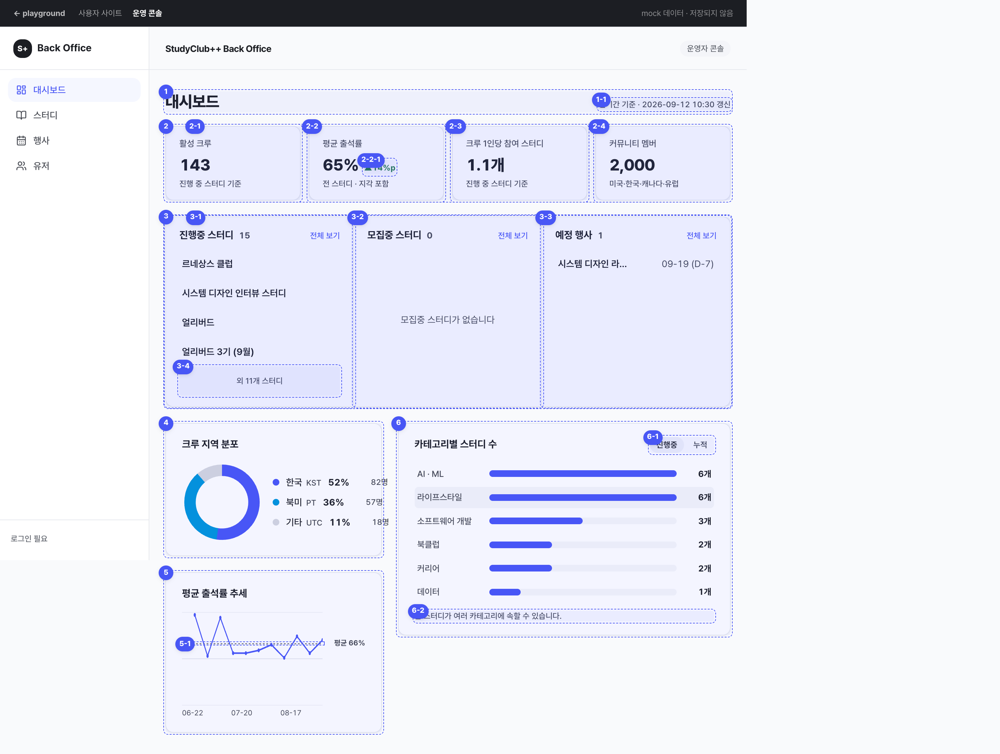

# 운영 대시보드 화면·API Spec

> PRD: [캡틴은 스터디클럽 웹사이트의 운영 현황을 볼 수 있다](https://app.notion.com/p/benkang/91583feabad382ac833b81e65dd894f8)
> 생성일: 2026-09-16
> 상태: **스펙작성중** — 화면·집계 기준 정리, API 계약은 제안 단계
> 확인한 코드: `origin/beta` / `5acb4b0e5054bf341cfb4d576180e01ba01f4625`
> 대상: 캡틴용 운영 콘솔 대시보드

## 1. 문서의 기준과 범위

캡틴이 커뮤니티 규모, 스터디 운영 현황, 출석 추세를 한 화면에서 확인한다. 아래 기준은 PRD와 기준 화면에 작성자가 추가로 결정한 집계 규칙을 반영한 것이다. 팀 전체의 스펙 확정이나 백엔드 구현 완료를 뜻하지 않는다.

- **작성 기준 확정**: 기수 단위 집계, 활성 크루의 범위, 온보딩 완료 회원 수, 시간대를 거주지로 간주하는 가정, 출석 계산 및 비교 기간, 마감 경과 표시, 행사 MVP 제외.
- **구현 제안**: API 응답 구조, 오류 문구, 숫자 표시 방법 등 개발을 위해 구체화한 내용. PRD에 없던 보완은 해당 위치에 명시한다.
- **미정**: 상태 모델 개편 등 다른 논의에 따라 달라지는 부분. 해당 화면에 `[NEEDS CLARIFICATION] TBD-번호`로 표시하고 맨 마지막에 모은다. 미정인 데이터 조건을 임의의 쿼리로 확정해서 구현하지 않는다.

대시보드의 ‘스터디 1개’는 **기수 1개**다. 같은 클럽의 1기와 2기는 각각 1개로 센다. 아래 `cohortId`는 이 단위를 식별하는 논리 이름이며, 향후 테이블 이름이 바뀌어도 집계 단위는 유지한다. 반 개수나 상위 스터디 템플릿 개수로 대체하지 않는다.

## 2. 기준 화면과 번호



첨부한 화면은 구성·배치·번호를 설명하는 기준이다. 파란 번호와 점선은 설명용이며 실제 화면에 표시하지 않는다. 화면의 `143`, `65%`, 지역별 인원, 행사 1건 등은 예시 데이터다. 지역별 인원 합계처럼 서로 맞지 않는 숫자를 구현 기준으로 사용하지 않는다. 예정 행사는 아래 MVP 결정에 따라 0건으로 표시한다.

| 화면 번호 | 구성 | 핵심 기준 |
|---|---|---|
| 1 / 1-1 | 제목 / 기준·갱신 시각 | 기간 필터 없음, 한국 시간으로 갱신 시각 표시 |
| 2 | KPI 4개 | 같은 비중으로 배치, 카드별 집계 범위 명시 |
| 2-1 | 활성 크루 | 진행 중 기수의 `ACTIVE` 참여자, 사람 중복 제거 |
| 2-2 / 2-2-1 | 평균 출석률 / 전주 대비 | 전기간 출석률 / 이번 주 현재까지와 직전 주 전체 비교 |
| 2-3 | 크루 1인당 참여 스터디 | 활성 참여 건수 ÷ 활성 크루 수 |
| 2-4 | 커뮤니티 멤버 | 온보딩 완료 회원 수 |
| 3 / 3-1 / 3-2 / 3-3 | 현황 보드 / 진행중 / 모집중 / 예정 행사 | 세 영역 동시 표시, 각 최대 4건, 행사는 MVP 빈 상태 |
| 3-4 | 외 N개 | 전체 건수에서 실제 표시 건수를 뺀 값 |
| 4 | 크루 지역 분포 | 활성 크루를 시간대 기준으로 한 번씩 분류 |
| 5 / 5-1 | 12주 출석률 추세 / 12주 평균 | 이번 주 포함, 기록 없는 주는 `null`, 주별 동일 가중치 평균 |
| 6 / 6-1 / 6-2 | 카테고리별 스터디 수 / 범위 전환 / 중복 안내 | 기수 단위, 복수 카테고리 기획 기준으로 작성하되 구조 논의는 미정 |

## 3. 공통 표시·집계 규칙

### 조회 시점과 시간

- 기간 선택 필터와 자동 갱신은 없다. 진입·새로고침 때 조회하고, 오류 영역에는 재시도를 제공한다.
- 서버가 응답별 집계 기준 시각 `asOf`를 제공한다. 날짜·시각은 UTC ISO 8601로 전달하고 대시보드는 **`Asia/Seoul`**로 표시한다. 캡틴이 해외에 있어도 주간 통계 기준이 바뀌지 않는다.
- 주는 한국 시간 월요일 00:00부터 다음 월요일 00:00 직전까지다. 구간은 시작 포함·끝 제외로 계산한다. 예: `2026-09-14 00:00 KST`는 `2026-09-13T15:00:00Z`다.
- `weekStart`는 한국 시간의 주 시작 **날짜**(`YYYY-MM-DD`)다. UTC 시각으로 재해석하지 않는다.
- 각 API 내부에서는 하나의 `asOf`로 관련 지표를 계산한다. 서로 다른 API 응답이 동일한 DB 스냅샷임을 보장하는 계약은 아니다. 주가 바뀌는 순간 등에 응답 기준 주가 서로 다르면 해당 출석 영역을 함께 재조회한다.

### 숫자·빈 값·오류

- 인원·기수 수는 정수와 천 단위 구분 기호를 사용한다. 1인당 참여 수는 소수 한 자리, 출석률은 화면에서 정수 `%`, 증감은 필요 시 소수 한 자리 `%p`로 표시한다.
- 비율 계산은 반올림 전 값으로 수행한다. API도 계산에 필요한 정밀도를 유지하고 마지막 화면 표시 단계에서만 반올림한다.
- **`0`은 실제 집계 결과가 0**, **`null`은 계산할 유효 데이터가 없음**을 뜻한다. 통신 오류는 어느 쪽으로도 바꾸지 않는다.
- 로딩 중에는 기존 카드 크기를 유지하는 스켈레톤을 표시한다. 최초 조회 실패 시 해당 영역에 ‘정보를 불러오지 못했습니다.’와 ‘다시 시도’를 표시한다. 다른 성공 영역은 유지한다.
- 재조회 실패 시 이전 데이터가 있으면 유지하되 ‘갱신 실패 · 이전 데이터’와 그 데이터의 갱신 시각을 표시한다. 이전 데이터를 방금 갱신한 것처럼 표시하지 않는다.
- 색 외에도 증가·감소 화살표, 상태 텍스트, 범례와 수치를 함께 제공한다. 차트 툴팁·카테고리 행은 키보드로도 확인할 수 있게 한다. 로딩·오류 문구와 접근 방식은 이 문서의 구현 제안이다.

### 접근 권한

캡틴 권한인 `ACCOUNT.SYSTEM_ROLE = ADMIN`만 조회할 수 있다. 화면 메뉴를 숨기는 것과 별개로 서버에서 모든 대시보드 API의 권한을 확인한다. 인증·인가 연계는 [운영 콘솔 로그인 명세](../back-office-login/spec.md)를 따른다.

## 4. 화면 번호별 상세 명세

### 1 / 1-1. 제목 줄과 기준·갱신 시각

- 왼쪽에 ‘대시보드’, 오른쪽에 집계 범위와 최근 조회 시각을 표시한다.
- 표시 제안: `전기간 기준 · 2026-09-16 12:00 KST 갱신`. 상단 시각은 요약 API의 `asOf`를 사용한다. 부분 실패 시 ‘일부 정보 조회 실패’를 함께 표시하고 오류 영역을 구분한다.
- ‘전기간’은 사용자가 기간을 제한하지 않는다는 뜻이다. **활성 크루·참여 수·진행중 목록은 현재 상태**, 커뮤니티 멤버는 현재 DB의 온보딩 완료 회원, 큰 출석률은 전기간 유효 기록, 차트는 최근 12주다. 네 KPI를 모두 과거 누적으로 계산하지 않는다.
- 새로고침 전에는 시간이 흘렀다는 이유만으로 수치나 마감 배지를 따로 바꾸지 않는다. 배지와 목록도 응답의 `asOf` 기준으로 맞춘다.
- 미정: 별도 정책 미정 없음. API별 실패 경계는 **TBD-07** 참조.

### 2. KPI 카드 공통

순서는 ‘활성 크루 → 평균 출석률 → 크루 1인당 참여 스터디 → 커뮤니티 멤버’다. 제목, 큰 숫자, 집계 범위 설명을 같은 비중으로 배치한다. 평균 출석률 카드 안에만 전주 대비 증감을 추가한다.

**미정 — [NEEDS CLARIFICATION] TBD-07:** PRD의 요약 API는 네 KPI를 한 응답으로 묶지만 ‘위젯 하나가 실패해도 나머지는 유지’의 위젯 경계는 명확하지 않다. 이 문서의 기본 오류 경계는 API 응답 단위다. 개별 KPI까지 독립 실패를 보장하려면 필드별 성공·실패 응답 또는 API 분리가 필요하다. 프론트와 백엔드가 계약 확정 때 선택한다.

### 2-1. 활성 크루

| 항목 | 명세 |
|---|---|
| 표시 | ‘활성 크루’, 인원 수, ‘진행 중 스터디 기준’ |
| 대상 | 진행 중인 기수에 `ACTIVE` 상태로 등록된 실제 참여자 |
| 사람 식별 | `ACCOUNT_ID`로 중복 제거. 이름·닉네임·이메일로 세지 않는다 |
| 운영 역할 | 캡틴·반장·부반장도 실제 참여자이고 `ACTIVE`이면 포함. 운영 권한만 있고 참여 명부에는 없으면 제외 |
| 제외 | `PAUSED`, `WITHDRAWN`, `COMPLETED` 참여 건. 신청서만 제출하고 참여 명부에 없는 사람 |
| 중복 | 한 회원이 진행 중 기수 2개에 참여해도 1명 |
| 빈 상태 | `0` 표시 |
| 이동 | 카드 클릭 시 해당 활성 크루 집합을 확인할 수 있는 회원 목록으로 이동하는 안. 목록 필터 계약은 TBD-07 |

집합을 다음과 같이 공통으로 정의한다.

```text
진행중기수 = 운영 도메인이 ‘현재 진행 중’으로 판정한 기수 집합
활성참여 = 진행중기수에 속하면서 PARTICIPANT.STATUS = ACTIVE인 (ACCOUNT_ID, COHORT_ID)의 고유 집합
활성크루 = 활성참여의 ACCOUNT_ID를 중복 제거한 집합
활성크루수 = 활성크루의 크기
```

**출처:** [참여 명부 ERD](../../docs/erd/STUDY_PARTICIPANT.md), 작성자 결정. 신청 승인 여부를 대시보드에서 별도로 추정하지 않고 최종 참여 명부를 조회한다.

**미정 — [NEEDS CLARIFICATION] TBD-01:** ‘진행 중’이라는 의미는 정했지만 현재 beta의 저장 enum은 `DRAFT / OPEN / CLOSED`다. `ONGOING`이 실제 저장 컬럼에 이미 존재한다고 가정하면 안 된다. 운영·모집·진행 상태를 재정의하는 논의 후 최종 판정식과 데이터 연결을 맞춘다. 명부 생성 시점 또한 신청 도메인의 변경 결과를 따라야 한다.

### 2-2. 평균 출석률

| 항목 | 명세 |
|---|---|
| 표시 | ‘평균 출석률’, 정수 `%`, ‘전기간 · 지각 0.5 반영’ |
| 기간 | 웹 DB에 저장된 전기간의 유효 출석 기록. 진행 중 기수만으로 제한하지 않는다 |
| 계산 단위 | 회차 × 회원의 출석 기록 1건. 한 회차에 회원 10명이 있으면 대상 기록은 최대 10건 |
| 가중치 | `PRESENT = 1`, `LATE = 0.5`, `ABSENT = 0`, `EXCUSED`는 분자·분모에서 제외 |
| 미입력 | 출석 처리가 완료되지 않은 기록·회차는 유효 기록에 포함하지 않는다. 결석 0점으로 바꾸지 않는다 |
| 분모 0 | API `null`, 화면 ‘—’와 ‘아직 출석 기록이 없습니다.’ |
| 실제 0% | 유효 기록은 있지만 모두 결석인 경우 `0%` |

```text
P = 유효 PRESENT 기록 수, L = 유효 LATE 기록 수, A = 유효 ABSENT 기록 수
환산출석수 = P + 0.5 × L
대상기록수 = P + L + A
출석률 = 대상기록수 > 0 ? 100 × 환산출석수 / 대상기록수 : null
```

기수별 출석률의 단순 평균이 아니라 **유효 기록을 합친 비율**이다. 예: 출석 6명·지각 1명·결석 3명·사전 양해 2명이라면 `6.5 / 10 × 100 = 65%`다. ‘회차 수’만 분모로 사용하면 안 된다.

2-2, 2-2-1, 5는 서버의 같은 출석 집계 규칙을 사용하고 기간만 달리한다. 출석 수정은 다음 조회에 반영한다. 프론트가 원시 기록에서 출석률을 다시 계산하지 않는다.

**출처:** [출석 ERD](../../docs/erd/STUDY_ATTENDANCE.md), [출석 엔티티](../../backend/domain/src/main/java/com/studyclub/domain/attendance/StudyAttendance.java), 작성자 결정.

**미정 — [NEEDS CLARIFICATION] TBD-03:** 현재 출석 모델에는 ‘입력 전’ 또는 ‘출석 처리 확정’ 필드가 없고, ERD도 기본 `ABSENT` 행을 언제 만드는지 미정이다. 행이 존재한다는 이유만으로 처리 완료라고 볼 수 없다. 완료 판정 단위가 회차 전체인지 개별 기록인지, 취소 회차·일부 입력을 어떻게 제외할지 출석 담당자와 정해야 한다. 또한 지금 `PAUSED / WITHDRAWN / COMPLETED`가 된 회원의 과거 유효 기록을 유지할지 확인한다. **현재 활성 크루의 `PAUSED` 제외 결정과 과거 출석 삭제 여부는 별개다.** 이 문서의 제안은 당시 유효한 과거 기록을 유지하는 것이다.

### 2-2-1. 전주 대비 출석률

- **이번 주 월요일 00:00부터 현재까지** 출석 처리가 완료된 유효 기록의 출석률과 **직전 주 전체**의 출석률을 비교한다. 두 구간 모두 `Asia/Seoul` 기준이다.
- `증감(%p) = 이번 주 출석률 − 직전 주 출석률`. 예: 이번 주 65%, 직전 주 85%라면 `↓ 20%p`다. 상대 변화율 `-23.5%`로 표시하지 않는다.
- 증가·감소는 화살표와 색을 함께 사용하고, 차이가 0이면 중립 표시 `0%p`와 ‘변화 없음’을 제공한다. 반올림 전 차이가 0이 아니지만 표시 정밀도보다 작으면 `<0.1%p`로 방향을 유지한다.
- 직전 주에 유효 기록이 없으면 증감을 표시하지 않는다. 이번 주에 유효 기록이 없는 경우도 비교할 수 없으므로 숨긴다. 값이 없는 직전 주를 건너뛰고 그 이전 주와 비교하지 않는다.
- 큰 숫자 2-2는 **전기간**, 옆 증감은 **이번 주 대 직전 주**다. 증감에 ‘이번 주 집계 중 · 전주 대비’ 설명을 붙여 서로 다른 기간임을 알린다. 일부 주와 완료된 한 주를 비교한다는 사실을 숨기지 않는다.
- 미정: 기간·산식은 결정되었다. 유효 출석 처리 판정은 **TBD-03**을 공유한다.

### 2-3. 크루 1인당 참여 스터디

- 표시: ‘크루 1인당 참여 스터디’, 소수 한 자리와 `개`, ‘진행 중 스터디 기준’.
- 분자 = 2-1의 **활성참여 건수**, 분모 = 2-1의 **활성크루수**. `(회원, 기수)`를 중복 제거하므로 같은 기수에서 반이 중복되어도 1건이다.
- 다른 기수에서 `ACTIVE`인 회원이라도 그 회원의 `PAUSED` 참여 건까지 분자에 더하지 않는다.
- 예: A가 진행 중 1·2기에서 ACTIVE, B가 1기에서 ACTIVE, B가 3기에서 PAUSED이면 활성 크루 2명, 활성 참여 3건, **1.5개**다.
- 활성 크루가 0명이면 나눌 수 없으므로 API `null`, 화면 ‘—’와 ‘활성 크루가 없습니다.’로 표시하는 것을 제안한다.
- 미정: ‘진행 중’ 판정 연결은 **TBD-01**. 분자·분모의 범위는 결정되었다.

### 2-4. 커뮤니티 멤버

- `ACCOUNT.ONBOARDING_COMPLETED_AT IS NOT NULL`인 고유 계정 수다. OAuth 로그인으로 계정만 생성되고 온보딩은 완료하지 않은 경우 제외한다.
- 스터디 참여 여부와 운영 역할은 조건이 아니다. 온보딩을 완료했다면 포함한다. 현재 DB에 존재하는 계정 기준이며 별도 탈퇴 이력까지 복원하는 누적 가입 통계가 아니다.
- `2,000`처럼 정수로 표시하며 데이터가 없으면 `0`이다.
- 화면 예시의 ‘미국·한국·캐나다·유럽’은 회원의 실제 구성으로 오해할 수 있어 **‘온보딩 완료 회원’**으로 바꾸는 안을 제안한다. 커뮤니티 전체의 지역 분포는 별도 집계하지 않는다. 4번 지역 차트는 활성 크루 대상이다.
- 클릭 시 온보딩 완료 회원 목록으로 이동하는 안을 제안한다. 필터 계약은 **TBD-07**.
- **출처:** [Account 엔티티](../../backend/domain/src/main/java/com/studyclub/domain/account/Account.java), [온보딩 서비스](../../backend/api/src/main/java/com/studyclub/api/auth/AccountOnboardingService.java), 작성자 결정.
- 미정: 인원 정의는 결정되었다. 화면 보조 문구 변경·목록 이동은 **TBD-07**에서 검토한다.

### 3. 현황 보드 공통

- ‘진행중 스터디 / 모집중 스터디 / 예정 행사’ 세 영역을 동시에 표시한다. 한 영역을 선택해야 다른 영역이 보이는 탭으로 바꾸지 않는다.
- 제목 옆 숫자는 **전체 대상 건수**, 목록은 최대 4건이다. 0건이어도 영역 높이를 유지한다. 개수가 4를 넘으면 3-4를 제공한다.
- 같은 상위 스터디의 서로 다른 기수를 구분할 수 있는 이름을 표시한다. 예: ‘얼리버드 3기’. 상위 이름만 같다는 이유로 합치지 않는다.
- ‘전체 보기’와 항목 클릭은 해당 조건과 해당 기수를 유지해야 한다. 목록이 상위 스터디 1개로 합쳐진다면 대시보드 건수와 일치하지 않을 수 있으므로 이동 계약을 확인한다(**TBD-07**).

### 3-1. 진행중 스터디

- 대상은 2-1과 같은 진행 중 기수 집합이다. 이름만 표시하며 출석률·회차 수는 추가하지 않는다.
- 이름 오름차순, 같은 이름이면 기수 ID 오름차순으로 고정하는 안을 제안한다. 목록 클릭 시 해당 기수 상세, 전체 보기 시 진행 중 목록으로 이동한다.
- 0건이면 ‘진행중 스터디가 없습니다.’를 표시한다.
- **미정 — [NEEDS CLARIFICATION] TBD-01:** 모집 여부와 진행 여부가 서로 독립적인지, 진행하며 모집하는 기수가 가능한지 상태 논의 결과를 반영해야 한다. 두 조건을 동시에 만족하는 것이 허용되면 같은 기수가 진행중·모집중 두 영역에 동시에 나오는 것은 오류가 아니다. 공개 상태 `OPEN`만으로 진행 중이라고 판정하지 않는다.

### 3-2. 모집중 스터디

이름, 마감일, 남은 일수 또는 마감 상태를 함께 표시한다. 마감일 없는 경우 ‘상시’로 표시한다. 마감일은 KST `MM-DD`, 정확한 시각은 툴팁·접근 가능한 설명에 `YYYY-MM-DD HH:mm KST`로 제공하는 안이다.

**표시 규칙 — 위에서부터 먼저 해당하는 조건 적용**

| 우선순위 | 조건 | 표시 예 | 의미 |
|---|---|---|---|
| 1 | 수동 모집 마감이 확인되었거나 `asOf >= recruitDeadline` | `09-15 · 마감 경과` / `마감 경과` | 마감 시각이 지났거나 사람이 먼저 모집을 닫음. 수동 마감이면 사유도 설명에 제공 |
| 2 | 아직 마감 전이고 마감일이 KST 오늘 | `09-16 · 오늘 마감` | 오늘이라는 날짜만으로 이미 지난 마감을 ‘오늘 마감’으로 되돌리지 않음 |
| 3 | 아직 마감 전이고 마감일까지 1~7일 | `09-19 · D-3 · 임박` | 임박은 7일 포함 |
| 4 | 아직 마감 전이고 마감일까지 8일 이상 | `09-26 · D-10` | 일반 모집 |
| 5 | 마감 시각이 없고 수동 마감도 아님 | `상시` | 마감일 미정/상시 모집 |

남은 일수는 KST 달력 날짜의 차이로 계산하는 안이다. 예를 들어 오늘 23:00이고 내일 01:00 마감이면 `D-1`이다. 임박·오늘 마감·마감 경과는 **배지 텍스트도 다르게** 표시한다. 같은 글자를 색만 바꾸어 표시하지 않는다.

- 정렬은 마감 시각 오름차순, 마감 없는 기수는 마지막, 동률이면 이름·기수 ID 순으로 한다. 실제 노출 대상에 포함된 기수 안에서 적용한다.
- 0건이면 ‘모집중 스터디가 없습니다.’를 표시한다.
- **마감 경과는 시작 전/진행 중/종료 여부를 뜻하지 않는다.** 모집 상태와 진행 상태를 서로 대신 사용하지 않는다.
- 시간 기준으로 ‘마감 경과’를 보여주는 것은 모집 상태를 DB에 저장하거나 신청을 자동 차단하는 동작이 아니다. 대시보드 조회가 모집 종료 작업을 수행해서는 안 된다.
- 현재 beta는 마감 시각 `null`을 허용한다([V8 마이그레이션](../../backend/domain/src/main/resources/db/migration/V8__alter_study_cohort_recruit_deadline_nullable.sql)). ERD의 `NOT NULL` 표기만 보고 상시 모집이 불가능하다고 판단하지 않는다. 현재 [StudyCohort](../../backend/domain/src/main/java/com/studyclub/domain/study/StudyCohort.java)의 임박 3일 로직을 이 화면의 7일 기준에 그대로 재사용하지 않는다.

**미정 — [NEEDS CLARIFICATION] TBD-02:** 시간 경과·수동 마감 모두 ‘마감 경과’라는 표시 규칙은 결정되었다. 다만 (1) 마감 도달 시 신청이 자동 차단되는지, (2) 수동 마감을 어디에 저장하는지, (3) 정원 도달만으로 닫힌 경우도 같은 문구인지, (4) 이미 마감된 기수를 ‘모집중’ 보드에 얼마나 오래·어떤 조건으로 남기는지가 미정이다. 마감된 모든 기수를 영구 노출하면 오래된 항목이 첫 4건을 차지할 수 있다. 이 범위가 정해져야 전체 건수·목록 필터를 확정할 수 있다.

### 3-3. 예정 행사

- **행사 기능은 MVP 제외**다. 제목과 0건, ‘예정된 행사가 없습니다.’를 고정 표시한다.
- 실제 행사 API·가짜 행사 데이터를 호출하지 않는다. 빈 상태에서 ‘전체 보기’ 링크는 숨기는 안을 제안한다.
- 첨부 화면에 보이는 예시 행사 1건은 구현하지 않는다. 향후 행사 기능을 포함할 때 데이터 출처와 날짜·링크 계약을 별도로 작성한다.
- 미정: MVP 범위에는 없음. 행사 데이터 담당자를 현재 구현의 선행 과제로 두지 않는다.

### 3-4. 외 N개

- `전체 대상 건수 > 표시 건수`일 때만 `외 N개 스터디`를 표시한다. `N = total − items.length`다.
- 예: 전체 15건, 표시 4건이면 ‘외 11개 스터디’다. 4건 이하이면 표시하지 않는다.
- 클릭 시 해당 영역 ‘전체 보기’와 동일한 목록·필터로 이동한다. 미정인 모집 노출 범위는 **TBD-02**, 이동 경로·필터는 **TBD-07**을 따른다.

### 4. 크루 지역 분포

- **온보딩에서 받은 시간대를 실제 거주지로 간주한다.** 별도 국가·도시 입력을 추가하는 것은 이 대시보드의 선행 조건이 아니다.
- 대상은 2-1의 활성 크루다. 한 사람이 여러 기수에 있어도 먼저 회원 중복을 제거한 후 한 지역에만 배정한다.
- 지역별 인원, 비율, 도넛 차트를 함께 표시한다. 비율은 `지역 인원 / 활성 크루 수 × 100`이다. 반올림한 비율의 합이 99% 또는 101%가 되는 것은 허용하되 인원 합은 반드시 활성 크루 수와 일치해야 한다.
- 한국은 `KST`, 북미는 동부와 서부를 함께 포함하므로 `ET·PT` 등 계절에 영향받지 않는 이름으로 설명한다. 모든 북미 크루를 `PT`로 표기하지 않는다. ‘기타’ 전체를 실제 시간대가 `UTC`인 것처럼 표시하지 않는다. 짧은 안내 ‘온보딩 시간대 기준’을 제공한다.
- 활성 크루가 없으면 API 지역 인원은 모두 0, 비율은 `null`로 전달하고 ‘활성 크루가 없습니다.’를 표시한다.

**시간대 분류 제안 — 별도 합의 전 DB 마이그레이션·온보딩 입력값을 바꾸지 않는다.**

| 저장된 시간대 | 지역 제안 | 비고 |
|---|---|---|
| `Asia/Seoul` | 한국 | 현재 선택지 |
| `America/New_York`, `America/Vancouver` | 북미 | 현재 선택지 |
| `America/Toronto`, `America/Los_Angeles` | 북미 | 기존 값이 남아 있을 때의 분류. 저장값 자체를 치환하지 않음 |
| 그 밖의 유효한 시간대 | 승인된 분류표에 따라 북미 또는 기타 | `America/*` 전체를 북미로 간주하지 않음. 다른 북미 도시도 무조건 기타에 넣지 않음 |
| 비어 있거나 유효하지 않은 값 | 미분류 제안 | 임의로 한국·기타 거주로 단정하지 않음 |

**출처:** [Account.timeZone](../../backend/domain/src/main/java/com/studyclub/domain/account/Account.java), 작성자 결정. `REGION_GROUP` 컬럼이 존재한다는 이유만으로 온보딩 시간대와 동기화되어 있다고 가정하지 않는다.

**미정 — [NEEDS CLARIFICATION] TBD-06:** 시간대를 거주지로 보는 가정은 결정되었다. 남은 것은 시간대→지역 분류표, 누락·유효하지 않은 값의 ‘미분류’ 표시 여부, 북미/기타 보조 라벨이다. 분류표와 화면 범례를 함께 확정해야 지역 합계에서 사람이 사라지지 않는다.

### 5. 평균 출석률 추세

- `Asia/Seoul` 기준 **이번 주를 포함한 최근 12개 주**를 시간 오름차순으로 보여준다. 2026-09-16 조회라면 2026-06-29 시작 주부터 2026-09-14 시작 주까지다.
- 이번 주는 현재까지 출석 처리가 완료된 유효 기록만 사용하고 ‘이번 주 · 집계 중’이라고 표시한다. 나머지 주는 각 주 전체의 유효 기록을 사용한다.
- 2-2의 동일한 산식을 주별로 적용한다. 출석 입력 시각이 아니라 회차가 속한 주에 집계하는 안이며, 기준 날짜는 `STUDY_MEETING.SCHEDULED_AT`의 KST 날짜를 제안한다.
- 유효 기록이 없는 주의 값은 `null`이다. 차트에서 0으로 찍거나 누락 주를 가로질러 연결하지 않는다. 실제 0%는 0 위치에 표시한다.
- 값이 한 주뿐이면 점 하나로 표시한다. 12주 모두 값이 없으면 ‘아직 출석 기록이 없습니다.’를 표시한다.
- 툴팁 예: `2026-09-14 주 · 출석률 65% (환산 출석 6.5 / 대상 10)`. 지각 때문에 0.5가 생길 수 있으므로 환산 출석수를 정수로 잘라내지 않는다. 과거 주의 출석 수정은 그 주의 값에 반영한다.
- 미정: 완료 판정, 취소·일부 입력, 회차의 예정일과 실제 진행일이 다를 때 귀속 주는 **TBD-03**. 이번 주 포함·빈 주 처리·12주 범위는 결정되었다.

### 5-1. 12주 평균

```text
값이있는주 = 최근12주의 출석률 중 null이 아닌 값 (0% 포함)
12주평균 = 값이있는주의 합 / 값이있는주의 개수
값이있는주가 0개이면 null
```

각 주를 **동일 가중치**로 계산한다. 주별 참여 인원이나 출석 기록 수로 가중하지 않는다. 반올림하지 않은 주별 출석률로 평균을 계산한 다음 화면에 정수 `%`로 표시한다.

예: 1주차 `10/10 = 100%`, 2주차 `1/2 = 50%`, 나머지 주는 `null`이라면 12주 평균은 **75%**다. `11/12 = 91.7%`로 계산하지 않는다. 따라서 큰 전기간 출석률 카드와 12주 평균은 정상적으로 다를 수 있다.

평균은 차트 안의 기준선과 ‘평균 75%’ 라벨로 표시한다. 값이 모두 없으면 기준선·평균 라벨을 표시하지 않는다. 별도의 큰 평균 카드를 추가하지 않는다. 미정: 평균 산식은 없음. 입력이 되는 출석 기록은 **TBD-03**을 공유한다.

### 6 / 6-1 / 6-2. 카테고리별 스터디 수

| 항목 | 명세 |
|---|---|
| 기본 범위 | ‘진행중’. 새로고침하면 기본값으로 돌아옴 |
| 진행중 | 2-1·3-1과 같은 진행 중 기수 집합 |
| 누적 | 종료된 기수까지 포함. 같은 클럽 1·2기는 각각 1개 |
| 카테고리 중복 | 기수가 여러 카테고리에 속하면 각 카테고리에 1개씩 포함. 한 카테고리 안에서는 기수 ID로 중복 제거 |
| 표시 | 카테고리 이름, 개수, 가로 막대. 현재 선택 범위에서 0개인 카테고리는 숨김 |
| 정렬 | 개수 내림차순. 동률은 카테고리 코드 오름차순 제안 |
| 막대 길이 | 선택 범위에서 가장 큰 카테고리의 개수를 100%로 함. 전체 기수 수로 나누지 않음 |
| 이동 | 행 전체 클릭 시 해당 카테고리 **코드**와 진행중/누적 범위를 유지한 목록으로 이동 |
| 빈 상태 | ‘해당하는 스터디가 없습니다.’ |
| 6-2 안내 | ‘한 스터디가 여러 카테고리에 속할 수 있습니다.’ |

예: 1기가 AI·ML과 BACKEND, 2기가 AI·ML에 속하면 AI·ML 2개, BACKEND 1개다. 카테고리 합계는 3개지만 고유 기수는 2개다. 합계를 억지로 2개에 맞추지 않는다. 카테고리 선택이 최대 3개라는 기획을 기준으로 하되, 등록 제약은 스터디 도메인에서 관리한다.

**미정 — [NEEDS CLARIFICATION] TBD-04:** 이 초안은 작성자가 요청한 복수 카테고리 기획을 유지한다. 그러나 현재 beta의 [Study.category](../../backend/domain/src/main/java/com/studyclub/domain/study/Study.java)는 단일 enum이고, 팀에서 단일·복수·단일+태그를 논의 중이다. 현재 모델로 복수 선택이 구현되어 있다고 쓰지 않는다. 최종 결정에 따라 데이터 연결과 6-2 문구를 함께 수정한다.

**미정 — [NEEDS CLARIFICATION] TBD-05:** 누적에 종료 기수를 포함하고 기수별로 센다는 점은 결정되었다. 작성 중 `DRAFT`, 공개 취소, 운영 중단 등도 누적에 포함할지는 미정이다. 제안은 작성만 한 초안을 제외하고 실제 공개·운영된 기수를 포함하는 것이지만, 공개 이력과 최종 상태 모델을 확인해야 한다.

진행 중 판정은 **TBD-01**, 카테고리별 목록 연결은 **TBD-07**을 공유한다.

## 5. API 계약 초안

아래는 개발 협의를 위한 **제안 계약**이다. 기존에 모두 구현된 API를 나열한 것이 아니다. 논의 중인 테이블 이름·상태를 응답 필드에 그대로 노출하지 않고, 화면에 필요한 의미를 기준으로 작성했다. 미정 ID에 해당하는 조건을 합의한 뒤 `스펙확정`으로 변경한다.

### 엔드포인트 목록

| Method | Path | 설명 | 인증 | 상태 |
|---|---|---|---|---|
| GET | `/api/admin/stats/summary` | KPI 4개와 이번 주·전주 출석 비교 | ADMIN | 스펙작성중 |
| GET | `/api/admin/studies?status=ongoing&limit=4` | 진행 중 기수 미리보기 | ADMIN | 스펙작성중 |
| GET | `/api/admin/studies?status=recruiting&sort=deadline_asc&limit=4` | 모집 보드 미리보기 | ADMIN | 스펙작성중 |
| GET | `/api/admin/stats/crew-regions` | 활성 크루 지역 분포 — PRD API 목록에 없어 추가 제안 | ADMIN | 스펙작성중 |
| GET | `/api/admin/stats/attendance-trend?weeks=12` | 12주 출석률과 동일 가중치 평균 | ADMIN | 스펙작성중 |
| GET | `/api/admin/stats/studies-by-category` | 진행중·누적 카테고리별 기수 수 | ADMIN | 스펙작성중 |

행사 API는 MVP에서 호출하지 않는다. 모든 엔드포인트는 Path Parameter와 Request Body가 없다. 성공 응답은 별도 공통 래퍼 없이 아래 객체를 반환한다. 상태 코드 enum은 대문자를 사용하며, 목록의 `status` 쿼리 값은 PRD의 소문자 뷰 필터명이지 DB enum이 아니다.

### 공통 오류와 프론트엔드 사용처

모든 API에 아래 오류를 적용한다. 빈 집계나 빈 목록은 404가 아니라 200과 빈 데이터다.

| HTTP | errorCode | 조건 |
|---|---|---|
| 400 | `INVALID_INPUT` | 지원하지 않는 쿼리 값·범위 |
| 401 | `UNAUTHORIZED` | 로그인되지 않았거나 유효한 인증 정보가 없음 |
| 403 | `FORBIDDEN` | 로그인했지만 ADMIN 권한이 없음 |
| 500 | `INTERNAL_ERROR` | 서버가 해당 API 집계를 완료하지 못함 |

```json
{
  "errorCode": "FORBIDDEN",
  "errorMessage": "접근 권한이 없습니다."
}
```

문구는 예시이며 프로젝트의 공통 오류 처리를 따른다. 화면별 연결 대상은 아래와 같다. 이는 **현재 playground의 참고 위치**이며 실제 운영 프론트에 API가 연결되어 있다는 뜻이 아니다.

| API | 화면 | 현재 참고 파일 |
|---|---|---|
| summary | 1-1, 2 전체 | [대시보드 페이지](../../frontend/apps/playground/src/app/\(proto\)/proto/console/page.tsx) |
| studies | 3-1, 3-2, 3-4 | [StudyStatusBoard](../../frontend/apps/playground/src/proto/console/components/StudyStatusBoard.tsx) |
| crew-regions | 4 | [DashboardCharts](../../frontend/apps/playground/src/proto/console/components/DashboardCharts.tsx) |
| attendance-trend | 5, 5-1 | [DashboardCharts](../../frontend/apps/playground/src/proto/console/components/DashboardCharts.tsx) |
| studies-by-category | 6 전체 | [대시보드 페이지](../../frontend/apps/playground/src/app/\(proto\)/proto/console/page.tsx) |

이동 경로와 쿼리의 실제 운영 프론트 연결은 **TBD-07**이다. 미정인 API 필드로 0·정상 결과를 임의 생성하지 않는다.

### GET /api/admin/stats/summary

**설명:** 네 KPI와 주간 비교를 한 응답에서 계산한다. 인증·파라미터·본문·오류는 위 공통 계약을 따른다. Query Parameter는 없다. 사용처는 1-1·2다.

**Response — 200**

```json
{
  "asOf": "2026-09-16T03:00:00Z",
  "timeZone": "Asia/Seoul",
  "activeCrew": 2,
  "activeEnrollments": 3,
  "studiesPerCrew": 1.5,
  "communityMembers": 10,
  "attendanceRate": 75.0,
  "attendanceComparison": {
    "currentWeekStart": "2026-09-14",
    "previousWeekStart": "2026-09-07",
    "currentRate": 65.0,
    "previousRate": 85.0,
    "deltaPercentagePoints": -20.0
  }
}
```

| 필드 | 타입 | NULL | 의미·소스 |
|---|---|---|---|
| asOf | ISO 8601 datetime | N | 서버의 집계 기준 시각 |
| timeZone | String | N | 고정 `Asia/Seoul` |
| activeCrew | Long | N | 계산: 2-1의 고유 ACCOUNT_ID 수 |
| activeEnrollments | Long | N | 계산: 2-1의 고유 (ACCOUNT_ID, COHORT_ID) 수. 분모와 일치하는 범위 확인용 |
| studiesPerCrew | Double | Y | 계산: activeEnrollments / activeCrew. 분모 0이면 null |
| communityMembers | Long | N | 계산: ACCOUNT.ONBOARDING_COMPLETED_AT이 있는 계정 수 |
| attendanceRate | Double | Y | 계산: 2-2의 전기간 유효 출석률, 0~100 |
| attendanceComparison | Object | N | 비교 구간은 데이터가 없어도 제공 |
| attendanceComparison.currentWeekStart | Date | N | KST 이번 주 월요일 |
| attendanceComparison.previousWeekStart | Date | N | KST 직전 주 월요일 |
| attendanceComparison.currentRate | Double | Y | 이번 주 현재까지 유효 출석률 |
| attendanceComparison.previousRate | Double | Y | 직전 주 전체 유효 출석률 |
| attendanceComparison.deltaPercentagePoints | Double | Y | currentRate − previousRate. 둘 중 하나가 null이면 null |

**미확정:** TBD-01(진행 중), TBD-03(유효 출석), TBD-07(API별 실패 경계·최종 계약). API의 필드 이름과 보조 필드는 제안이다.

### GET /api/admin/studies

**설명:** 보드 종류별 총 기수 수와 미리보기 목록을 반환한다. ADMIN 전용. Path Parameter·Request Body 없음. 오류는 공통 계약을 따른다. 사용처는 3-1·3-2·3-4다.

| Query | 타입 | 필수 | 기본값·조건 |
|---|---|---|---|
| status | String | Y | `ongoing` 또는 `recruiting` |
| sort | String | N | ongoing은 `name_asc`, recruiting은 `deadline_asc`. 해당 조합만 지원하는 안 |
| limit | Integer | N | 기본 4, 1~4 허용. 보드는 4 사용. 전체 목록 페이지네이션 API가 아님 |

**Response — 200 (모집 보드의 정상 모집 항목 예시)**

```json
{
  "asOf": "2026-09-16T03:00:00Z",
  "timeZone": "Asia/Seoul",
  "view": "RECRUITING",
  "total": 1,
  "items": [
    {
      "cohortId": 103,
      "studyId": 10,
      "displayName": "시스템 디자인 3기",
      "recruitDeadline": "2026-09-19T14:59:00Z",
      "deadlineBadge": "CLOSING_SOON",
      "daysUntilDeadline": 3,
      "deadlinePassedReason": null
    }
  ]
}
```

| 필드 | 타입 | NULL | 의미·소스 |
|---|---|---|---|
| asOf / timeZone | Datetime / String | N | 공통 규칙 |
| view | Enum | N | `ONGOING` / `RECRUITING` 화면 구분. DB 상태값 아님 |
| total | Long | N | 계산: 확정된 보드 대상의 고유 기수 수, limit 적용 전 |
| items | Array | N | 0~limit개, 위 정렬 적용. 없으면 [] |
| items[].cohortId | Long | N | 현재 STUDY_COHORT.ID. 상태/테이블 개편 후에도 같은 집계 단위 보장 |
| items[].studyId | Long | N | 현재 STUDY_COHORT.STUDY_ID. 최종 명칭은 TBD-01 |
| items[].displayName | String | N | 계산: 스터디 이름과 기수 식별 정보를 조합한 표시명. 최종 원천은 TBD-01 |
| items[].recruitDeadline | Datetime | Y | STUDY_COHORT.RECRUIT_DEADLINE. 상시이면 null |
| items[].deadlineBadge | Enum | Y | 계산: 3-2 우선순위. `DEADLINE_PASSED / TODAY / CLOSING_SOON / NORMAL / ALWAYS_OPEN`. ongoing 뷰는 null |
| items[].daysUntilDeadline | Integer | Y | 계산: KST 마감 날짜 − 기준 날짜. 마감이 없거나 ongoing 뷰이면 null |
| items[].deadlinePassedReason | Enum | Y | `TIME / MANUAL / BOTH` 제안. DEADLINE_PASSED일 때만 값 제공. 수동 종료의 원천 데이터는 TBD-02 |

진행중 응답은 `view=ONGOING`, 동일한 기수 식별·이름 구조를 사용하며 마감 배지·남은 일수·경과 사유는 null로 전달하고 화면에도 표시하지 않는다. 총 건수가 0이면 `total=0`, `items=[]`다. 수동 마감이면서 마감일은 미래인 항목은 남은 일수가 양수여도 **배지 우선**으로 ‘마감 경과’를 표시한다.

**미확정:** TBD-01(상태·표시명 원천), TBD-02(마감 항목 포함 범위·수동 상태·정원 도달), TBD-07(실제 목록/상세 경로·API 계약). 모집 종료 항목을 포함하는지 확정되기 전에는 `status=recruiting`이라는 이름만으로 SQL 필터를 결정하지 않는다.

### GET /api/admin/stats/crew-regions

**설명:** 활성 크루의 지역별 인원과 비율을 반환한다. Query Parameter 없음. ADMIN 및 나머지 공통 계약 적용. 사용처는 4다. PRD에서 빠져 있던 데이터 연결을 보완하는 제안이다.

**Response — 200**

```json
{
  "asOf": "2026-09-16T03:00:00Z",
  "totalCrew": 2,
  "regions": [
    { "code": "KOREA", "count": 1, "percentage": 50.0 },
    { "code": "NORTH_AMERICA", "count": 1, "percentage": 50.0 },
    { "code": "OTHER", "count": 0, "percentage": 0.0 },
    { "code": "UNKNOWN", "count": 0, "percentage": 0.0 }
  ]
}
```

| 필드 | 타입 | NULL | 의미·소스 |
|---|---|---|---|
| asOf | Datetime | N | 공통 규칙 |
| totalCrew | Long | N | 계산: 이 API 기준 시점의 2-1 활성 크루 수 |
| regions | Array | N | 지역별 집계. 예시의 UNKNOWN은 TBD-06 제안 |
| regions[].code | Enum | N | 계산: ACCOUNT.TIME_ZONE 분류. `KOREA / NORTH_AMERICA / OTHER / UNKNOWN` 제안 |
| regions[].count | Long | N | 계산: 해당 지역의 고유 활성 회원 수. 합계 = totalCrew |
| regions[].percentage | Double | Y | 계산: count / totalCrew × 100. totalCrew 0이면 null |

**미확정:** TBD-01(활성 모수의 진행 상태), TBD-06(분류표·UNKNOWN·범례), TBD-07(최종 응답 계약). 시간대를 거주지로 간주하는 가정 자체는 미정이 아니다.

### GET /api/admin/stats/attendance-trend

**설명:** 이번 주를 포함한 12주와 평균을 반환한다. ADMIN 및 나머지 공통 계약 적용. 사용처는 5·5-1이다.

| Query | 타입 | 필수 | 기본값·조건 |
|---|---|---|---|
| weeks | Integer | N | 기본 12. MVP는 12만 허용. 화면에서 변경하는 기능 없음 |

**Response — 200**

```json
{
  "asOf": "2026-09-16T03:00:00Z",
  "timeZone": "Asia/Seoul",
  "averageRate": 75.0,
  "points": [
    { "weekStart": "2026-06-29", "isCurrentWeek": false, "weightedAttended": 0, "eligibleCount": 0, "rate": null },
    { "weekStart": "2026-07-06", "isCurrentWeek": false, "weightedAttended": 0, "eligibleCount": 0, "rate": null },
    { "weekStart": "2026-07-13", "isCurrentWeek": false, "weightedAttended": 0, "eligibleCount": 0, "rate": null },
    { "weekStart": "2026-07-20", "isCurrentWeek": false, "weightedAttended": 0, "eligibleCount": 0, "rate": null },
    { "weekStart": "2026-07-27", "isCurrentWeek": false, "weightedAttended": 0, "eligibleCount": 0, "rate": null },
    { "weekStart": "2026-08-03", "isCurrentWeek": false, "weightedAttended": 0, "eligibleCount": 0, "rate": null },
    { "weekStart": "2026-08-10", "isCurrentWeek": false, "weightedAttended": 0, "eligibleCount": 0, "rate": null },
    { "weekStart": "2026-08-17", "isCurrentWeek": false, "weightedAttended": 0, "eligibleCount": 0, "rate": null },
    { "weekStart": "2026-08-24", "isCurrentWeek": false, "weightedAttended": 0, "eligibleCount": 0, "rate": null },
    { "weekStart": "2026-08-31", "isCurrentWeek": false, "weightedAttended": 0, "eligibleCount": 0, "rate": null },
    { "weekStart": "2026-09-07", "isCurrentWeek": false, "weightedAttended": 8.5, "eligibleCount": 10, "rate": 85.0 },
    { "weekStart": "2026-09-14", "isCurrentWeek": true, "weightedAttended": 6.5, "eligibleCount": 10, "rate": 65.0 }
  ]
}
```

| 필드 | 타입 | NULL | 의미·소스 |
|---|---|---|---|
| asOf / timeZone | Datetime / String | N | 공통 규칙 |
| averageRate | Double | Y | 계산: points의 null이 아닌 rate의 동일 가중치 산술평균. 유효 주 0개면 null |
| points | Array | N | 정확히 12개. 날짜 오름차순, 빈 주도 포함 |
| points[].weekStart | Date | N | 계산: 회차 기준일을 KST 주로 묶은 월요일 날짜. 귀속 기준은 TBD-03 |
| points[].isCurrentWeek | Boolean | N | asOf가 속한 주인지. 마지막 점만 true |
| points[].weightedAttended | Double | N | 계산: 유효 PRESENT + 0.5 × LATE. 0.5 단위를 유지 |
| points[].eligibleCount | Long | N | 계산: 유효 PRESENT + LATE + ABSENT 기록 수 |
| points[].rate | Double | Y | 계산: 100 × weightedAttended / eligibleCount. 분모 0이면 null |

**미확정:** TBD-03(완료·유효 판정과 회차 귀속 주), TBD-07(최종 API 계약). 12주 평균을 전체 환산 출석수 / 전체 대상 기록 수로 구현하지 않는다.

### GET /api/admin/stats/studies-by-category

**설명:** 한 번의 조회로 진행중·누적 개수를 내려주고 화면의 범위 전환은 해당 값을 선택한다. Query Parameter 없음. ADMIN 및 나머지 공통 계약 적용. 사용처는 6 전체다.

**Response — 200**

```json
{
  "asOf": "2026-09-16T03:00:00Z",
  "categories": [
    { "code": "AI_ML", "ongoingCount": 2, "totalCount": 2 },
    { "code": "BACKEND", "ongoingCount": 1, "totalCount": 1 },
    { "code": "DATA", "ongoingCount": 0, "totalCount": 1 }
  ]
}
```

| 필드 | 타입 | NULL | 의미·소스 |
|---|---|---|---|
| asOf | Datetime | N | 공통 규칙 |
| categories | Array | N | 카테고리별 집계. 없으면 [] |
| categories[].code | String | N | 카테고리 코드. 화면 라벨·목록 필터에 사용. 현재 StudyCategory 코드 참고, 복수 매핑 원천은 TBD-04 |
| categories[].ongoingCount | Long | N | 계산: 해당 카테고리의 고유 진행 중 기수 수 |
| categories[].totalCount | Long | N | 계산: 해당 카테고리의 고유 누적 기수 수. 누적 포함 범위는 TBD-05 |

프론트는 선택 범위의 개수가 0인 행을 숨기고 정렬·막대 길이를 계산한다. 두 범위 모두 0인 카테고리는 응답에서 생략할 수 있다. 예시 코드는 [StudyCategory](../../backend/domain/src/main/java/com/studyclub/domain/study/StudyCategory.java)를 참고했으며 표시 라벨 문자열을 필터 값으로 쓰지 않는다.

**미확정:** TBD-01(진행 중 판정), TBD-04(카테고리 구조), TBD-05(누적 범위), TBD-07(필터 연결·API 계약).

## 6. 현재 beta와 연결할 때 필요한 작업

이 문서를 추가했다고 실제 대시보드가 API에 연결되거나 미정 상태가 해결되는 것은 아니다. 다음 차이를 구현 시 확인한다.

| 영역 | 현재 확인한 내용 | 구현 시 필요한 처리 |
|---|---|---|
| 진행 중 | 저장 enum은 DRAFT/OPEN/CLOSED. playground는 자체 mock 상태로 판단 | TBD-01 결과로 서버 공통 판정. OPEN 또는 ‘closed가 아님’만으로 진행 중 처리하지 않기 |
| 모집 | null 마감 지원은 beta 반영. 기존 임박 기준은 3일 | 이 화면의 7일 배지 규칙 적용. 수동 마감·보드 대상은 TBD-02 |
| 참여 명부 | ERD는 승인→명부 생성 설명, 디스코드에는 MVP 승인 절차 제거 논의 | 신청 도메인이 실제 ACTIVE 명부를 생성하는 시점 확인. 대시보드는 신청 건수로 참여자를 대체하지 않기 |
| 회원 | 온보딩 완료 시각·시간대 필드 존재 | 전체 계정 수 대신 완료 시각이 있는 회원 집계 |
| 출석 | 상태 4개만 존재, 처리 완료 표시는 별도 확인 필요 | TBD-03 해결 후 공통 집계 모듈로 기간별 조회 |
| 지역 | mock 집계는 스터디별 순회 중 같은 사람을 중복 집계할 수 있음 | 회원 중복 제거 후 시간대 분류. 지역 인원 합계와 활성 크루 일치 확인 |
| 전주 대비 | mock은 값이 있는 마지막 두 점을 비교 | 빈 주를 건너뛰지 않고 이번 주와 직전 주를 고정 비교 |
| 추세 | mock은 일부 계산 결과를 정수로 반올림 | 0.5 환산 출석과 반올림 전 주별 비율 유지, 화면에서 마지막에 반올림 |
| 카테고리 | 현재 Study.category는 단일 값 | 복수 기획을 구현하려면 TBD-04 결정과 데이터 연결 필요 |
| 행사 | playground는 mock 행사 표시 | MVP에서는 0건·빈 상태로 표시 |
| 오류 | playground의 위젯별 로딩·오류 상태 미구현 | 공통 상태 구현, 실패 경계는 TBD-07로 확정 |

## 7. 개발 완료 확인 기준

미정 조건에 해당하는 검증은 해당 결정 후 구체적인 데이터 조건을 보완한다. 아래는 구현 시 필요한 수용 기준이며, 이 문서 변경에서 제품 테스트를 실행했다는 뜻은 아니다.

| 확인할 상황 | 기대 결과 |
|---|---|
| 한 회원이 진행 중 두 기수에서 ACTIVE | 활성 크루 1명, 활성 참여 2건 |
| 다른 회원은 ACTIVE 1건과 PAUSED 1건 | 앞 회원과 합쳐 활성 크루 2명, 참여 3건, 1인당 1.5개. PAUSED 건은 분자에서도 제외 |
| 캡틴·반장이 실제 ACTIVE 참여자 | 일반 회원과 같은 기준으로 포함. 운영 권한만 있으면 제외 |
| 계정 12개 중 온보딩 완료 10개 | 커뮤니티 멤버 10명 |
| 같은 클럽의 1기·2기 | 각각 1개. 서로 다른 반으로 나뉘어도 기수 개수는 늘지 않음 |
| 출석 6·지각 1·결석 3·사전 양해 2 | 6.5/10 = 65%. 지각을 1 또는 0으로 취급하지 않음 |
| 아직 처리하지 않은 기록만 존재 | 출석률 null. 기본 ABSENT 행이 있더라도 완료 판정 전에는 0%로 만들지 않음 |
| 처리된 결석만 존재 / 유효 기록이 모두 EXCUSED | 각각 0% / null |
| 한국 월요일 00:00 직전·직후 회차 | 다른 주에 집계. 조회자 브라우저가 북미 시간이어도 동일 |
| 이번 주 65%, 직전 주 85% | 전주 대비 -20%p. 큰 카드의 전기간 비율과 혼동하지 않게 설명 |
| 이번 주 기록 있음, 직전 주 없음, 2주 전 있음 | 증감 숨김. 2주 전과 대신 비교하지 않음 |
| 12주 중 100%, 50% 두 주만 유효 | 평균 75%. 인원 가중 평균을 사용하지 않음 |
| 차트에 null 주와 실제 0% 주가 섞임 | null은 빈 구간, 0은 0% 점. null 구간을 선으로 연결하지 않음 |
| 같은 활성 크루가 여러 기수에 참여 | 지역 분포에 한 번만 포함. 지역 인원 합계 = 활성 크루 수 |
| 마감 시각과 asOf가 같음 | 마감 경과. 아직 오늘이라는 이유로 오늘 마감 표시하지 않음 |
| 마감일은 미래 또는 null인데 수동 마감 | 마감 경과. 미래 날짜·상시 배지가 이를 덮어쓰지 않음 |
| 마감까지 7일 / 8일 / 마감일 없음 | 각각 임박 / 일반 / 상시. 수동 마감은 우선 적용 |
| 진행 중이면서 모집도 가능한 기수 | 상태 정책상 허용되면 두 보드에 표시. 한쪽에서 임의 제외하지 않음 |
| 전체 기수 15개 | 미리보기 4개, 외 11개, 전체 보기의 대상과 일치 |
| 한 기수에 카테고리 2개 | 복수 정책 확정 시 각 카테고리 1개씩. 합계를 고유 기수 수에 강제로 맞추지 않음 |
| 카테고리 범위 전환·새로고침 | 해당 범위로 수·정렬·막대 변경, 새로고침 시 진행중 복귀 |
| MVP 행사 영역 | 0건·빈 문구. 예시 행사 노출·행사 API 호출 없음 |
| 한 통계 API 실패 | 다른 성공 영역 유지. 실패를 0 또는 기록 없음으로 표시하지 않음 |
| 로그인 전 / 일반 회원 직접 API 호출 | 각각 401 / 403. 프론트 메뉴 숨김만으로 권한을 처리하지 않음 |

## 8. 근거와 확인 시점

문서·코드가 다르면 ‘기획상 원하는 동작’과 ‘현재 구현된 사실’을 구분한다. 2026-09-16에 정리했으며 이후 팀 논의·beta 변경에 맞춰 갱신해야 한다.

| 자료 | 이 문서에서 참고한 내용 |
|---|---|
| [Notion 대시보드 PRD](https://app.notion.com/p/benkang/91583feabad382ac833b81e65dd894f8) | 화면 구성, 번호별 목적, 7일 임박, 12주 추세, 복수 카테고리, 독립 영역 실패, API 초안 |
| 이 문서에 포함한 기준 화면 및 작성자의 추가 결정(2026-09-16) | 활성·참여 정의, PAUSED 제외, 시간대 가정, 마감 경과, 주간 비교, 평균 계산, 행사 범위 |
| [playground 번호별 명세](../../frontend/apps/playground/src/app/\(proto\)/proto/console/spec.ts) | 화면 번호·배치·표시·링크 동작 |
| [playground mock 집계](../../frontend/apps/playground/src/proto/console/lib/dashboard.ts) | 현재 예시 구현의 집계 방식 확인. 운영 DB 집계의 정답으로 사용하지 않음 |
| [STUDY_COHORT ERD](../../docs/erd/STUDY_COHORT.md), [StudyCohortStatus](../../backend/domain/src/main/java/com/studyclub/domain/study/StudyCohortStatus.java) | 기수 단위, 현재 저장 상태와 계산 상태의 차이 |
| [상태 논의 메시지](https://discord.com/channels/1528293741734133830/1549765657233465359/1549777457026965625), [논의 표 공유](https://discord.com/channels/1528293741734133830/1549765657233465359/1549765814259945562) | 상태 정의를 정리 중이며 변경 주체·조건은 후속 논의라는 맥락. 최종 DB 확정 아님 |
| [스터디·기수 명칭 개편 제안](https://discord.com/channels/1528293741734133830/1544288425887408148/1549774096374702092) | 테이블·도메인 이름 또한 변경 가능. 집계 의미와 물리 컬럼을 구분해야 하는 이유 |
| [모집 상태 PR #83](https://github.com/StudyClub-PlusPlus/studyclub-engineering/pull/83) | 확인 시점 Draft·미병합. 마감·정원으로 모집 상태를 계산하는 제안이며, beta에 반영된 상태 모델로 간주하지 않음 |
| [MVP 신청 승인 절차 논의](https://discord.com/channels/1528293741734133830/1544288439963357287/1548222592777719819), [참여 명부 ERD](../../docs/erd/STUDY_PARTICIPANT.md) | 승인→명부라는 과거 문서와 변경 논의의 연결 확인 필요 |
| [출석 ERD](../../docs/erd/STUDY_ATTENDANCE.md), [회차 ERD](../../docs/erd/STUDY_MEETING.md), [StudyMeeting](../../backend/domain/src/main/java/com/studyclub/domain/study/StudyMeeting.java) | 출석 상태, 처리 완료 판정의 부족, 주간 귀속에 사용할 수 있는 시각 필드 |
| [Study](../../backend/domain/src/main/java/com/studyclub/domain/study/Study.java) | 현재 category는 단일 값. 단일/복수/단일+태그 논의는 미정으로 보존 |
| [기존 스펙 작성 가이드](../../docs/backend-development-guide/spec-driven-development.md) | 엔드포인트·응답 타입·원천·오류·미확정 항목 구성 |

## 9. 미정 항목 모음

아래는 각 카드에 적은 미정 사항만 다시 모은 것이다. 작성 기준으로 정한 집계 규칙을 다시 결정하자는 목록이 아니다. 담당은 확정된 개인 배정이 아니라 **결정이 필요한 역할**을 표시한다.

| ID | 관련 화면 | 아직 정할 내용 | 미정인 이유·현재 근거 | 결정이 필요한 역할 / 완료 조건 |
|---|---|---|---|---|
| **TBD-01** | 2-1, 2-3, 3-1, 3-2, 4, 6 | 진행 중의 최종 상태·판정식, 모집과 진행의 동시 성립, 기수 ID·표시명 원천, 변경 후 명부 편입 시점 | 현재 enum은 DRAFT/OPEN/CLOSED지만 디스코드에서 운영·모집·진행 상태와 테이블 명칭을 논의 중. 신청 승인 절차도 기존 ERD와 변경 논의가 다름. 날짜 없는 기수를 임의로 제외하거나 OPEN을 진행 중으로 간주할 수 없음 | 스터디 기획·백엔드 / 상태 전이·담당 주체·판정 조건과 기수 식별·명부 생성 계약 확정. 기수별 1개 및 ACTIVE만 센다는 결정은 유지 |
| **TBD-02** | 3-2, 3-4 | 마감 도달 시 자동 신청 차단 여부, 수동 마감의 저장 신호, 정원 도달의 문구, 마감된 기수의 보드 포함 조건·보존 기간 | 시간·수동 마감의 ‘마감 경과’ 표시는 결정됐지만 실제 모집 종료 동작과 노출 범위는 미정. Draft PR #83의 계산 상태만으로 수동 마감 사유를 확정할 수 없음 | 모집 기획·백엔드 / 각 마감 사유·신청 가능 여부·보드 대상 조건 확정. 오래된 마감 항목이 첫 4건을 계속 차지하지 않게 규칙 작성 |
| **TBD-03** | 2-2, 2-2-1, 5, 5-1 | 출석 처리 완료를 회차/기록 중 무엇으로 판정할지, 일부 입력·기본 ABSENT·취소 회차 처리, 현재 PAUSED/탈퇴/완료 회원의 과거 유효 출석 보존, 예정일과 실제 진행일이 다를 때 귀속 주 | 현재 모델에는 입력 전/확정 구분이 없고 ERD의 행 생성 시점도 미정. 현재 활성 크루의 상태만 적용하면 과거 출석까지 사라질 수 있음. SCHEDULED_AT·STARTS_AT 중 어떤 시각을 통계에 쓸지 필요 | 출석 기획·백엔드 / 공통 유효 기록 판정과 귀속 날짜 계약 확정. 제안은 당시 유효 기록 보존·예정 시각 기준. 지각 0.5·KST 주간·이번 주 포함·동일 가중치 평균은 유지 |
| **TBD-04** | 6, 6-2 | 카테고리를 단일·복수·단일+태그 중 무엇으로 저장하고 대시보드가 어떤 분류를 셀지 | 작성 요청·PRD는 복수 선택 기준이나 현재 beta는 단일 category. 기획팀의 분류 구조 논의가 아직 완료되지 않음 | 스터디 기획·백엔드 / 분류 구조·코드·매핑 API 확정 후 집계와 중복 안내를 함께 맞춤. 이 초안은 복수 카테고리를 기준으로 보존 |
| **TBD-05** | 6-1의 누적 | 작성 중, 공개 취소, 운영 중단 기수의 누적 포함 여부 | 종료 기수를 포함한다는 것은 정했지만 공개/운영 이력과 변경 예정 상태 체계가 확정되지 않아 초안·취소 건의 포함 범위를 확정할 수 없음 | 대시보드·스터디 기획 / 누적 대상의 포함·제외 목록과 이력을 판정할 데이터 확정. 같은 클럽의 서로 다른 기수를 각각 센다는 결정은 유지 |
| **TBD-06** | 4 | 지원 시간대·기존 값의 지역 매핑표, 누락/잘못된 값의 UNKNOWN 처리와 범례·보조 라벨 | 시간대를 거주지로 보는 가정은 결정됨. 다만 저장 가능한 값·기존 값이 화면의 세 선택지와 항상 일치하는지는 별도 문제이며 북미 전체를 PT·기타 전체를 UTC로 표시할 수 없음 | 온보딩·대시보드 기획과 백엔드 / 매핑표와 예외 처리 확정, 중복 제거 후 지역 합계가 활성 크루와 일치하는지 검증 |
| **TBD-07** | 1-1, 2 전체, 3의 링크, 6의 링크, 전체 API | 요약 4개 KPI의 실패 경계, 실제 목록·상세 경로와 필터, 제안한 응답 필드·보조 문구의 최종 합의 | PRD의 단일 summary와 개별 위젯 실패 요구 사이의 경계가 불명확. 현재 playground 경로와 상위 스터디 중심 목록을 그대로 연결하면 기수·카테고리·회원 범위가 달라질 수 있음. 지역 API도 추가 제안 상태 | 프론트·백엔드, 문구는 기획 / API 계약·오류 경계 확정 및 같은 대상을 여는 링크 합의. 커뮤니티 멤버 보조 문구 ‘온보딩 완료 회원’ 등 제안 검토 |
