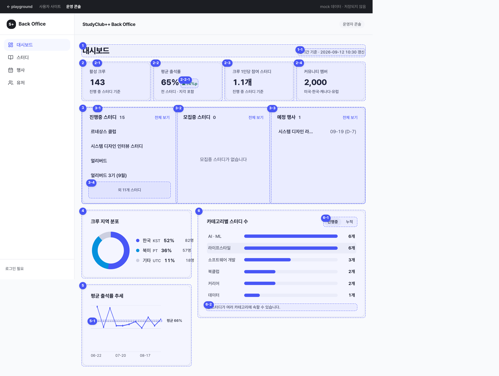

# 운영 대시보드 화면·API Spec

> 플레이그라운드 주소: [운영 콘솔 대시보드](https://playground.studyclub-plusplus.com/proto/console)
> PRD: [캡틴은 스터디클럽 웹사이트의 운영 현황을 볼 수 있다](https://app.notion.com/p/benkang/91583feabad382ac833b81e65dd894f8)
> 생성일: 2026-09-16
> 상태: **스펙작성중** — 화면·집계 기준, 요약 부분 성공, 보드 전용 API와 기존 관리자 목록 확장 방향은 확정. 구현·리뷰 전 단계
> 초안 작성 시 확인한 코드: `origin/beta` / `5acb4b0e5054bf341cfb4d576180e01ba01f4625` — 이후 코드 변경은 구현 시 다시 확인한다.
> 활성 크루·상태·신청 정책 재확인: 2026-09-28, `origin/beta` / `5e6f571e15e685e5a93e135780d62ec7221f044d`. 진행·모집·반 배정 관련 집계 기준은 확정했으며, 백엔드 반영 작업은 5절에 구분한다.
> 출석 계산 적용 기준: [PR #146](https://github.com/StudyClub-PlusPlus/studyclub-engineering/pull/146)의 공통 계산 로직(`4521123`). `EXCUSED`는 출석 1점으로 반영한다.
> 모집 판정 재확인: 2026-09-28, `origin/beta` / `976e425b04db21e184252d77347e096d00459dd5`. 9월 27일 정리에 따라 현재 기수 정원·참여 명부 기준을 사용하며, 모집 회차 기준으로의 변경은 후속 공통 정책을 따른다.
> 화면·시간대 기준 갱신: 2026-10-04. 9월 29일~10월 2일 대시보드 논의와 작성자의 후속 결정을 반영한다. 갱신 시각·모집 마감·주간 출석 집계는 브라우저에서 감지한 시간대를 우선 사용하며, 감지 실패 시 회원 설정 → UTC 순으로 적용한다. 시간대 분포 4개 그룹·현황 보드 2열·전체 보기만 제공하는 구성으로 변경한다.
> 대상: 캡틴용 운영 콘솔 대시보드

## 1. 기준 화면과 번호



기준 화면은 이전 배치·번호 참고용이다. 기획팀에서 playground를 수정하면 변경할 예정. 파란 번호·점선은 실제 UI에서 제외하고 예시 수치 대신 아래 집계 규칙을 적용한다. 최신 명세에서는 예정 행사(3-3)·외 N개(3-4)·복수 카테고리 안내(6-2)를 제거하며, 현황 보드는 2열, 화면 4는 KST·ET·PT·미분류의 시간대 분포로 표시한다. 기존 화면 번호는 문서 대조를 위해 유지한다.

| 화면 번호 | 구성 | 핵심 기준 |
|---|---|---|
| 1 / 1-1 | 제목 / 기준·갱신 시각 | 기간 필터 없음, 브라우저 감지값 우선으로 결정한 조회자 시간대로 갱신 시각 표시 |
| 2 | KPI 4개 | 같은 비중으로 배치, 카드별 집계 범위 명시 |
| 2-1 | 활성 크루 | 진행 중 기수의 `ACTIVE` 참여자, 사람 중복 제거 |
| 2-2 / 2-2-1 | 평균 출석률 / 전주 대비 | 전기간 출석률 / 조회자 시간대의 이번 주 현재까지와 직전 주 전체 비교 |
| 2-3 | 크루 1인당 참여 스터디 | 활성 참여 건수 ÷ 활성 크루 수 |
| 2-4 | 커뮤니티 멤버 | 온보딩 완료 회원 수 |
| 3 / 3-1 / 3-2 | 현황 보드 / 진행중 / 모집중 | 두 영역 동시 표시, 각각 최대 4건과 전체 보기. 예정 행사·외 N개는 표시하지 않음 |
| 4 | 크루 시간대 분포 | 활성 크루의 저장된 시간대를 KST·ET·PT·미분류로 한 번씩 분류 |
| 5 / 5-1 | 12주 출석률 추세 / 12주 평균 | 조회자 시간대의 이번 주 포함, 집계 분모가 0인 주는 `null`, 주별 동일 가중치 평균 |
| 6 / 6-1 / 6-2 | 카테고리별 스터디 수 / 범위 전환 / 기존 중복 안내 제거 | 기수당 대표 카테고리 하나로 집계. 누적은 공개된 기수 전체 |

## 2. 공통 표시·집계 규칙

### 조회 시점과 시간

- 기간 필터·자동 갱신 없이 페이지 진입·새로고침 때 모든 영역을 조회한다. 카드별 재시도 버튼은 제공하지 않는다.
- **`asOf`는 서버의 집계 기준 시각**이다. 회차·모집 마감 등 실제 시각은 UTC로 저장·전달하고, 화면에는 조회자의 시간대로 변환해 표시한다. 브라우저에서는 시간대만 가져오며, 기기의 현재 시각을 집계·마감 판정의 기준으로 사용하지 않는다.
- **조회자 시간대는 브라우저 감지값을 우선 사용**한다. 페이지 진입·새로고침 때 `Intl.DateTimeFormat().resolvedOptions().timeZone`으로 감지한 IANA 시간대 ID를 요약·보드·출석 추세 API의 `timeZone` Query로 동일하게 전달한다. 회원 설정과 달라도 브라우저 감지값을 우선하며, `ACCOUNT.TIME_ZONE`을 자동 변경하지 않는다.
- 감지 결과가 없거나 감지 중 오류가 발생하면 프론트는 `timeZone` Query를 생략한다. 서버는 생략된 경우에만 로그인한 운영진의 유효한 `ACCOUNT.TIME_ZONE`을 사용하고, 이 값도 없거나 유효하지 않으면 `UTC`를 사용한다. 서버는 실제 적용한 기준을 응답의 `timeZone`으로 반환하고 프론트도 이 값을 사용한다. 전달된 Query가 빈 값·유효하지 않은 시간대이면 400으로 처리하며 임의로 다른 시간대로 바꾸지 않는다.
- 갱신 시각·마감 날짜·주간 집계에 같은 조회자 시간대를 적용한다. 한 번의 전체 조회에서는 감지값 하나를 공유하고, 시간대 변경은 다음 조회에서 다시 감지해 반영한다.
- 한 응답은 같은 `asOf`를 사용하며, 활성 크루·참여 건수·1인당 참여 수는 같은 참여자 데이터로 계산한다. 서로 다른 API는 조회 시점이 달라질 수 있어 동일한 순간의 DB 상태를 보장하지 않는다. 같은 데이터의 중복·누락으로 생긴 불일치는 허용하지 않는다.
- 주간 구간은 **조회자 시간대의 월요일 00:00 이상 다음 월요일 00:00 미만**이다. 서버가 각 주 경계를 해당 시간대의 규칙으로 구한 뒤 UTC 시각으로 변환해 회차를 조회한다. 서머타임 등으로 한 주의 실제 길이가 달라질 수 있으므로 고정 168시간으로 자르지 않는다. `weekStart`는 해당 시간대의 월요일 날짜(`YYYY-MM-DD`)이며 UTC 시각으로 재해석하지 않는다.
- 모든 참여자의 회차를 **조회자 시간대 하나로** 구분한다. 참여자·반마다 다른 시간대로 주를 나누지 않는다. 적용한 조회자 시간대에 따라 주간 출석률·12주 평균이 달라질 수 있지만, 같은 데이터·`asOf`의 전기간 출석률은 시간대만으로 달라지지 않는다.
- 조회 중 주가 바뀌어 출석 API들의 기준 주가 달라지면 전주 대비와 12주 차트를 함께 다시 조회한다. 요약·보드·추세 응답의 `timeZone`이 서로 다르면 서로 다른 기준을 섞지 않고 전체를 다시 조회한다.

### 숫자·빈 값·오류

- 인원·기수 수는 정수와 천 단위 구분 기호, 1인당 참여 수는 소수 한 자리, 출석률은 정수 `%`, 증감은 필요 시 소수 한 자리 `%p`로 표시한다. API·계산은 정밀도를 유지하고 화면에서만 반올림한다.
- `0`은 실제 0, `null`은 유효 데이터 없음이다. 집계·통신 오류는 별도 실패 상태로 처리한다.
- 실패 지표와 같은 원천 데이터에 의존하는 지표만 오류 처리하며 정상 영역은 유지한다. KPI별 오류 경계는 화면 2를 따른다.
- 로딩은 카드 크기를 유지하는 스켈레톤으로 표시한다.
- 최초 조회·재조회 모두 실패한 카드의 수치 대신 ‘정보를 불러오지 못했습니다.’만 표시한다. 이전 데이터는 표시하지 않으며, 사용자가 페이지를 새로고침하면 전체를 다시 조회한다.
- 색과 함께 화살표·상태 텍스트·범례·수치를 제공하고, 차트 툴팁·카테고리 행은 키보드로도 확인할 수 있게 한다. 로딩·접근 방식은 구현 제안이다.

### 접근 권한

캡틴 권한인 `ACCOUNT.SYSTEM_ROLE = ADMIN`만 조회할 수 있다. 화면 메뉴를 숨기는 것과 별개로 서버에서 모든 대시보드 API의 권한을 확인한다. 인증·인가 연계는 [운영 콘솔 로그인 명세](../back-office-login/spec.md)를 따른다.

## 3. 화면 번호별 상세 명세

### 1 / 1-1. 제목 줄과 기준·갱신 시각

- 왼쪽 ‘대시보드’, 오른쪽 `전기간 기준 · YYYY-MM-DD HH:mm {시간대 표기} 갱신`을 표시한다. 요약 API의 `asOf`를 같은 응답의 `timeZone`으로 변환한다. 상대 시간인 ‘N분 전’은 사용하지 않는다. 요약 API 자체가 실패해 시각을 받지 못하면 `전기간 기준`만 표시한다. 부분 실패는 해당 카드에서만 알리고 상단에는 별도 오류 안내를 표시하지 않는다.
- ‘전기간’은 기간 필터가 없다는 뜻이다. 현재 상태·온보딩 완료·전기간 출석·최근 12주 등 실제 집계 범위는 각 카드 명세를 따른다.
- 수치·마감 문구·목록은 응답의 `asOf` 기준으로 유지하고 다음 조회 시 갱신한다. 부분 성공 응답은 아래 요약 API 명세를 따른다.

### 2. KPI 카드 공통

‘활성 크루 → 평균 출석률 → 크루 1인당 참여 스터디 → 커뮤니티 멤버’ 순서로 제목·큰 숫자·집계 범위를 같은 비중으로 배치한다. 전주 대비는 평균 출석률 카드 안에만 표시한다.

| 실패 범위 | 오류 표시 대상 |
|---|---|
| 출석 집계 | 평균 출석률·전주 대비 |
| 활성 참여자 집계 | 활성 크루·1인당 참여 스터디 |
| 커뮤니티 멤버 집계 | 커뮤니티 멤버 |
| 요약 API 요청 자체 | KPI 4개. 별도 요청에 성공한 목록·차트는 유지 |

요약 API 하나에서 부분 성공을 구분한다. 정상 조회된 카드는 유지하고, 활성 크루·참여 건수·1인당 참여 수는 같은 응답으로 함께 갱신한다. 실패 카드의 표시는 공통 규칙, 인증·권한 오류는 공통 로그인 정책을 따른다.

성공한 집계의 값은 반환하고 실패한 집계는 데이터 필드를 생략한 뒤 `errors`로 알린다. 집계 묶음·응답 필드·HTTP 상태는 아래 요약 API 명세를 따른다.

### 2-1. 활성 크루

| 항목 | 명세 |
|---|---|
| 표시 | ‘활성 크루’, 인원 수, ‘진행 중 스터디 기준’. 없으면 `0` |
| 대상 | `STUDY.STATUS = ONGOING`인 기수의 `STUDY_PARTICIPANT.STATUS = ACTIVE` 참여자. `ACCOUNT_ID`로 중복 제거 |
| 반 배정 | 신청만 완료한 사람은 제외한다. 반 배정 후 생성된 실제 참여 명부의 기수·참여 상태로 판단하며, 별도 반 배정 필터는 추가하지 않는다 |
| 운영 역할 | 캡틴·반장·부반장도 실제 `ACTIVE` 참여자이면 포함. 운영 권한만 있으면 제외 |
| 제외 | `PAUSED / WITHDRAWN / COMPLETED / DELETED` 참여 건, 참여 명부에 없는 신청자 |
| 이동 | 카드 클릭 시 운영 콘솔의 ‘유저’ 메뉴와 같은 전체 유저 목록으로 이동한다. 별도 필터는 적용하지 않는다 |

```text
진행중기수 = STUDY.STATUS = ONGOING인 기수 목록
활성참여 = 해당 기수의 ACTIVE 참여 명부에서 회원·기수 조합(ACCOUNT_ID, STUDY_ID)을 중복 제거한 참여 목록
활성크루 = 활성참여에서 회원(ACCOUNT_ID)을 중복 제거한 회원 목록
활성크루수 = 활성크루의 회원 수
```

기수는 `STUDY`, 상위 묶음은 `STUDY_PROGRAM`, 반은 `STUDY_GROUP`이다. 참여 명부는 `STUDY_ID`로 기수, `STUDY_GROUP_ID`로 반에 연결된다. 참여 명부 ERD에는 이전 컬럼명이 남아 있으므로 현재 필드명은 아래 참여자 코드를 기준으로 한다.

진행 중 판정은 저장 상태 `STUDY.STATUS = ONGOING`으로 확정한다. 최신 기획에 따라 네비게이터의 첫 미팅 등록으로 전환하며 시작일 경과만으로 판정하지 않는다. 2-3·3-1·4·6의 진행 중 집계도 같은 기준을 사용한다.

신청 시에는 신청서만 저장하고, 캡틴이 이후 반을 배정할 때 참여 명부를 생성한다. 신청만으로 활성 크루가 되지는 않는다. 대시보드는 실제 참여 명부에 등록된 회원 중 기수가 `ONGOING`이고 참여 상태가 `ACTIVE`인 회원만 집계한다.

**출처:** [현재 참여자 코드](https://github.com/StudyClub-PlusPlus/studyclub-engineering/blob/5e6f571e15e685e5a93e135780d62ec7221f044d/backend/domain/src/main/java/com/studyclub/domain/participant/StudyParticipant.java), [상태 정책](https://github.com/StudyClub-PlusPlus/studyclub-engineering/blob/5e6f571e15e685e5a93e135780d62ec7221f044d/01-planning/_registry/policies/POL-0002-study-status.md), [진행 상태 계산 코드](https://github.com/StudyClub-PlusPlus/studyclub-engineering/blob/5e6f571e15e685e5a93e135780d62ec7221f044d/backend/domain/src/main/java/com/studyclub/domain/study/Study.java), [신청·명부 생성 흐름 — PR #197](https://github.com/StudyClub-PlusPlus/studyclub-engineering/pull/197), 작성자 결정.

**구현 확인:** 신청 저장은 PR #197 적용 기준이다. 반 배정 시 명부 생성과 기수 상태 전환은 스터디·반 배정 기능에서 연결해야 하며, 필요한 작업은 5절에 정리한다.

### 2-2. 평균 출석률

| 항목 | 명세 |
|---|---|
| 표시 | ‘평균 출석률’, 정수 `%`, 보조 문구 ‘전 스터디 · 지각 포함’ |
| 대상 | 웹 DB 전기간의 참여자별 소속 반 회차. 진행 중 기수로 제한하지 않음 |
| 참여 상태 | `ACTIVE / PAUSED / COMPLETED`는 `asOf`까지, 하차한 `WITHDRAWN`·회원 탈퇴한 `DELETED`는 떠난 시각 `LEFT_AT`까지의 회차를 포함 |
| 회원 탈퇴 | 계정은 삭제되지만 참여 명부는 `DELETED`로 보존한다. 탈퇴 전 출석·결석은 집계에 남기며, 이미 하차한 회원은 기존 `LEFT_AT`을 유지 |
| 회차 시각 | `참여자의 JOINED_AT <= 회차의 SCHEDULED_AT <= 집계 상한`. 상한은 위 참여 상태별 시각이며 경계를 포함한다. 합류 전·집계 상한 이후 회차는 제외하고, 실제 시작·종료나 출석 입력 완료를 기다리지 않음 |
| 떠난 시각 누락 | `WITHDRAWN / DELETED`인데 `LEFT_AT`이 없으면 참여 기간을 알 수 없어 해당 참여자의 기록 전체를 분자·분모에서 제외 |
| 가중치 | `PRESENT = 1`, `EXCUSED = 1`, `LATE = 0.5`, `ABSENT = 0`. `EXCUSED`도 분모에 1건 포함 |
| 미입력 | 출석 행이 없어 조회 시 `null`인 칸도 대상 회차이면 분모에 포함하고 점수는 0. 기본 생성된 `ABSENT`도 같은 기준 적용 |
| 빈 상태 | 분모 0이면 API `null`, 화면 ‘—’와 ‘집계할 출석 대상이 없습니다.’. 분모가 있고 결석·미입력만 있으면 `0%` |

`출석률 = 100 × (PRESENT 수 + EXCUSED 수 + 0.5 × LATE 수) / 집계 대상 수`

집계 대상 수는 위 회원·참여 상태·시각 조건을 만족하는 **회원 × 소속 반 회차** 수이며, `EXCUSED`와 미입력도 포함한다. 출석 행만 세어 분모를 만들지 않는다.

2-2·2-2-1·5는 PR #146의 `EXCUSED` 처리와 PR #141의 탈퇴·하차 처리까지 반영된 `AttendanceRateCalculator.components()`를 사용한다. 서버에서 대상 참여자의 분자·분모를 각각 합산하며, 반·기수별 출석률을 단순 평균하지 않는다.

계산기는 출석률을 **0 이상 1 이하의 비율**로 계산한다. 대시보드 API는 서버에서 이 값에 100을 곱해 **0 이상 100 이하의 백분율 값**으로 반환한다. 프론트는 다시 100을 곱하지 않고, 표시 규칙에 따라 반올림한 뒤 `%`를 붙인다. 분모가 0이면 `null`을 유지한다. 주간 집계는 회차의 `SCHEDULED_AT`을 조회자 시간대의 주간 구간으로 제한한 뒤 같은 로직을 적용한다. 이미 계산된 주간 출석률을 프론트에서 시간대 변환하는 방식은 사용하지 않는다.

출석 수정·회원 탈퇴·참여 상태 변경은 다음 조회에 반영한다. **탈퇴·하차 전 기록은 유지하고, 떠난 이후 회차는 결석이 아니라 집계 대상에서 제외한다.** 활성 크루의 `ACTIVE` 전용 조건이나 현재 계정 존재 여부로 출석 대상을 제한하지 않는다. 다른 반 참석은 소속 반 회차에 저장된 `EXCUSED`로 인정하며, 다른 반 출석 기록을 별도로 더하지 않는다.

**출처:** [공통 출석 계산기](https://github.com/StudyClub-PlusPlus/studyclub-engineering/blob/a38aa64bdece9175c46acbea34222130621abd28/backend/api/src/main/java/com/studyclub/api/attendance/AttendanceRateCalculator.java), [소속 반 조회·가중평균](https://github.com/StudyClub-PlusPlus/studyclub-engineering/blob/a38aa64bdece9175c46acbea34222130621abd28/backend/api/src/main/java/com/studyclub/api/attendance/AttendanceService.java), [회원 탈퇴·명부 보존](https://github.com/StudyClub-PlusPlus/studyclub-engineering/blob/a38aa64bdece9175c46acbea34222130621abd28/backend/domain/src/main/java/com/studyclub/domain/participant/StudyParticipant.java), [9월 30일 출석 집계 합의](https://discord.com/channels/1528293741734133830/1554167649829920798/1554826812037795841), 작성자 결정.

**후속 참고 — 회차 취소:** 취소·미개최 회차 처리는 공통 출석 정책을 따른다. 현재는 별도 제외 조건을 추가하지 않으며, 향후 공통 계산이 바뀌면 모든 출석 지표에 함께 반영한다. 대시보드 개발을 위한 미정 사항으로 두지 않는다.

### 2-2-1. 전주 대비 출석률

- 조회자 시간대에서 **이번 주 월요일 00:00부터 asOf까지**와 **직전 주 전체**를 정하고, 그 구간에 속한 `SCHEDULED_AT`의 출석률을 2-2의 공통 규칙으로 비교한다. `증감(%p) = 이번 주 출석률 − 직전 주 출석률`이다.
- Playground처럼 증감 숫자(`%p`)와 화살표만 표시한다. 상승은 `▲`, 하락은 `▼`와 색으로 구분하고, 차이가 0이면 중립 색상으로 `–0%p`를 표시한다.
- 어느 한 주라도 집계 분모가 0이면 증감을 숨긴다. 분모가 있고 결석·미입력만 있는 주는 `0%`로 비교에 포함한다. 빈 직전 주를 건너뛰어 이전 주와 비교하지 않는다.
- 큰 수치는 전기간 출석률이다. 두 주 모두 2-2의 참여 상태·참여 기간·출석 가중치를 적용하며, 탈퇴·하차 전 기록도 포함한다.

### 2-3. 크루 1인당 참여 스터디

- ‘크루 1인당 참여 스터디’, 소수 한 자리와 `개`, ‘진행 중 스터디 기준’을 표시한다.
- `2-1의 활성참여 건수 / 활성크루수`. 같은 조회 기준 시점의 `ACTIVE` 참여 명부에서 분자는 고유 `(ACCOUNT_ID, STUDY_ID)` 수, 분모는 고유 `ACCOUNT_ID` 수로 계산한다. 같은 회원·기수의 반 중복은 1건이다.
- `PAUSED / WITHDRAWN / COMPLETED / DELETED` 참여 건은 제외한다. 다른 기수에서 `ACTIVE`인 회원도 해당 회원의 `PAUSED` 참여 건까지 포함하지는 않는다.
- 분모 0이면 API `null`, 화면 ‘—’와 ‘활성 크루가 없습니다.’를 표시한다. 값이 있으면 화면에서만 소수 한 자리로 반올림한다.
- 진행 중 판정은 2-1의 `STUDY.STATUS = ONGOING`을 따른다.

**구현 주의:** 기존 [`countByStudyIds()`](https://github.com/StudyClub-PlusPlus/studyclub-engineering/blob/976e425b04db21e184252d77347e096d00459dd5/backend/domain/src/main/java/com/studyclub/domain/participant/StudyParticipantRepository.java#L22)는 모집 정원용으로 `ACTIVE + PAUSED`를 세므로 이 카드에 그대로 사용하지 않는다. 2-1과 공유하는 `ACTIVE` 참여 집계가 필요하다.

### 2-4. 커뮤니티 멤버

- 조회 시점에 `ACCOUNT`에 존재하고 `ONBOARDING_COMPLETED_AT IS NOT NULL`인 고유 `ACCOUNT.ID` 수. 스터디 참여 여부·참여 상태·운영 역할은 무관하다. 스터디에서 하차(`WITHDRAWN`)해도 사이트 회원으로 남아 있으면 포함하며, 온보딩 전 계정·회원탈퇴로 삭제된 계정·별도 탈퇴 이력은 제외한다.
- 제목 ‘커뮤니티 멤버’, 보조 문구 ‘온보딩 완료 회원’을 표시한다. 대상 계정이 없으면 `0`이다.
- 카드 클릭 시 운영 콘솔의 ‘유저’ 메뉴와 같은 전체 유저 목록으로 이동한다. 별도 필터는 적용하지 않는다. 회원 관리 목록으로 가는 바로가기이며, 목록에 온보딩 미완료 계정이 포함되면 카드 수치와 목록 인원은 다를 수 있다.
- 커뮤니티 전체 시간대 분포는 집계하지 않으며, 화면 4는 활성 크루만 대상이다.
- **출처:** [Account](../../backend/domain/src/main/java/com/studyclub/domain/account/Account.java), [온보딩 서비스](../../backend/api/src/main/java/com/studyclub/api/auth/AccountOnboardingService.java), [회원탈퇴 명세](https://github.com/StudyClub-PlusPlus/studyclub-engineering/blob/976e425b04db21e184252d77347e096d00459dd5/specs/user-leave/spec.md#L62), [Playground 카드 연결](https://github.com/StudyClub-PlusPlus/studyclub-engineering/blob/976e425b04db21e184252d77347e096d00459dd5/frontend/apps/playground/src/app/(proto)/proto/console/page.tsx#L62), 작성자 결정. 온보딩 처리·카드 연결은 2026-09-28 beta `976e425`에서 재확인했다.

### 3. 현황 보드 공통

- 진행중·모집중 두 영역을 함께 표시한다. 넓은 화면은 같은 너비의 가로 2열, 좁은 화면은 세로 배치하며 탭으로 다른 영역을 숨기지 않는다. 0건이어도 영역 높이를 유지한다.
- 두 스터디 영역의 제목 옆은 **전체 대상 건수**, 목록은 최대 4건이다. 상단 ‘전체 보기’만 제공하고 하단 ‘외 N개’는 표시하지 않는다. 전체 목록의 첫 페이지에는 카드에 보인 항목도 포함한다.
- MVP에서는 예정 행사 영역과 ‘준비 중’ 안내를 모두 표시하지 않는다. 행사 API·mock 데이터는 사용하지 않으며, 행사 기능 도입 시 영역을 추가한다.
- 이름은 등록된 기수 제목 `STUDY.TITLE`을 그대로 사용한다. 기수 표기는 등록 제목에서 관리하며 자동으로 번호를 추정하지 않는다. 같은 프로그램에 속해도 기수별로 표시하고 합치지 않는다.
- 스터디 이름을 클릭하면 해당 기수의 운영 상세 `/studies/{studyId}`로 이동한다. `studyId`는 `STUDY.ID`이며 상위 프로그램 ID나 이름을 주소 식별자로 사용하지 않는다.
- ‘전체 보기’는 아래 경로로 이동하며 목록의 기존 필터를 자동 선택한다. `view`는 진입 시 필터·정렬을 설정하기 위한 주소 값이며, 별도의 ‘모집 현황’ 필터를 추가하지 않는다.

| 영역 | 이동 경로 | 상태 필터 | 모집 필터 |
|---|---|---|---|
| 진행중 | `/studies?view=ongoing` | 진행 중 (`ONGOING`) | 모집 전체 |
| 모집중 | `/studies?view=recruitment` | 개설 (`OPEN`) | 모집 전체 — `RECRUITING`·`RECRUIT_CLOSED` 모두 포함 |

- 각 보드와 같은 대상 조건·정렬을 적용한 전체 목록의 첫 페이지를 열고, 다른 검색·필터는 초기화한다. 모집중 보드에서 이동할 때 모집 필터를 ‘모집중’으로 선택해 마감된 기수를 제외하지 않는다.
- 위 주소는 실제 서비스용 백오피스에 적용할 경로다. Playground에는 ‘개설 + 모집 전체’ 필터 조합이 이미 있지만, 대시보드에서 자동 선택하는 연결은 없다. 실제 백오피스에는 이 필터 구성과 조회·주소 연결을 구현해야 한다. Playground 주소에는 `/proto/console`이 앞에 붙는다.

### 3-1. 진행중 스터디

- 2-1과 같은 진행 중 기수 집합의 이름만 표시한다. 참여자 유무와 관계없이 표시하며, 출석률·회차 수는 추가하지 않는다.
- 기수 제목 오름차순으로 정렬하고, 제목이 같으면 기수 ID 오름차순으로 정렬한다. 항목은 해당 기수 상세, 전체 보기는 진행 중 목록으로 이동한다. 빈 문구는 ‘진행중 스터디가 없습니다.’다.
- 같은 기준 시점에 같은 기수는 진행중·모집중 두 보드에 동시에 포함하지 않는다. 같은 프로그램의 진행 중 기수와 모집 중인 다음 기수는 서로 다른 기수이므로 각 보드에 표시할 수 있다.

### 3-2. 모집중 스터디

대상은 `STUDY.STATUS = OPEN`이면서 공통 모집 판정이 `RECRUITING` 또는 `RECRUIT_CLOSED`인 기수다. 모집이 마감되어도 진행 시작 전(`OPEN`)까지 유지하며, 마감 후 별도 일수 제한은 두지 않는다. `ONGOING / ENDED / CLOSED / DRAFT`로 바뀌면 제외한다. 제목 옆 전체 건수에는 모집중·마감 후 진행 전 기수를 모두 포함한다.

모집 상태·마감 사유·임박 여부는 현재 백엔드의 공통 규칙으로 판정한다. 프론트는 서버의 상태를 유지하며, UTC 마감 시각을 조회자 시간대로 변환해 날짜·D-day·‘오늘 마감’ 문구를 표시한다.

- 마감 시각은 해당 기수의 가장 최신 모집 회차(`STUDY_RECRUITMENT.ID` 최대)의 `RECRUIT_DEADLINE_AT`이다.
- 정원은 `STUDY.CAPACITY`, 정원을 차지하는 수는 해당 `STUDY_ID`의 `ACTIVE + PAUSED` 참여 명부 건수다. 현재 `countByStudyIds()`와 같으며, 활성 크루의 사람 중복 제거·`ACTIVE` 전용 기준을 적용하지 않는다. `WITHDRAWN / COMPLETED`는 제외하고 정원 `null`은 인원 제한 없음으로 처리한다.
- 마감 시각이 있고 `asOf >= recruitDeadlineAt`이거나, 정원이 있고 참여 명부 건수가 정원 이상이면 `RECRUIT_CLOSED`, 그 외에는 `RECRUITING`이다. 상태·표시 문구는 같은 `asOf`와 데이터로 판정한다.

각 행은 왼쪽 이름을 한 줄 말줄임, 오른쪽 마감 정보를 줄바꿈 없이 오른쪽 정렬한다.

| 우선순위 | 조건 | 오른쪽 표시 |
|---|---|---|
| 1 | 마감 시각이 있고 `asOf >= recruitDeadlineAt` | `~MM-DD (마감 경과)`. 정원도 찼으면 이 문구 우선 |
| 2 | 마감 시각 미경과 또는 미등록이며 정원 도달 | `~MM-DD (정원 마감)`. 날짜 없으면 `정원 마감` |
| 3 | `RECRUITING`이며 조회자 시간대에서 마감 날짜와 `asOf` 날짜가 같음 | `~MM-DD (오늘 마감)` |
| 4 | `RECRUITING`이며 `Study.isClosingSoon()`이 true | `~MM-DD (D-n · 임박)` |
| 5 | `RECRUITING`이며 마감 시각이 있고 `Study.isClosingSoon()`이 false | `~MM-DD (D-n)` |
| 6 | `RECRUITING`이며 마감 시각 없음 | `마감일 미등록` |

- `MM-DD`와 남은 일수는 보드 응답의 `timeZone`으로 표시한다. `D-n`은 해당 시간대의 마감 날짜와 `asOf` 날짜의 달력 날짜 차이다. 브라우저의 현재 시각이나 고정 24시간으로 나눈 값은 사용하지 않는다. 임박은 주의 색상, 오늘 마감·마감 경과·정원 마감은 경고 색상과 해당 문구를 함께 사용한다.
- 모집중(`RECRUITING`)을 먼저, 마감(`RECRUIT_CLOSED`)을 뒤에 둔다. 각 묶음 안에서는 마감 시각 오름차순, 마감 없는 기수는 마지막, 동률은 제목·기수 ID 순으로 정렬한다. 이 순서로 최대 4건을 표시하며 전체 보기에도 같은 정렬을 적용한다. 0건 문구는 ‘모집중 스터디가 없습니다.’다.
- 최신 기획은 상시 모집이 없지만 현재 DB는 마감 `null`을 허용한다. 이 값은 ‘상시’ 대신 ‘마감일 미등록’으로 표시하며, 모집 상태는 위 공통 규칙을 따른다.
- 별도 수동 마감 신호·사유는 사용하지 않는다. 마감 시각이 수정되면 변경된 값으로 판정하며 수동 변경 여부를 추정하지 않는다.
- 마감 시각·정원에 따른 신청 차단은 신청 API의 공통 정책이다. 대시보드 조회는 상태를 계산해 보여주며 DB 상태를 변경하지 않는다. 실제 제출 차단 구현은 5절에서 확인한다.
- 현재 `Study.isClosingSoon()`의 3일 판정 결과를 그대로 사용한다. 마감 경과·정원 마감·오늘 마감 표시가 우선이며, 나머지 모집중 항목에 임박 여부를 표시한다. 기존 판정은 마감까지 3일(72시간) 미만이면 true, 정확히 3일 이상이면 false다. 화면의 `D-n`은 조회자 시간대의 달력 날짜 차이로 별도 표시한다. 시간대에 따라 날짜·D-day·오늘 마감 표시는 달라질 수 있지만, 같은 데이터·`asOf`에서 실제 마감 여부와 72시간 임박 여부는 같다.

**출처:** [9월 27일 정원 정리](https://github.com/StudyClub-PlusPlus/studyclub-engineering/blob/976e425b04db21e184252d77347e096d00459dd5/share/2026-09-27-study-capacity-column.md#L69), [현재 모집 판정](https://github.com/StudyClub-PlusPlus/studyclub-engineering/blob/976e425b04db21e184252d77347e096d00459dd5/backend/domain/src/main/java/com/studyclub/domain/study/Study.java#L144), [정원용 참여 명부 집계](https://github.com/StudyClub-PlusPlus/studyclub-engineering/blob/976e425b04db21e184252d77347e096d00459dd5/backend/domain/src/main/java/com/studyclub/domain/participant/StudyParticipantRepository.java#L22), 작성자 결정.

**후속 참고 — 나중에 정원 계산 방식이 바뀌면 대시보드도 함께 수정**

- **지금 사용할 기준:** 기존 백엔드처럼 기수 전체의 정원과 활동 중(`ACTIVE`)·일시중지(`PAUSED`) 상태의 참여 등록 건수를 비교해 정원이 찼는지 판단한다.
- **나중에 바뀔 수 있는 부분:** 설계 문서에는 1차 모집·추가 모집마다 정원을 따로 정하고, 각 모집에 제출된 신청서 수를 세는 방식이 있다. 이 방식으로 바꿀지는 스터디 팀에서 결정한다.
- **개발 진행:** 지금은 첫 번째 기준으로 개발하면 된다. 나중에 스터디 팀이 계산 방식을 바꾸면 대시보드도 같은 방식으로 수정한다. 추가 결정을 기다릴 필요는 없다.

### 4. 크루 시간대 분포

- 2-1의 활성 크루를 `ACCOUNT_ID`로 중복 제거한 뒤 **각 크루의 조회 시점 `ACCOUNT.TIME_ZONE`**으로 한 그룹에만 분류한다. 거주 국가를 추정하는 통계가 아니며 조회하는 운영진의 시간대로 크루를 재분류하지 않는다. 시간대 변경이 DB에 저장되면 다음 조회부터 반영한다.
- 도넛·인원·비율을 표시한다. `비율 = 시간대 그룹 인원 / totalCrew × 100`. 응답 내 그룹 인원 합은 `totalCrew`와 일치해야 하며, 반올림 비율 합의 99%·101%는 허용한다. 카드와 별도 조회 시 차이는 공통 조회 시점 규칙을 따른다.
- 범례는 ‘KST → ET → PT → 미분류’, 안내는 ‘회원 설정 시간대 기준’이다. 미분류도 총인원·비율 분모에 포함하며 0명일 때만 조각·범례를 숨긴다.
- 활성 크루가 없으면 네 그룹 인원은 0·비율은 `null`이며 차트·범례 대신 ‘활성 크루가 없습니다.’를 표시한다. 전 세계 분류표는 추가하지 않는다.
- 탈퇴로 계정이 삭제되고 참여 명부가 `DELETED`로 바뀐 회원은 다음 조회부터 그룹 인원과 `totalCrew`에서 제외한다. 미분류로 남기지 않는다.

| 저장된 시간대 | 분류 |
|---|---|
| `Asia/Seoul` | KST |
| `America/New_York`, `America/Toronto` | ET |
| `America/Vancouver`, `America/Los_Angeles` | PT |
| 그 외 모든 값·null·빈 값·유효하지 않은 값 | 미분류 (`UNKNOWN`). 다른 유효 시간대도 임의 추정하지 않음 |

온보딩은 서울·북미 동부(뉴욕/토론토)·밴쿠버·LA의 네 선택지를 기준으로 하며, 토론토 자동 감지값은 뉴욕으로 연결한다. 대시보드는 **최종 DB 저장값**을 위 표로 분류하고, 자동 감지·`REGION_GROUP`으로 재추정하거나 저장값을 변경하지 않는다. 서버의 유효 `ZoneId` 검증은 유지한다. KST·ET·PT는 이 차트의 그룹 코드이며 실제 날짜 계산에는 각 IANA 시간대를 사용한다. 조회자 시간대의 브라우저 감지·회원 설정·UTC 대체 규칙은 크루 분포에 적용하지 않고, 각 크루의 저장값 누락은 `UNKNOWN`에 포함한다.

**출처:** [Account.timeZone](../../backend/domain/src/main/java/com/studyclub/domain/account/Account.java), [온보딩 #93](https://github.com/StudyClub-PlusPlus/studyclub-engineering/pull/93)·[#94](https://github.com/StudyClub-PlusPlus/studyclub-engineering/pull/94), [회원 탈퇴 #141](https://github.com/StudyClub-PlusPlus/studyclub-engineering/pull/141), 작성자 결정.

### 5. 평균 출석률 추세

- **조회자 시간대의 이번 주 포함 최근 12주**를 시간 오름차순으로 표시한다. 이번 주는 asOf까지 집계하고, 나머지 주는 해당 주 전체를 대상으로 한다.
- 2-2의 공통 로직을 주별로 적용한다. 회차의 `STUDY_MEETING.SCHEDULED_AT`을 조회자 시간대로 변환한 날짜가 속한 주에 귀속하며, 입력 시각·실제 시작 시각으로 주를 옮기지 않는다. 과거 출석 수정·현재 참여 상태 변경도 다음 조회에 반영한다.
- 집계 분모가 0인 주는 `null`로 비워 두고 선으로 연결하지 않는다. 분모가 있고 결석·미입력만 있으면 `0%` 점으로 표시한다. 값이 한 주뿐이면 점 하나, 모두 null이면 ‘집계할 출석 대상이 없습니다.’를 표시한다.
- 툴팁은 주 시작일·적용한 `timeZone`·출석률·환산 출석수·집계 대상 수(미입력 포함)를 제공하며 환산 출석수의 0.5 단위를 유지한다.
- 탈퇴·하차 전 기록도 2-2의 참여 기간 기준으로 포함한다. 같은 기준을 5-1의 12주 평균에도 적용한다.

### 5-1. 12주 평균

`12주 평균 = null이 아닌 주별 출석률의 합 / 해당 주 수`이며 0% 주도 포함한다. 각 주는 **동일 가중치**로 계산하며 인원·기록 수로 가중하지 않는다. 반올림 전 비율로 계산한 뒤 정수 `%`로 표시한다.

차트 기준선과 ‘평균 N%’ 라벨로 표시하고 별도 큰 카드는 추가하지 않는다. 분모가 있는 주가 하나도 없으면 `null`이며 기준선·라벨을 숨긴다. 화면 5와 같은 조회자 시간대로 나눈 주별 출석률을 사용한다. 주별 동일 가중치이므로 전기간 출석률과 값이 다를 수 있고, 조회자 시간대에 따라서도 평균이 달라질 수 있다.

### 6 / 6-1 / 6-2. 카테고리별 스터디 수

| 항목 | 명세 |
|---|---|
| 기본 범위 | ‘진행중’. 새로고침하면 기본값으로 돌아옴 |
| 진행중 | 2-1·3-1과 같은 `STUDY.STATUS = ONGOING` 기수 집합 |
| 누적 | 조회 시점의 상태가 `OPEN / ONGOING / ENDED / CLOSED`인 기수. `DRAFT`는 제외 |
| 집계 단위 | `STUDY.CATEGORY`의 대표 카테고리 하나에 기수당 1개. `STUDY.ID`로 중복 제거하며 같은 클럽 1·2기는 각각 1개 |
| 표시 | 카테고리 이름, 개수, 가로 막대. 현재 선택 범위에서 0개인 카테고리는 숨김 |
| 정렬 | 개수 내림차순. 동률은 카테고리 코드 오름차순 |
| 막대 길이 | 선택 범위에서 가장 큰 카테고리의 개수를 100%로 함. 전체 기수 수로 나누지 않음 |
| 이동 | 행 전체 클릭 시 아래 필터를 적용한 스터디 목록의 첫 페이지로 이동. 카테고리는 라벨 대신 **코드**로 전달 |
| 빈 상태 | ‘해당하는 스터디가 없습니다.’ |
| 6-2 안내 | 단일 카테고리이므로 기준 화면의 ‘한 스터디가 여러 카테고리에 속할 수 있습니다.’ 문구는 표시하지 않음 |

각 범위의 카테고리별 개수 합은 해당 범위의 고유 기수 수와 일치한다. 누적은 과거에 한 번이라도 공개된 이력이 아니라 **현재 공개된 기수 전체**를 뜻한다. 공개 취소로 `DRAFT`가 되면 다음 조회부터 누적에서 제외한다.

| 클릭한 범위 | 운영 프론트 이동 경로 | 목록에 자동 적용할 필터 |
|---|---|---|
| 진행중 | `/studies?view=ongoing&category={categoryCode}` | 해당 카테고리 · 상태 ‘진행 중’ · 공개 ‘공개’ · 모집·종류 ‘전체’ |
| 누적 | `/studies?view=cumulative&category={categoryCode}` | 해당 카테고리 · 상태 ‘전체’ · 공개 ‘공개’ · 모집·종류 ‘전체’ |

공개 필터는 `STUDY.STATUS != DRAFT`로 판단한다. 누적에서는 상태 여러 개를 선택하지 않고 ‘상태 전체 + 공개’를 조합한다. 검색어·‘신청 폼 없는 것만’ 등 추가 조건은 해제하고, 적용된 필터를 목록 화면에 표시한다. 진행중 목록은 제목·기수 ID 오름차순, 누적 목록은 기존 목록의 기본 정렬인 기수 ID 내림차순을 사용한다. 이동 후에는 사용자가 필터를 변경할 수 있다.

위 경로와 필터 조합은 구현할 동작이다. Playground에는 공개 필터가 있지만 URL로 자동 선택하는 연결이 없고, 실제 백오피스에는 공개 필터도 추가해야 한다. 목록과 차트는 같은 집계 조건을 사용하며, 조회 시점 차이는 공통 규칙을 따른다.

**출처:** [스터디 명세의 단일 카테고리 결정](https://github.com/StudyClub-PlusPlus/studyclub-engineering/blob/271c640225b02f906a03c1fb761d1589ae2f1faa/specs/study/spec.md#L295), [공개 판정 정책](https://github.com/StudyClub-PlusPlus/studyclub-engineering/blob/271c640225b02f906a03c1fb761d1589ae2f1faa/01-planning/_registry/policies/POL-0002-study-status.md#L41), 작성자 결정.

## 4. API 계약 초안

요약 API의 부분 성공 응답 방식과 화면의 집계 기준은 **작성 기준으로 확정**했다. 현황 보드는 전용 `/api/admin/stats/study-board`를 신설하고, 전체 보기·카테고리 목록은 기존 `/api/admin/studies`를 확장해 사용한다. 두 API는 대상 선정·모집 판정·정렬 로직을 공유한다. 아래는 구현할 계약이며, 구현 완료 여부는 표에서 구분한다. 필드 표와 응답 JSON 예시는 이 문서에서 함께 관리하며 예시의 날짜·수치는 설명용이다.

### 최신 구현과의 관계

2026-10-04 beta `a38aa64`에서 대시보드 API 유무·관리자 목록 요청·응답·정렬을 확인했다. 이 문서에서 추가로 정의한 필터·정렬은 구현 대상이다.

| 확인 대상 | 현재 구현과 이 명세의 차이 |
|---|---|
| `/api/admin/stats/*` | 대시보드 집계 API는 없음. 신규 조회·집계 구현 필요 |
| `GET /api/admin/studies` | `category / studyKind / status / studyId / offset / limit`와 `items / total / offset / limit` 응답이 이미 있음. 정렬은 기수 ID 내림차순으로 고정. 아래 명세대로 공개·모집 필터와 정렬을 추가 |
| 현황 보드 조회 | `/api/admin/stats/study-board`로 분리 확정. 기준 시각·전체 건수·최대 4건·마감 표시를 반환하며 전체 목록 API와 조회 규칙을 공유 |
| 백오피스 프론트 목록 | 현재 `/api/studies` 호출을 관리자 목록 API로 전환하고 응답 타입·필터·페이지·주소 연결을 반영 |
| 기존 출석 API | 특정 스터디·반의 명부 조회용. 대시보드는 PR #141까지 반영된 공통 계산을 재사용하고, 전기간·주간 합산 및 ADMIN 전용 응답은 새로 구현 |

**근거:** [관리자 목록 요청](https://github.com/StudyClub-PlusPlus/studyclub-engineering/blob/a38aa64bdece9175c46acbea34222130621abd28/backend/api/src/main/java/com/studyclub/api/study/AdminStudyController.java)·[응답](https://github.com/StudyClub-PlusPlus/studyclub-engineering/blob/a38aa64bdece9175c46acbea34222130621abd28/backend/api/src/main/java/com/studyclub/api/study/BackofficeStudyListResponse.java)·[조회·정렬](https://github.com/StudyClub-PlusPlus/studyclub-engineering/blob/a38aa64bdece9175c46acbea34222130621abd28/backend/api/src/main/java/com/studyclub/api/study/BackofficeStudyJpqlDao.java), [프론트 목록 호출](https://github.com/StudyClub-PlusPlus/studyclub-engineering/blob/a38aa64bdece9175c46acbea34222130621abd28/frontend/apps/back-office-front/src/features/studies/queries.ts).

### 엔드포인트 목록

| Method | Path | 설명 | 인증 | 상태 |
|---|---|---|---|---|
| GET | `/api/admin/stats/summary` | KPI 4개와 이번 주·전주 출석 비교 | ADMIN | 스펙작성중 |
| GET | `/api/admin/stats/study-board?view=ONGOING&limit=4` | 진행 중 기수 미리보기 | ADMIN | 계약 확정 · 신규 구현 필요 |
| GET | `/api/admin/stats/study-board?view=RECRUITMENT&limit=4` | 모집중·마감 후 진행 전 기수 미리보기 | ADMIN | 계약 확정 · 신규 구현 필요 |
| GET | `/api/admin/studies` | 전체 보기·카테고리별 스터디 목록 | ADMIN | 기존 API · 아래 필터·정렬 확장 필요 |
| GET | `/api/admin/stats/crew-timezones` | 활성 크루 시간대 분포 — KST·ET·PT·미분류 | ADMIN | 스펙작성중 |
| GET | `/api/admin/stats/attendance-trend?weeks=12` | 12주 출석률과 동일 가중치 평균 | ADMIN | 스펙작성중 |
| GET | `/api/admin/stats/studies-by-category` | 진행중·누적 카테고리별 기수 수 | ADMIN | 스펙작성중 |

모든 API는 ADMIN 전용이며 Path Parameter·Request Body가 없다. 백엔드 요청은 `Authorization: Bearer <JWT>` 인증 후 현재 관리자 목록과 같은 `@RequireAdmin` 권한 검사를 거친다. `/api/admin` 접두만으로 ADMIN 검사가 자동 적용되지는 않는다.

Query는 별도 표가 있는 API만 사용한다. 성공 응답에 `success`·`data` 래퍼를 추가하지 않으며 enum은 대문자다. `asOf`·`recruitDeadlineAt` 등 시각은 UTC ISO 8601로 반환한다. 요약·보드·출석 추세 API는 선택 Query `timeZone`을 받고, 실제 적용한 시간대를 같은 이름의 응답 필드로 반환한다. 프론트는 응답의 `timeZone`으로 날짜를 표시하고 서버는 같은 기준으로 주간 집계를 한다. `view`는 대시보드의 보드 구분이며 DB 상태나 모집 상태 enum과 다르다. 행사 API는 호출하지 않는다.

**시간대 Query 공통 계약:** `timeZone`은 브라우저에서 감지한 유효한 IANA 시간대 ID 또는 `UTC`다. 온보딩 선택지로 제한하지 않는다. 생략하면 서버가 유효한 회원 설정 시간대 → UTC 순으로 결정한다. 전달된 빈 값·무효 값은 400 `INVALID_INPUT`이며 요약 API의 부분 성공으로 감싸지 않는다. 프론트는 감지 완료 후 같은 값을 세 API에 전달하고, 감지에 실패하면 모두 생략한다. 기기의 현재 시각은 전달하지 않는다.

JSON 예시는 브라우저에서 `America/New_York`를 감지해 `timeZone=America%2FNew_York`로 요청한 경우다. `weekStart` 계열은 응답 시간대의 월요일 날짜이며, UTC 타임스탬프처럼 변환하지 않는다. 시간대에 영향을 받는 집계 결과를 캐시한다면 최종 적용 시간대도 캐시 키에 포함한다.

`/studies?view=ongoing`·`view=recruitment`·`view=cumulative`는 **프론트 목록 화면 주소**다. 아래 백엔드 API의 Query와 동일한 계약이 아니며, 화면 3·6의 필터로 변환해 연결한다.

### 공통 오류와 프론트엔드 사용처

모든 API에 아래 오류를 적용한다. 빈 집계나 빈 목록은 404가 아니라 200과 빈 데이터다.

| HTTP | errorCode | 조건 |
|---|---|---|
| 400 | `INVALID_INPUT` | 지원하지 않는 쿼리 값·범위 |
| 401 | `UNAUTHORIZED` | 로그인되지 않았거나 토큰이 무효·만료됨. 토큰에 해당하는 계정이 없는 경우도 포함 |
| 403 | `FORBIDDEN` | 로그인했지만 ADMIN 권한이 없음 |
| 500 | `INTERNAL_ERROR` | 서버가 해당 API의 사용 가능한 집계 응답을 반환하지 못함. summary의 일부 지표만 실패한 경우는 아래 부분 성공 계약 적용 |

오류 코드·형식은 기존 [ErrorCode](https://github.com/StudyClub-PlusPlus/studyclub-engineering/blob/271c640225b02f906a03c1fb761d1589ae2f1faa/backend/common/src/main/java/com/studyclub/common/error/ErrorCode.java)와 [공통 오류 처리](https://github.com/StudyClub-PlusPlus/studyclub-engineering/blob/271c640225b02f906a03c1fb761d1589ae2f1faa/backend/api/src/main/java/com/studyclub/api/web/GlobalExceptionHandler.java)를 따른다. 카드의 일반 조회 실패 문구는 서버 메시지 대신 화면 공통 규칙을 사용하고, 401·403은 공통 로그인·권한 처리를 따른다.

**403 응답 예시**

```json
{
  "errorCode": "FORBIDDEN",
  "errorMessage": "권한이 없습니다."
}
```

아래는 운영 API 연동 전 **playground 참고 위치**다.

| API | 화면 | 현재 참고 파일 |
|---|---|---|
| summary | 1-1, 2 전체 | [대시보드 페이지](../../frontend/apps/playground/src/app/\(proto\)/proto/console/page.tsx) |
| study-board | 3-1, 3-2 | [StudyStatusBoard](../../frontend/apps/playground/src/proto/console/components/StudyStatusBoard.tsx) |
| crew-timezones | 4 | [DashboardCharts](../../frontend/apps/playground/src/proto/console/components/DashboardCharts.tsx) |
| attendance-trend | 5, 5-1 | [DashboardCharts](../../frontend/apps/playground/src/proto/console/components/DashboardCharts.tsx) |
| studies-by-category | 6 전체 | [대시보드 페이지](../../frontend/apps/playground/src/app/\(proto\)/proto/console/page.tsx) |

활성 크루·커뮤니티 멤버 카드는 필터 없이 전체 유저 목록으로 이동한다. 현황 보드의 목록·상세 경로와 필터는 화면 3, 카테고리 목록은 화면 6을 따른다. 보드·전체 목록의 요청과 응답은 아래 확정 계약을 사용하며, 미구현 API를 0·정상 결과로 임의 대체하지 않는다.

### GET /api/admin/stats/summary

네 KPI·주간 비교를 반환한다. 서버가 요청의 `timeZone` 또는 생략 시 대체 시간대로 이번 주·직전 주를 구분해 계산하고, 사용한 기준을 `timeZone`으로 반환한다. 아래 집계 묶음별로 성공·실패를 구분한다. 일부 집계 실패는 HTTP 200에 성공 데이터와 오류 정보를 함께 포함하고, 전체 실패는 공통 500을 반환한다. 집계 결과가 0이거나 분모가 없어 null인 경우는 성공으로 처리한다. 인증·권한 오류는 부분 성공으로 감싸지 않고 401·403으로 반환한다.

| Query | 타입 | 필수 | 기본값·조건 |
|---|---|---|---|
| timeZone | String | N | 브라우저 감지 시간대. 생략 시 회원 설정 → UTC. 검증은 시간대 Query 공통 계약 적용 |

| 집계 묶음 | 함께 반환할 필드 | 실패 시 영향을 받는 카드 |
|---|---|---|
| `participation` | activeCrew, activeEnrollments, studiesPerCrew | 2-1·2-3. 같은 활성 참여 집합으로 계산 |
| `attendance` | attendanceRate, attendanceComparison | 2-2·2-2-1. 기존 백엔드와 같은 출석 계산 규칙 적용 |
| `communityMembers` | communityMembers | 2-4 |

실패한 묶음은 `errors`에 넣고 데이터 필드를 **생략**한다. 성공한 묶음은 모든 필드를 제공하며 계산 불가일 때만 표의 `null`을 허용한다. 전체 성공 시 `errors={}`다. 오류 정보와 필드가 불일치하면 0·정상 결과로 보정하지 않는다.

**200 응답 예시 — 전체 성공**

```json
{
  "asOf": "2026-09-16T03:00:00Z",
  "timeZone": "America/New_York",
  "activeCrew": 2,
  "activeEnrollments": 3,
  "studiesPerCrew": 1.5,
  "communityMembers": 10,
  "attendanceRate": 75.0,
  "attendanceComparison": {
    "currentWeekStart": "2026-09-14",
    "previousWeekStart": "2026-09-07",
    "currentRate": 65.0,
    "previousRate": 85.0,
    "deltaPercentagePoints": -20.0
  },
  "errors": {}
}
```

**200 응답 예시 — 출석 집계만 실패**

```json
{
  "asOf": "2026-09-16T03:00:00Z",
  "timeZone": "America/New_York",
  "activeCrew": 2,
  "activeEnrollments": 3,
  "studiesPerCrew": 1.5,
  "communityMembers": 10,
  "errors": {
    "attendance": {
      "errorCode": "INTERNAL_ERROR",
      "errorMessage": "출석 정보를 불러오지 못했습니다."
    }
  }
}
```

`asOf`, `timeZone`, `errors`는 모든 200 응답에 포함하며 아래 NULL 여부는 성공한 묶음에 적용한다. 실패 필드 생략과 성공 값의 null은 구분한다.

| 필드 | 타입 | NULL | 의미·소스 |
|---|---|---|---|
| asOf | ISO 8601 datetime | N | 서버의 집계 기준 시각 |
| timeZone | String | N | 요청 Query 또는 생략 시 회원 설정 → UTC로 결정한 최종 적용 시간대. 주간 집계와 갱신 시각 표시에 사용 |
| activeCrew | Long | N | 계산: 2-1의 고유 ACCOUNT_ID 수 |
| activeEnrollments | Long | N | 계산: 2-1의 고유 (ACCOUNT_ID, STUDY_ID) 수. 분모와 일치하는 범위 확인용 |
| studiesPerCrew | Double | Y | 계산: activeEnrollments / activeCrew. 분모 0이면 null |
| communityMembers | Long | N | 현재 존재하는 ACCOUNT 중 ONBOARDING_COMPLETED_AT이 있는 고유 계정 수. 삭제된 계정·별도 탈퇴 이력 제외 |
| attendanceRate | Double | Y | 계산: 2-2의 전기간 출석률, 0 이상 100 이하. 분모 0이면 null |
| attendanceComparison | Object | N | 비교 구간은 데이터가 없어도 제공 |
| attendanceComparison.currentWeekStart | Date | N | 응답 timeZone 기준 이번 주 월요일 날짜 |
| attendanceComparison.previousWeekStart | Date | N | 같은 timeZone 기준 직전 주 월요일 날짜 |
| attendanceComparison.currentRate | Double | Y | 2-2 규칙으로 계산한 이번 주 asOf까지 출석률, 0 이상 100 이하. 분모 0이면 null |
| attendanceComparison.previousRate | Double | Y | 2-2 규칙으로 계산한 직전 주 전체 출석률, 0 이상 100 이하. 분모 0이면 null |
| attendanceComparison.deltaPercentagePoints | Double | Y | currentRate − previousRate. 둘 중 하나가 null이면 null |
| errors | Object | N | 집계 실패 정보. 키는 participation / attendance / communityMembers 중 실패한 묶음만 포함. 전부 성공하면 {} |
| errors.{집계 묶음}.errorCode | String | N | 해당 묶음의 집계 실패 코드. INTERNAL_ERROR |
| errors.{집계 묶음}.errorMessage | String | N | 사용자에게 공개 가능한 실패 설명. 내부 예외·쿼리 등은 포함하지 않음 |

진행 중 판정·출석 계산 기준·부분 성공 응답 방식은 확정했다. 출석은 2-2의 탈퇴·하차 전 기록 보존 기준을 포함한다. API 연결 작업은 5절을 따른다.

### GET /api/admin/stats/study-board — 대시보드 전용

보드별 총 기수 수·미리보기를 반환한다. `ONGOING`은 `STUDY.STATUS = ONGOING`, `RECRUITMENT`는 3-2의 `OPEN` 기수 대상 조건을 적용한다. 같은 기준 시점에는 동일 기수가 두 목록에 포함되지 않는다. 각 `total`은 조건에 맞는 고유 기수 수, `items`는 정렬·limit을 적용한 목록이다. 정렬 후 첫 페이지의 최대 4건만 반환하며, 전체 보기용 API는 아니다.

| Query | 타입 | 필수 | 기본값·조건 |
|---|---|---|---|
| view | Enum | Y | `ONGOING` 또는 `RECRUITMENT`. 후자는 OPEN의 모집중·모집마감을 모두 포함하며, 모집 상태 RECRUITING만 거르는 값이 아님 |
| limit | Integer | N | 기본 4, 1 이상 4 이하. 보드는 4 사용 |
| timeZone | String | N | 브라우저 감지 시간대. 생략 시 회원 설정 → UTC. 검증은 시간대 Query 공통 계약 적용 |

정렬은 view에 따라 서버에서 고정한다. `ONGOING`은 제목·기수 ID 오름차순, `RECRUITMENT`는 3-2의 모집중 우선·마감 시각·제목·기수 ID 순이다. view 누락·지원하지 않는 값·limit 범위 오류는 400이다. offset은 요청받지 않고 0으로 고정한다.

**200 응답 예시 — 모집중·마감 후 진행 전 기수**

```json
{
  "asOf": "2026-09-16T03:00:00Z",
  "timeZone": "America/New_York",
  "view": "RECRUITMENT",
  "total": 2,
  "offset": 0,
  "limit": 4,
  "items": [
    {
      "studyId": 103,
      "programId": 10,
      "title": "시스템 디자인 3기",
      "recruitStatus": "RECRUITING",
      "recruitDeadlineAt": "2026-09-18T14:59:00Z",
      "deadlineBadge": "CLOSING_SOON"
    },
    {
      "studyId": 104,
      "programId": 11,
      "title": "데이터 분석 1기",
      "recruitStatus": "RECRUIT_CLOSED",
      "recruitDeadlineAt": "2026-09-15T14:59:00Z",
      "deadlineBadge": "DEADLINE_PASSED"
    }
  ]
}
```

| 필드 | 타입 | NULL | 의미·소스 |
|---|---|---|---|
| asOf / timeZone | Datetime / String | N | 공통 규칙 |
| view | Enum | N | `ONGOING` / `RECRUITMENT` 화면 구분. DB 상태값 아님 |
| total | Long | N | 계산: 확정된 보드 대상의 고유 기수 수, limit 적용 전 |
| offset | Integer | N | 고정 0. 전체 보기의 다음 페이지를 이 API로 조회하지 않음 |
| limit | Integer | N | 적용한 미리보기 최대 개수. items의 실제 개수와 다를 수 있음 |
| items | Array | N | 0개 이상 limit개 이하, 위 정렬 적용. 없으면 [] |
| items[].studyId | Long | N | 기수 ID인 STUDY.ID. 상세 화면 이동에 사용 |
| items[].programId | Long | N | 상위 프로그램 ID인 STUDY.PROGRAM_ID. 기수를 합쳐 집계하는 키로 사용하지 않음 |
| items[].title | String | N | 등록된 기수 제목 STUDY.TITLE |
| items[].recruitStatus | Enum | Y | 3-2의 공통 모집 판정 `RECRUITING` / `RECRUIT_CLOSED`. 현재 STUDY.CAPACITY와 ACTIVE·PAUSED 명부 건수를 사용. ONGOING 뷰는 null |
| items[].recruitDeadlineAt | Datetime | Y | 해당 기수의 최신 모집 회차(ID 최대)의 STUDY_RECRUITMENT.RECRUIT_DEADLINE_AT. 미등록 또는 ONGOING 뷰이면 null. 기존 목록·상세 응답과 필드명 통일 |
| items[].deadlineBadge | Enum | Y | 서버의 기본 표시 코드: `DEADLINE_PASSED / CAPACITY_FULL / CLOSING_SOON / NORMAL / DEADLINE_MISSING`. 마감 시각 경과 → 정원 마감 → 마감 미등록 → 임박 → 일반 순으로 판정. 임박은 기존 Study.isClosingSoon()의 3일 기준 사용. ONGOING 뷰는 null. `TODAY`는 서버가 반환하지 않음 |

`view=ONGOING`도 동일한 기수 식별·이름 구조를 쓰되 모집 상태·마감 시각·기본 표시 코드는 `null`로 전달하고 숨긴다. 빈 응답은 `total=0, items=[]`다. `total`은 제목 옆 전체 건수에 계속 사용한다.

서버는 같은 `asOf`로 모집 상태·기본 표시 코드를 계산한다. 프론트는 응답의 `timeZone`으로 `asOf`와 `recruitDeadlineAt`의 날짜를 구해 `D-n`을 계산한다. 서버가 `RECRUITING`으로 반환했고 두 날짜가 같으면 `CLOSING_SOON / NORMAL`보다 ‘오늘 마감’을 우선 표시한다. 마감 경과·정원 마감은 덮어쓰지 않는다. `daysUntilDeadline`은 API에서 반환하지 않으며, 날짜·문구·색상은 3-2의 우선순위를 따른다. 시간 흐름만으로 화면의 모집 상태를 바꾸지 않고 다음 조회에서 갱신한다.

**확정:** 보드 전용 API를 신설하고, 대상 선정·모집 판정·정렬은 아래 관리자 목록과 같은 로직을 사용한다. 모집 기준은 3-2를 따른다. 동일한 데이터·기준 시각이면 보드의 `total`은 전체 목록의 `total`과 같고, 보드의 항목은 전체 목록의 첫 최대 4건과 일치해야 한다. 별도 요청 사이의 실제 데이터·시각 변화는 공통 조회 시점 규칙을 따른다.

### GET /api/admin/studies — 전체 보기·카테고리 목록 연결

기존 관리자 목록 API를 확장한다. 기존 필터와 `items / total / offset / limit` 응답을 유지하고, 공개·모집 필터와 정렬을 추가한다. 아래에서 ‘추가’로 표시한 항목과 검증·프론트 연결은 구현할 계약이다.

| Query | 허용값·기본값 | 적용 |
|---|---|---|
| category | 기존 `StudyCategory` 코드. 생략 시 전체 | 기존 유지 |
| studyKind | `STUDY / CLUB`. 생략 시 전체 | 기존 유지 |
| status | `DRAFT / OPEN / ONGOING / ENDED / CLOSED` 중 하나. 생략 시 전체 | 기존 유지. 여러 상태를 배열로 보내지 않음 |
| studyId | 특정 `STUDY.ID`. 생략 시 제한 없음 | 기존 유지 |
| visibility | `PUBLIC / PRIVATE`. 생략 시 전체 | 추가. PUBLIC은 `STATUS != DRAFT`, PRIVATE는 `STATUS = DRAFT` |
| recruitStatus | `RECRUITING / RECRUIT_CLOSED`. 생략 시 모집 조건 없음 | 추가. 지정하면 OPEN인 기수에 3-2의 공통 모집 판정 적용 |
| sort | `ID_DESC / TITLE_ASC / RECRUITMENT`. 기본 `ID_DESC` | 추가. 아래 정렬 규칙 적용 |
| offset | 기본 0, 0 이상 | 기존 페이지 방식 유지. 조회할 시작 위치 |
| limit | 기본 20, 1 이상 100 이하 | 기존 기본값 유지. 한 번에 가져올 최대 개수 |

- 화면의 ‘전체’는 해당 Query를 생략한다. 전달한 조건은 모두 함께 적용하며, 유효한 조건끼리 충돌하면 `200, total=0, items=[]`를 반환한다.
- `ID_DESC`는 기존 기수 ID 내림차순, `TITLE_ASC`는 3-1의 제목·기수 ID 오름차순이다. `RECRUITMENT`는 `status=OPEN`일 때만 사용하며 3-2의 모집중 우선·마감 시각·제목·기수 ID 순이다. 다른 상태나 상태 생략과 함께 요청하면 400이다.
- 모집 필터·정렬은 요청마다 서버에서 한 번 정한 기준 시각으로 계산한다. **필터 적용 → 정렬 → 페이지 추출** 순서를 지키고, `total`에는 페이지를 자르기 전 전체 대상 수를 넣는다. 4건이나 20건을 먼저 가져온 뒤 프론트에서 필터링·정렬하지 않는다.
- 지원하지 않는 enum·빈 필터 값·숫자 형식 오류·잘못된 페이지 범위는 400 `INVALID_INPUT`이다. 끝을 넘는 `offset`은 오류가 아니라 `items=[]`이며 실제 `total`을 유지한다. 기존 필드와 enum 의미를 바꾸지 않는다.

**프론트 주소 → 목록 API 요청**

아래는 `/api/admin/studies`에 전달할 Query다. 처음에는 모두 `offset=0&limit=20`으로 조회하며, 표시된 필터를 바꾸면 `offset`을 0으로 초기화한다. `view` 자체는 목록 API에 보내지 않는다.

| 대시보드에서의 진입 | 목록 API Query (`offset / limit` 제외) |
|---|---|
| 진행중 보드 전체 보기: `view=ongoing` | `status=ONGOING&sort=TITLE_ASC` |
| 모집중 보드 전체 보기: `view=recruitment` | `status=OPEN&sort=RECRUITMENT`. `recruitStatus`는 생략해 마감된 기수도 포함 |
| 진행중 카테고리: `view=ongoing&category={code}` | `category={code}&status=ONGOING&visibility=PUBLIC&sort=TITLE_ASC` |
| 누적 카테고리: `view=cumulative&category={code}` | `category={code}&visibility=PUBLIC&sort=ID_DESC`. `status`는 생략 |

진입 시 검색어·종류·신청 폼 유무 등 추가 조건을 초기화하고 위 필터를 화면에 실제 선택된 상태로 표시한다. 페이지를 넘겨도 필터·정렬은 유지한다. 사용자가 상태를 OPEN 이외로 바꾸면 `RECRUITMENT` 정렬은 `ID_DESC`로 변경한다.

**응답:** 기존 `BackofficeStudyListResponse`의 항목 필드를 유지한다. `items`는 현재 페이지, `total`은 전체 조건 일치 건수, `offset / limit`은 적용한 페이지 값이다. 모집 상태를 목록에서도 표시하도록 `items[].recruitStatus`를 추가하며, OPEN 기수는 공통 판정값, 그 외 상태는 `null`이다. 보드의 `view / asOf / timeZone / deadlineBadge` 응답과는 구분한다.

```json
{
  "items": [
    {
      "studyId": 103,
      "title": "시스템 디자인 3기",
      "status": "OPEN",
      "category": "SOFTWARE",
      "studyKind": "STUDY",
      "recruitmentCapacity": 20,
      "recruitmentStartAt": "2026-09-01T00:00:00Z",
      "recruitDeadlineAt": "2026-09-18T14:59:00Z",
      "startAt": null,
      "timezone": "KST",
      "hasApplicationForm": true,
      "recruitStatus": "RECRUITING"
    }
  ],
  "total": 1,
  "offset": 0,
  "limit": 20
}
```

프론트 목록 호출을 `/api/studies`에서 `/api/admin/studies`로 전환하면서 응답 타입·행 변환도 함께 수정한다. 페이지마다 서버가 반환한 `total`을 사용한다. 보드·전체 목록·카테고리 집계의 대상 조건을 공유하며, 이 연결은 미정 기획이 아닌 개발 작업으로 관리한다.

### GET /api/admin/stats/crew-timezones

활성 크루의 회원 설정 시간대별 인원·비율을 반환한다. Query는 없다. 기존 초안의 지역 API를 시간대 분포에 맞게 변경한 신규 API 제안이다. 조회하는 운영진의 시간대는 분류에 영향을 주지 않는다.

**200 응답 예시**

```json
{
  "asOf": "2026-09-16T03:00:00Z",
  "totalCrew": 2,
  "timeZoneGroups": [
    {"code": "KST", "count": 1, "percentage": 50.0},
    {"code": "ET", "count": 1, "percentage": 50.0},
    {"code": "PT", "count": 0, "percentage": 0.0},
    {"code": "UNKNOWN", "count": 0, "percentage": 0.0}
  ]
}
```

| 필드 | 타입 | NULL | 의미·소스 |
|---|---|---|---|
| asOf | Datetime | N | 공통 규칙 |
| totalCrew | Long | N | 계산: 이 API 기준 시점의 2-1 활성 크루 수 |
| timeZoneGroups | Array | N | `KST / ET / PT / UNKNOWN` 네 항목을 이 순서로 항상 반환. 미분류가 0명이면 프론트에서 해당 차트 조각·범례를 숨김 |
| timeZoneGroups[].code | Enum | N | 계산: 각 크루의 조회 시점 ACCOUNT.TIME_ZONE을 화면 4의 분류표로 분류한 그룹 코드 |
| timeZoneGroups[].count | Long | N | 계산: 해당 그룹의 고유 활성 회원 수. 합계 = totalCrew |
| timeZoneGroups[].percentage | Double | Y | 계산: count / totalCrew × 100. 미분류도 분모에 포함. totalCrew 0이면 null |

위 구조를 응답 계약 초안으로 제안한다. 시간대 그룹 분류는 확정했으며 추가 기획 결정이 필요하지 않다. 빈 상태는 네 항목의 count가 모두 0, percentage가 모두 null이다. 전체 요청 실패만 공통 오류로 처리하며 그룹별 부분 성공 응답은 두지 않는다.

### GET /api/admin/stats/attendance-trend

요청의 `timeZone` 또는 생략 시 대체 시간대 기준으로 이번 주 포함 12주 출석률과 동일 가중치 평균을 반환한다. 요약 API와 같은 시간대 결정·주간 경계 규칙을 사용한다.

| Query | 타입 | 필수 | 기본값·조건 |
|---|---|---|---|
| weeks | Integer | N | 기본 12. MVP는 12만 허용. 화면에서 변경하는 기능 없음 |
| timeZone | String | N | 브라우저 감지 시간대. 생략 시 회원 설정 → UTC. 검증은 시간대 Query 공통 계약 적용 |

**200 응답 예시**

```json
{
  "asOf": "2026-09-16T03:00:00Z",
  "timeZone": "America/New_York",
  "averageRate": 75.0,
  "points": [
    {"weekStart": "2026-06-29", "isCurrentWeek": false, "weightedAttended": 0, "eligibleCount": 0, "rate": null},
    {"weekStart": "2026-07-06", "isCurrentWeek": false, "weightedAttended": 0, "eligibleCount": 0, "rate": null},
    {"weekStart": "2026-07-13", "isCurrentWeek": false, "weightedAttended": 0, "eligibleCount": 0, "rate": null},
    {"weekStart": "2026-07-20", "isCurrentWeek": false, "weightedAttended": 0, "eligibleCount": 0, "rate": null},
    {"weekStart": "2026-07-27", "isCurrentWeek": false, "weightedAttended": 0, "eligibleCount": 0, "rate": null},
    {"weekStart": "2026-08-03", "isCurrentWeek": false, "weightedAttended": 0, "eligibleCount": 0, "rate": null},
    {"weekStart": "2026-08-10", "isCurrentWeek": false, "weightedAttended": 0, "eligibleCount": 0, "rate": null},
    {"weekStart": "2026-08-17", "isCurrentWeek": false, "weightedAttended": 0, "eligibleCount": 0, "rate": null},
    {"weekStart": "2026-08-24", "isCurrentWeek": false, "weightedAttended": 0, "eligibleCount": 0, "rate": null},
    {"weekStart": "2026-08-31", "isCurrentWeek": false, "weightedAttended": 0, "eligibleCount": 0, "rate": null},
    {"weekStart": "2026-09-07", "isCurrentWeek": false, "weightedAttended": 8.5, "eligibleCount": 10, "rate": 85.0},
    {"weekStart": "2026-09-14", "isCurrentWeek": true, "weightedAttended": 6.5, "eligibleCount": 10, "rate": 65.0}
  ]
}
```

| 필드 | 타입 | NULL | 의미·소스 |
|---|---|---|---|
| asOf / timeZone | Datetime / String | N | 공통 규칙 |
| averageRate | Double | Y | 계산: points의 null이 아닌 rate의 동일 가중치 산술평균. 분모가 있는 주가 0개면 null |
| points | Array | N | 정확히 12개. 날짜 오름차순, 빈 주도 포함 |
| points[].weekStart | Date | N | 응답 timeZone 기준 각 주의 월요일 날짜. 회차 SCHEDULED_AT을 이 시간대로 변환해 귀속 주를 정함 |
| points[].isCurrentWeek | Boolean | N | asOf가 속한 주인지. 마지막 점만 true |
| points[].weightedAttended | Double | N | 계산: 2-2의 대상 중 PRESENT 수 + EXCUSED 수 + 0.5 × LATE 수. 0.5 단위를 유지 |
| points[].eligibleCount | Long | N | 계산: 2-2의 회원 × 회차 집계 대상 수. EXCUSED·미입력·ABSENT 포함 |
| points[].rate | Double | Y | 계산: 100 × weightedAttended / eligibleCount. 분모 0이면 null |

위 구조를 응답 계약 초안으로 제안한다. 계산 기준·귀속 주는 2-2·5를 따르며 추가 기획 결정이 필요하지 않다. weeks가 12가 아니면 400이며, 데이터가 없어도 12개 점을 반환한다. 빈 주는 weightedAttended=0, eligibleCount=0, rate=null이다. 일부 주의 집계 실패를 null로 바꾸지 않고 전체 요청 실패로 처리한다.

### GET /api/admin/stats/studies-by-category

진행중·누적 개수를 함께 반환하고 프론트가 선택한 범위의 값을 사용한다. Query는 없으며 범위 전환 시 API를 다시 호출하지 않는다.

**200 응답 예시**

```json
{
  "asOf": "2026-09-16T03:00:00Z",
  "categories": [
    {"code": "AI_ML", "ongoingCount": 2, "totalCount": 2},
    {"code": "SOFTWARE", "ongoingCount": 1, "totalCount": 2},
    {"code": "DATA", "ongoingCount": 0, "totalCount": 1}
  ]
}
```

| 필드 | 타입 | NULL | 의미·소스 |
|---|---|---|---|
| asOf | Datetime | N | 공통 규칙 |
| categories | Array | N | 카테고리별 집계. 없으면 [] |
| categories[].code | String | N | `STUDY.CATEGORY`의 StudyCategory 코드. 화면 라벨·목록 필터에 사용 |
| categories[].ongoingCount | Long | N | 해당 카테고리에서 상태가 `ONGOING`인 고유 `STUDY.ID` 수 |
| categories[].totalCount | Long | N | 해당 카테고리에서 상태가 `OPEN / ONGOING / ENDED / CLOSED`인 고유 `STUDY.ID` 수 |

두 범위 모두 0인 카테고리는 생략 가능하다. 프론트는 화면 6에 따라 정렬·막대·숨김을 처리한다. 예시 코드는 [StudyCategory](../../backend/domain/src/main/java/com/studyclub/domain/study/StudyCategory.java)를 참고하며 필터에는 라벨 대신 코드를 사용한다.

위 구조를 응답 계약 초안으로 제안한다. 단일 카테고리·집계 범위·목록 이동은 화면 6의 확정 기준을 따르며 추가 기획 결정이 필요하지 않다. 두 범위 모두 대상이 없으면 categories=[]다. 일부 카테고리의 실패를 0으로 바꾸지 않고 전체 요청 실패로 처리한다.

## 5. 현재 beta와 연결할 때 필요한 작업

집계 기준은 앞 절의 확정 내용을 따른다. 관리자 목록·출석 계산은 2026-10-04 beta `a38aa64`에서 재확인했으며, 나머지 영역의 확인 시점은 7절을 따른다. 아래는 명세를 실제 코드에 연결하기 위한 작업이다.

| 영역 | 확인 내용 → 필요한 처리 |
|---|---|
| 진행 중 | 저장 상태 ONGOING으로 확정. PR #146은 ONGOING·ENDED enum을 추가하지만 기존 Study.phase()는 날짜 기반 판정 → 첫 미팅 등록 시 상태 저장·공통 조회 연결 필요. 대시보드 집계를 날짜 판정으로 대체하지 않음 |
| 진행·모집 구분 | OPEN에서만 모집 판정, ONGOING 기수는 모집 보드에서 제외하도록 확정 → 스터디 담당자의 공통 모집 판정과 목록 필터를 연결 |
| 모집 | 현재 Study.recruitStatus()·countByStudyIds()의 기수 정원·ACTIVE/PAUSED 명부 기준과 Study.isClosingSoon()의 3일 판정 재사용. 공통 모집·임박 판정이 응답 asOf를 받도록 연결. UTC 마감 시각·기본 표시 코드를 반환하고 프론트가 응답 timeZone으로 날짜·D-day·오늘 마감을 표시. 우선순위는 3-2 적용 |
| 신청 차단 | 마감·정원 도달 시 제출 거부는 신청 명세에 정의되어 있으나 확인한 beta에는 제출 API가 없음 → 신청 담당자가 동일한 공통 규칙으로 제출 시점에 검증. 대시보드 화면에 표시된 과거 판정으로 허용하지 않음 |
| 보드 목록·상세 연결 | 기존 관리자 목록의 status·offset·limit·total 활용. 공개·모집 필터와 sort를 4절대로 추가하고, 사용자 사이트 API를 호출하는 백오피스 목록을 관리자 API로 전환. view에 맞는 필터 자동 선택·페이지 초기화·서버 정렬 연결. 상세는 STUDY.ID로 조회 |
| 참여 명부 | 신청 시 신청서만 저장하고, 캡틴의 반 배정 시 참여 명부를 생성하도록 연결. 대시보드는 진행 중 기수의 실제 ACTIVE 명부를 집계하며 신청 건수로 대체하거나 별도 반 배정 필터를 추가하지 않음 |
| 회원 | 온보딩 완료 시각·시간대 존재 → 완료 계정만 집계 |
| 출석 | PR #141까지 반영된 public AttendanceRateCalculator.components() 재사용. EXCUSED 1점·분모 포함, WITHDRAWN·DELETED는 LEFT_AT까지 포함. 계정 삭제로 보존 명부가 조회에서 빠지지 않게 하고 같은 asOf·참여 기간 기준으로 분자·분모를 합산해 백분율로 변환 |
| 조회자 시간대 | 프론트가 브라우저 시간대를 감지해 요약·보드·추세에 같은 timeZone Query로 전달. 감지 실패 시 모두 생략하고 서버는 회원 설정 → UTC 순으로 결정. 전달된 빈 값·무효 값은 400. 응답의 실제 timeZone으로 표시하며 ACCOUNT.TIME_ZONE은 변경하지 않음 |
| 시간대 분포 | 활성 크루를 ACCOUNT_ID로 중복 제거한 뒤 각 크루의 DB 시간대를 KST·ET·PT·UNKNOWN으로 분류. 조회자 시간대는 분류에 사용하지 않음. 프로필 변경은 DB 저장 완료 후 다음 조회에 반영 |
| 전주 대비·추세 | 대시보드 주간 집계는 조회자 시간대의 월요일 경계를 UTC로 변환해 SCHEDULED_AT에 적용하고 공통 계산기를 연결. 서머타임·주 경계 검증 필요. 이번 주/직전 주 고정·분모 0만 null·최종 표시에서만 반올림 |
| 카테고리 집계 | STUDY.CATEGORY 단일 값으로 기수별 1개 집계. 진행중은 ONGOING, 누적은 DRAFT를 제외한 네 상태. Playground의 ‘closed가 아니면 진행중’·DRAFT 포함 누적 집계를 그대로 사용하지 않음 |
| 카테고리 목록 연결 | 기존 category·status 필터에 visibility 추가. 진행중은 ONGOING·PUBLIC·TITLE_ASC, 누적은 상태 생략·PUBLIC·ID_DESC로 연결. category 코드와 필터·정렬을 페이지 이동에도 유지 |
| 대시보드 API | 4절의 stats API 신규 구현. 현황 보드는 study-board 전용 API, 전체 목록은 기존 admin/studies 확장으로 확정. 대상 선정·모집 판정·정렬을 공통 로직으로 만들고 필터·정렬 뒤 페이지 추출. 모든 요청에 ADMIN 권한 검사 |
| 현황 보드 배치 | 진행중·모집중 2열로 변경하고 예정 행사 영역·준비 중 안내·외 N개를 제거. 제목 옆 전체 건수·상단 전체 보기·최대 4건은 유지. 행사 API·mock 데이터는 사용하지 않음 |
| 오류 | 위젯별 로딩·오류 미구현 → 공통 표시 규칙과 확정한 summary 부분 성공 응답 구현 |

## 6. 개발 완료 확인 기준

구현 시 검증할 수용 기준이다. 확정한 화면·집계·API 계약을 기준으로 확인한다.

| 확인 항목 | 기대 결과 |
|---|---|
| 활성 크루·참여 수 | 사람은 ACCOUNT_ID, 참여는 (ACCOUNT_ID, STUDY_ID)로 중복 제거. PAUSED는 양쪽 제외하고 실제 ACTIVE 운영진은 포함 |
| 활성 크루·커뮤니티 멤버 카드 클릭 | ‘유저’ 메뉴와 같은 전체 유저 목록으로 이동. 별도 필터를 적용하지 않음 |
| 진행 판정 | 활성 크루·참여 수·진행중 보드·시간대 분포·진행중 카테고리 집계는 STUDY.STATUS = ONGOING만 포함. 시작일이 지났어도 상태가 OPEN이면 제외 |
| 명부 연결·반 배정 | 신청만 완료한 회원은 제외. 반 배정 후 실제 명부가 생성되어도 기수가 ONGOING이고 참여 상태가 ACTIVE일 때만 집계. 별도 반 배정 필터 없이 명부 기준 사용 |
| 기수·반 | 같은 클럽의 서로 다른 기수는 각각 집계. 반 분할은 기수 수에 영향 없음 |
| 커뮤니티 멤버 | 현재 존재하는 온보딩 완료 계정만 집계. 스터디 참여 상태·역할 무관, 대상이 없으면 0. 보조 문구는 ‘온보딩 완료 회원’ |
| 출석 대상 | 소속 반 회차에 JOINED_AT <= SCHEDULED_AT <= 집계 상한 적용. ACTIVE·PAUSED·COMPLETED는 asOf, WITHDRAWN·DELETED는 LEFT_AT이 상한이며 경계 포함. 떠난 이후 회차는 분자·분모에서 제외 |
| 탈퇴·하차 기록 보존 | 계정이 없어도 보존된 명부의 탈퇴·하차 전 출석·결석은 포함. 기존 LEFT_AT이 있으면 회원 탈퇴 시각으로 덮어쓰지 않음. WITHDRAWN·DELETED인데 LEFT_AT이 없으면 해당 참여자의 기록 전체 제외. 평균·전주 대비·12주 추세·평균에 동일 적용 |
| 출석 가중치·분모 | PRESENT·EXCUSED 1, LATE 0.5, ABSENT·미입력 0. 대상 회차는 모두 분모에 포함. 입력 완료·실제 종료 조건을 추가하지 않음 |
| 출석 빈 값 | 분모가 있고 결석·미입력만 있으면 0%, 모두 EXCUSED면 100%, 대상이 없으면 null. 성공의 null과 집계 실패를 구분 |
| 공통 계산 재사용 | 기존 출석 API와 대상·시각을 동일하게 두면 같은 분자·분모·비율. 대시보드 API의 백분율 변환 외 계산 차이 없음. 반·기수별 비율을 단순 평균하지 않음 |
| 출석 카드 표시 | 보조 문구는 ‘전 스터디 · 지각 포함’. 증감은 숫자·화살표만 표시하고 차이가 0이면 중립 색상의 `–0%p` |
| 조회자 시간대 | 브라우저 감지값을 회원 설정보다 우선. 요약·보드·추세에 같은 Query를 전달하고 응답 timeZone으로 갱신 시각·마감·주간 집계를 일치시킴. 온보딩 선택지 밖의 유효 시간대도 허용 |
| 감지 실패·Query 검증 | 감지 실패 시 세 API 모두 Query 생략. 서버는 유효한 회원 설정 → UTC 순으로 결정·반환. 전달된 빈 값·무효 값은 400이며 임의 대체·부분 성공 처리하지 않음 |
| 브라우저와 서버의 역할 | 기기 시각을 바꿔도 같은 서버 asOf·시간대·데이터면 집계 결과는 동일. 브라우저 시간대 변경은 다음 조회부터 반영하며 ACCOUNT.TIME_ZONE·크루 시간대 분포를 자동 변경하지 않음 |
| 주간 경계·증감 | 조회자 시간대의 월요일 00:00 이상 다음 월요일 00:00 미만. 모든 회차에 같은 조회자 시간대 적용. 큰 수치는 전기간 출석률, 증감은 이번 주/직전 주의 %p 차이 |
| 시간대별 값 차이 | 같은 데이터·asOf라도 조회자 시간대에 따라 회차의 귀속 주와 주간 출석률·12주 평균이 달라질 수 있음. 전기간 출석률·인원·기수 수·크루 시간대 분포는 조회자 시간대만으로 달라지지 않음 |
| 서머타임·날짜 처리 | 해당 IANA 시간대의 각 월요일 경계를 계산해 UTC로 변환. 고정 168시간을 사용하지 않으며 weekStart 날짜를 UTC 시각으로 재변환하지 않음 |
| 조회 도중 기준 변경 | 전주 대비와 추세의 기준 주가 다르면 함께 재조회. 요약·보드·추세의 timeZone이 다르면 전체 재조회하여 서로 다른 시간대 결과를 섞지 않음 |
| 비교 주 누락 | 어느 한 주라도 분모 0이면 증감 숨김. 분모가 있고 미입력만 있으면 0%로 비교하며, 빈 주를 건너뛰지 않음 |
| 12주 추세·평균 | 조회자 시간대의 이번 주 포함 12개 점. null은 빈 구간, 실제 0%는 점. null을 가로질러 연결하지 않고 유효 주별 동일 가중치 평균 |
| 시간대 모수·분류 | 활성 크루를 ACCOUNT_ID로 중복 제거한 뒤 각 크루의 ACCOUNT.TIME_ZONE으로 한 번씩 분류. 서울은 KST, 뉴욕·토론토는 ET, 밴쿠버·LA는 PT, 나머지는 UNKNOWN |
| 크루 설정 변경 | 변경한 시간대의 DB 저장이 완료되면 다음 조회에 반영. 브라우저에만 저장한 변경은 반영하지 않음. ‘회원 설정 시간대 기준’ 표시. REGION_GROUP으로 추정하거나 저장된 시간대를 변경하지 않음 |
| 시간대 분포·회원 탈퇴 | 계정이 삭제되고 명부가 DELETED로 바뀐 회원은 그룹 인원·totalCrew에서 제외하며 미분류에도 포함하지 않음 |
| 시간대 분모·범례 | 미분류도 인원·비율에 포함. 합계는 해당 응답 totalCrew와 일치. KST·ET·PT·미분류 순서. 조회자의 시간대가 달라도 같은 데이터면 분포 동일 |
| 시간대 빈 값 | API는 네 그룹을 항상 반환. UNKNOWN 0은 조각·범례 숨김. 활성 크루 0은 네 그룹 모두 count 0·percentage null과 빈 문구 |
| 조회 시점 차이 | 별도 응답 사이의 실제 데이터 변경은 허용하되 각 응답 내부 계산은 일치 |
| 모집 정원 계산 | STUDY.CAPACITY와 같은 기수의 ACTIVE·PAUSED 명부 건수 비교. 정원 도달(이상)이면 마감, WITHDRAWN·COMPLETED 제외, 정원 null은 인원 제한 없음. 활성 크루용 중복 제거를 적용하지 않음 |
| 마감 우선순위·경계 | asOf가 마감과 같으면 경과. 시각·정원 조건을 모두 만족하면 경과 우선. 마감 전 정원 도달은 정원 마감. 모집중 항목은 오늘 마감 우선, 그 외에는 기존 isClosingSoon()의 3일 판정으로 임박·일반 구분 |
| 임박 판정·일수 표시 | 마감까지 72시간 미만이면 isClosingSoon() true, 정확히 72시간 이상이면 false. D-n은 조회자 시간대의 마감 날짜와 asOf 날짜의 차이. D-3도 실제 남은 시간에 따라 임박·일반이 달라질 수 있음. 마감·정원 마감 항목에 임박을 표시하지 않음 |
| 마감 표시 책임 | 서버는 모집 상태·마감 사유·임박 여부와 UTC 마감 시각을 반환. 프론트는 응답 timeZone으로 날짜·D-day·오늘 마감 표시. 모집중일 때만 오늘 마감 문구 우선. 실제 마감·72시간 판정은 시간대에 따라 달라지지 않음 |
| 마감 시각·누락 | 기수별 ID 최대 모집 회차의 마감 시각 사용. null이면 정원 도달 시 ‘정원 마감’, 그 외 ‘마감일 미등록’. 별도 수동 마감 사유·상시 문구 없음 |
| 모집 카드 배치 | 상단 왼쪽 제목·전체 건수, 오른쪽 전체 보기, 본문 최대 4행. 긴 이름은 왼쪽 말줄임, 마감은 오른쪽 한 줄 정렬 |
| 마감 기수 유지·정렬 | OPEN인 모집마감 기수는 기간 제한 없이 포함하고 모집중 기수 뒤에 표시. ONGOING·ENDED·CLOSED·DRAFT로 바뀌면 제외. total에는 두 묶음 모두 포함 |
| 마감 표시 | 같은 오른쪽 영역에 3-2 형식 적용. 임박·오늘 마감·마감 경과·정원 마감은 색과 문구로 구분 |
| 보드·진행·모집 구분 | 진행중·모집중 두 영역을 넓은 화면 2열·좁은 화면 세로로 동시 표시. 같은 기준 시점에 ONGOING 기수는 진행중, OPEN 중 모집 조건을 만족하는 기수는 모집중에 표시하며 동일 기수 중복 없음. 같은 프로그램의 서로 다른 기수는 각 보드에 표시 가능 |
| 보드 목록·상세 이동 | 전체 보기는 각 view의 대상·정렬을 적용한 첫 페이지. recruitment 진입 시 ‘개설 + 모집 전체’, ongoing 진입 시 ‘진행 중 + 모집 전체’가 실제 선택되어 있음. 모집 보드의 마감 기수도 목록에 포함. 이름은 STUDY.TITLE, 상세 식별자는 STUDY.ID이며 기수별로 표시 |
| 보드·목록 API 일치 | 보드는 stats/study-board, 전체 목록은 admin/studies 사용. 같은 데이터·기준 시각에서 total과 첫 최대 4건의 ID·순서가 일치. 모집·공개 필터와 정렬을 전체 대상에 적용한 뒤 페이지 추출 |
| 목록 계약·페이지 | 기존 항목 필드와 items·total·offset·limit 유지, recruitStatus 추가. 첫 페이지 offset=0·limit=20, 다음 페이지에도 필터·정렬 유지. 필터 변경 시 offset=0. 빈 결과·끝을 넘는 offset은 200·items=[], 실제 total 유지. 잘못된 Query는 400 |
| 전체 보기만 제공 | 제목 옆 전체 건수·최대 4건·상단 전체 보기는 유지하고 하단 외 N개는 표시하지 않음. 전체 목록 첫 페이지에 카드의 항목도 포함 |
| 단일 카테고리 | 기수당 대표 카테고리 하나에 1개 집계. 각 범위의 카테고리 합계는 고유 기수 수와 일치. 6-2 중복 안내는 표시하지 않음 |
| 카테고리 누적 범위 | OPEN·ONGOING·ENDED·CLOSED 포함, DRAFT 제외. 공개 취소로 DRAFT가 되면 다음 조회에서 제외. 같은 프로그램의 서로 다른 기수는 각각 집계 |
| 카테고리 전환 | 범위에 따라 수·정렬·막대 변경. 새로고침 시 진행중 복귀 |
| 카테고리 목록 이동 | 클릭한 category 코드와 진행중/누적 범위를 적용한 첫 페이지. 진행중은 ONGOING·PUBLIC·TITLE_ASC, 누적은 상태 생략·PUBLIC·ID_DESC. 모집·종류는 전체, 검색·신청 폼 유무 등 추가 조건 해제. 동일 데이터에서 목록 total과 클릭한 카테고리 수 일치 |
| MVP 행사 | 예정 행사 카드·준비 중 안내·빈 공간을 표시하지 않음. 행사 API 호출·mock 데이터 없음 |
| 부분 실패 | 화면 2의 의존 지표만 오류 표시하고 정상 영역 유지. 오류를 0·기록 없음으로 바꾸지 않음 |
| 요약 부분 성공 응답 | HTTP 200에 성공한 묶음의 필드와 실패한 묶음의 errors를 반환. 실패 필드는 생략하고, 성공의 0·null은 오류로 처리하지 않음. 전체 성공이면 errors는 빈 객체 |
| 요약 요청·전체 집계 실패 | KPI 네 개 오류, 별도 요청에 성공한 목록·차트 유지 |
| 최초 조회·재조회 실패 | 실패 카드에 ‘정보를 불러오지 못했습니다.’만 표시. 이전 데이터·카드별 재시도 버튼·상단 오류 안내는 표시하지 않고 정상 카드는 유지 |
| 페이지 새로고침 | 모든 영역을 다시 조회해 성공한 새 데이터를 표시. 활성 크루·참여 건수·1인당 참여 수는 같은 응답으로 함께 갱신 |
| 상단 갱신 시각 | 요약 API의 asOf를 같은 응답의 timeZone으로 변환하고 해당 날짜의 시간대 표기를 함께 제공. 요약 API 자체가 실패해 시각이 없으면 ‘전기간 기준’만 표시 |
| 접근 권한 | 미로그인 401, 일반 회원 403. 서버에서 검사 |

## 7. 근거와 확인 시점

문서·코드가 다르면 설계와 현재 구현을 구분한다. 초안은 2026-09-16 기준이며, 2026-09-28에 활성 크루·상태·신청 정책은 beta `5e6f571`, 모집 판정·회원 시간대 원천은 `976e425`, 카테고리·공개 필터는 `271c640`에서 재확인했다. 관리자 목록 API와 출석 계산·회원 탈퇴는 2026-10-04 beta `a38aa64`에서 확인했다. 회원 시간대에는 PR #93·#94의 적용 기준도 포함한다. 같은 날 아래 디스코드 논의와 작성자 결정을 반영해 화면 구성·시간대·주간 경계, 보드 전용 API·기존 목록 확장 계약을 갱신했다. 대시보드 자체의 구현 완료를 뜻하지 않으며 나머지 코드 확인 시점은 기존 자료를 따른다.

| 자료 | 이 문서에서 참고한 내용 |
|---|---|
| [Notion 대시보드 PRD](https://app.notion.com/p/benkang/91583feabad382ac833b81e65dd894f8) | 화면 구성, 번호별 목적, 12주 추세, 독립 영역 실패, API 초안. 복수 카테고리는 최신 스터디 명세의 단일 선택으로, 7일 임박은 작성자 결정으로 기존 백엔드의 3일 판정 사용으로 변경 |
| 이 문서에 포함한 기준 화면 및 작성자의 추가 결정(2026-09-16 및 후속 검토) | 활성·참여 정의(활성 크루에서 PAUSED 제외), 마감 경과, 출석 산식·평균 계산, 정상 지표 유지. 2026-09-28에 저장 ONGOING·반 배정 무관 집계·OPEN 모집 기준과 공통 출석 로직 적용을 확정. 기준 이미지와 최신 화면의 차이는 1절 참고 |
| [대시보드 UI 변경 정리(9월 29일)](https://discord.com/channels/1528293741734133830/1554604442861703198/1554605436777267271) | 사용자 시간대의 갱신 시각, 예정 행사 제거·2열, KST·ET·PT·미분류, 전체 보기 유지·외 N개 제거 방향. 작성자의 반영 요청에 따라 적용 |
| [주간 출석 집계 답변(10월 2일)](https://discord.com/channels/1528293741734133830/1554604442861703198/1555454985242935359), [시간대별 값 차이 확인](https://discord.com/channels/1528293741734133830/1554604442861703198/1555455484251734117) | 이번 주·전주 출석률과 12주 차트를 조회자 시간대 기준으로 집계하며 운영진 시간대에 따라 값이 달라질 수 있음을 확인 |
| 작성자의 후속 결정 및 이번 명세의 적용 기준(2026-10-04) | 조회자 시간대는 브라우저 감지값 우선, 감지 실패 시 회원 설정 → UTC. 기준 시각은 서버 asOf 유지. ACCOUNT.TIME_ZONE 자동 변경 없음. 시간대 Query·응답·날짜 표시 책임은 이 문서에서 구체화 |
| [시간대 정책](https://github.com/StudyClub-PlusPlus/studyclub-engineering/blob/976e425b04db21e184252d77347e096d00459dd5/01-planning/_registry/policies/POL-0006-timezone.md), [온보딩 선택지](https://github.com/StudyClub-PlusPlus/studyclub-engineering/blob/d1ab86439e1c692d23f9194f867117a3c6739b56/frontend/apps/core-front/src/lib/onboarding.ts#L12) | UTC 전송·조회자 시간대 표시, 회원 설정값·네 선택지와 토론토→뉴욕 연결 참고. 대시보드는 거주지 추정 대신 화면 4의 시간대 그룹을 사용 |
| [시간대 서버 검증](https://github.com/StudyClub-PlusPlus/studyclub-engineering/blob/976e425b04db21e184252d77347e096d00459dd5/backend/api/src/main/java/com/studyclub/api/auth/validation/TimeZoneValidator.java), [온보딩 요청](https://github.com/StudyClub-PlusPlus/studyclub-engineering/blob/976e425b04db21e184252d77347e096d00459dd5/backend/api/src/main/java/com/studyclub/api/auth/dto/AccountDtos.java#L32) | 유효한 ZoneId 허용, 빈 값·유효하지 않은 값 거부 |
| [프로필 수정](https://github.com/StudyClub-PlusPlus/studyclub-engineering/blob/976e425b04db21e184252d77347e096d00459dd5/frontend/apps/core-front/src/components/ProfileDialog.tsx#L14) | 시간대 변경의 DB 저장 연계 필요. 저장 완료 후 대시보드에 반영 |
| [회원 탈퇴](https://github.com/StudyClub-PlusPlus/studyclub-engineering/blob/a38aa64bdece9175c46acbea34222130621abd28/backend/api/src/main/java/com/studyclub/api/auth/AccountDeletionService.java), [참여 명부 보존](https://github.com/StudyClub-PlusPlus/studyclub-engineering/blob/a38aa64bdece9175c46acbea34222130621abd28/backend/domain/src/main/java/com/studyclub/domain/participant/StudyParticipant.java) | 계정 삭제·명부 DELETED 전환, 기존 LEFT_AT 보존. 탈퇴 회원은 시간대 분포에서 제외하지만 떠난 시각까지의 출석은 집계에 포함 |
| [playground 번호별 명세](../../frontend/apps/playground/src/app/\(proto\)/proto/console/spec.ts) | 화면 번호·배치·표시·링크 동작 |
| [playground mock 집계](https://github.com/StudyClub-PlusPlus/studyclub-engineering/blob/976e425b04db21e184252d77347e096d00459dd5/frontend/apps/playground/src/proto/console/lib/dashboard.ts#L99) | 지역은 시간대 대신 mock 지역값을 참여 건마다 더해 회원 중복 가능. 운영 DB 집계는 화면 4의 회원 중복 제거·분류 규칙으로 구현 |
| [Playground 목록 필터](https://github.com/StudyClub-PlusPlus/studyclub-engineering/blob/976e425b04db21e184252d77347e096d00459dd5/frontend/apps/playground/src/proto/console/components/StudiesTable.tsx#L61), [실제 백오피스 목록](https://github.com/StudyClub-PlusPlus/studyclub-engineering/blob/976e425b04db21e184252d77347e096d00459dd5/frontend/apps/back-office-front/src/app/studies/page.tsx#L15) | Playground는 ‘개설 + 모집 전체’ 조합 지원. 실제 백오피스는 전체·모집중·진행중·종료 단계 필터만 있으며, 대시보드 주소로 필터를 자동 선택하는 연결은 양쪽 모두 미구현 |
| [상태 정책](https://github.com/StudyClub-PlusPlus/studyclub-engineering/blob/5e6f571e15e685e5a93e135780d62ec7221f044d/01-planning/_registry/policies/POL-0002-study-status.md), [STUDY ERD](https://github.com/StudyClub-PlusPlus/studyclub-engineering/blob/5e6f571e15e685e5a93e135780d62ec7221f044d/docs/erd/STUDY.md), [현재 Study 코드](https://github.com/StudyClub-PlusPlus/studyclub-engineering/blob/5e6f571e15e685e5a93e135780d62ec7221f044d/backend/domain/src/main/java/com/studyclub/domain/study/Study.java) | 설계의 저장 ONGOING과 beta의 날짜 기반 StudyPhase 차이. 같은 기수의 동시 모집과 다음 기수 선행 모집 구분 |
| [상태 논의 메시지](https://discord.com/channels/1528293741734133830/1549765657233465359/1549777457026965625), [논의 표 공유](https://discord.com/channels/1528293741734133830/1549765657233465359/1549765814259945562) | 상태 정의를 정리 중이며 변경 주체·조건은 후속 논의라는 맥락. 최종 DB 확정 아님 |
| [명칭 변경 마이그레이션 V15](https://github.com/StudyClub-PlusPlus/studyclub-engineering/blob/5e6f571e15e685e5a93e135780d62ec7221f044d/backend/domain/src/main/resources/db/migration/V15__rename_study_tables.sql), [현재 참여자 코드](https://github.com/StudyClub-PlusPlus/studyclub-engineering/blob/5e6f571e15e685e5a93e135780d62ec7221f044d/backend/domain/src/main/java/com/studyclub/domain/participant/StudyParticipant.java) | STUDY_PROGRAM·STUDY·STUDY_GROUP으로 명칭 변경 완료. 참여 명부는 STUDY_ID·STUDY_GROUP_ID 사용 |
| [정원 정리(9월 27일)](https://github.com/StudyClub-PlusPlus/studyclub-engineering/blob/976e425b04db21e184252d77347e096d00459dd5/share/2026-09-27-study-capacity-column.md), [현재 모집 판정](https://github.com/StudyClub-PlusPlus/studyclub-engineering/blob/976e425b04db21e184252d77347e096d00459dd5/backend/domain/src/main/java/com/studyclub/domain/study/Study.java#L144), [모집 회차 조회](https://github.com/StudyClub-PlusPlus/studyclub-engineering/blob/976e425b04db21e184252d77347e096d00459dd5/backend/domain/src/main/java/com/studyclub/domain/study/StudyRecruitmentRepository.java#L13) | 현재 코드의 기수 정원·ACTIVE/PAUSED 명부 기준과 isClosingSoon()의 3일 판정 사용. 마감 시각은 최신 모집 회차 기준. 모집 회차 정원 설계로의 전환은 후속 확인 |
| [모집 ERD](https://github.com/StudyClub-PlusPlus/studyclub-engineering/blob/976e425b04db21e184252d77347e096d00459dd5/docs/erd/STUDY_RECRUITMENT.md#L16), [현재 마감 컬럼](https://github.com/StudyClub-PlusPlus/studyclub-engineering/blob/976e425b04db21e184252d77347e096d00459dd5/backend/domain/src/main/java/com/studyclub/domain/study/StudyRecruitment.java#L44), [신청 제출 명세](https://github.com/StudyClub-PlusPlus/studyclub-engineering/blob/976e425b04db21e184252d77347e096d00459dd5/specs/study-application/spec.md#L305) | 기획은 상시 모집 없음·현재 코드는 마감 null 허용. 신청 명세는 마감·정원 도달 시 제출 거부를 요구하나 제출 API 구현은 별도 확인 |
| [신청 API — PR #197](https://github.com/StudyClub-PlusPlus/studyclub-engineering/pull/197), [신청 저장 코드](https://github.com/StudyClub-PlusPlus/studyclub-engineering/blob/b755928d4f13a7d2508dfce3e2c0829473b979dd/backend/api/src/main/java/com/studyclub/api/application/StudyApplicationService.java) | 신청 시 신청서만 저장하고 캡틴의 반 배정 시 명부 생성. 대시보드는 신청서가 아닌 실제 참여 명부를 기준으로 집계. PR #197 적용 기준이며 반 배정 연계는 별도 구현 |
| [참여 명부 ERD](https://github.com/StudyClub-PlusPlus/studyclub-engineering/blob/5e6f571e15e685e5a93e135780d62ec7221f044d/docs/erd/STUDY_PARTICIPANT.md) | 참여 상태·역할 참고. 이전 반·기수 컬럼명이 남아 있어 물리 필드는 현재 참여자 코드·V15를 기준으로 확인 |
| [탈퇴·하차 전 출석 보존 제안](https://discord.com/channels/1528293741734133830/1554167649829920798/1554724970200834070), [운영진 동의](https://discord.com/channels/1528293741734133830/1554167649829920798/1554725323810021387), [대시보드 반영 합의](https://discord.com/channels/1528293741734133830/1554167649829920798/1554826812037795841) | 9월 30일 합의: 탈퇴·하차 전 출석·결석은 유지하고 이후 회차만 제외. 대시보드는 전체 참여 기간의 기록을 집계 |
| [공통 출석 계산기](https://github.com/StudyClub-PlusPlus/studyclub-engineering/blob/a38aa64bdece9175c46acbea34222130621abd28/backend/api/src/main/java/com/studyclub/api/attendance/AttendanceRateCalculator.java), [출석 조회 서비스](https://github.com/StudyClub-PlusPlus/studyclub-engineering/blob/a38aa64bdece9175c46acbea34222130621abd28/backend/api/src/main/java/com/studyclub/api/attendance/AttendanceService.java), [관련 테스트](https://github.com/StudyClub-PlusPlus/studyclub-engineering/blob/a38aa64bdece9175c46acbea34222130621abd28/backend/api/src/test/java/com/studyclub/api/attendance/AttendanceRateCalculatorTest.java) | EXCUSED 1점·미입력 분모 포함. ACTIVE·PAUSED·COMPLETED는 asOf까지, WITHDRAWN·DELETED는 LEFT_AT까지 집계. 떠난 시각 누락은 전체 제외. 소속 반 범위·분자와 분모 합산 유지 |
| [출석 ERD](../../docs/erd/STUDY_ATTENDANCE.md), [회차 ERD](../../docs/erd/STUDY_MEETING.md), [StudyMeeting](../../backend/domain/src/main/java/com/studyclub/domain/study/StudyMeeting.java) | 회차·출석 데이터 구조 참고. 회차 취소는 공통 출석 정책을 따르며 대시보드만 별도 보정하지 않음 |
| [스터디 명세](https://github.com/StudyClub-PlusPlus/studyclub-engineering/blob/271c640225b02f906a03c1fb761d1589ae2f1faa/specs/study/spec.md#L295), [Study](../../backend/domain/src/main/java/com/studyclub/domain/study/Study.java) | 대표 카테고리 하나만 선택하도록 확정. 기수별 단일 category 집계 |
| [공개 정책](https://github.com/StudyClub-PlusPlus/studyclub-engineering/blob/271c640225b02f906a03c1fb761d1589ae2f1faa/01-planning/_registry/policies/POL-0002-study-status.md#L41), [Playground 상태·공개 필터](https://github.com/StudyClub-PlusPlus/studyclub-engineering/blob/271c640225b02f906a03c1fb761d1589ae2f1faa/frontend/apps/playground/src/proto/console/components/StudiesTable.tsx#L65) | 누적은 상태 전체·공개 조합으로 조회. 실제 백오피스 공개 필터와 URL 자동 선택은 구현 필요 |
| [관리자 목록 API](https://github.com/StudyClub-PlusPlus/studyclub-engineering/blob/a38aa64bdece9175c46acbea34222130621abd28/backend/api/src/main/java/com/studyclub/api/study/AdminStudyController.java), [목록 조회](https://github.com/StudyClub-PlusPlus/studyclub-engineering/blob/a38aa64bdece9175c46acbea34222130621abd28/backend/api/src/main/java/com/studyclub/api/study/BackofficeStudyJpqlDao.java), [목록 응답](https://github.com/StudyClub-PlusPlus/studyclub-engineering/blob/a38aa64bdece9175c46acbea34222130621abd28/backend/api/src/main/java/com/studyclub/api/study/BackofficeStudyListResponse.java) | category·studyKind·status·studyId·페이지 조회와 total 지원, 기본 ID 내림차순. 공개·모집 필터·정렬 확장은 이번 명세에서 정의 |
| [백오피스 목록 호출](https://github.com/StudyClub-PlusPlus/studyclub-engineering/blob/a38aa64bdece9175c46acbea34222130621abd28/frontend/apps/back-office-front/src/features/studies/queries.ts), 작성자 결정(2026-10-04) | 현재 목록은 사용자 사이트 API 호출. 대시보드는 전용 API 신설, 전체 목록은 기존 관리자 API 확장·연결로 확정. 응답의 기존 필드는 유지 |
| [기존 스펙 작성 가이드](../../docs/backend-development-guide/spec-driven-development.md) | 엔드포인트·응답 타입·원천·오류·미확정 항목 구성 |

## 8. 미정 항목과 후속 참고

현재 이 문서에서 추가 기획 결정을 기다리는 항목은 없다. 기존 미정 항목은 앞 절의 확정 기준에 반영했다. 현황 보드는 전용 API를 신설하고 전체 보기·카테고리 목록은 기존 관리자 API를 확장한다. 필터·정렬·페이지·응답 계약은 4절, 남은 구현 작업은 5절, 검증 기준은 6절에서 관리한다. 구현 완료를 뜻하지 않으며, 실제 코드·DTO의 계약 준수 여부는 개발 리뷰에서 확인한다.

**후속 참고 — 정원 계산 방식 변경 (3-2):** 9월 27일 정리에 따라 지금은 기수 전체 정원과 활동 중·일시중지 참여 등록 건수를 비교한다. 추후 스터디 팀이 ‘1차 모집·추가 모집별 정원과 신청서 수’로 계산 방식을 바꾸면 대시보드도 함께 수정한다. 현재 개발은 추가 답변을 기다리지 않고 진행한다.

**후속 참고 — 회차 취소 (2-2):** 취소·미개최 회차는 공통 출석 정책을 따르며, 현재 대시보드 개발의 미정 사항으로 두지 않는다. 공통 계산 변경 시 모든 출석 지표에 함께 반영한다.
