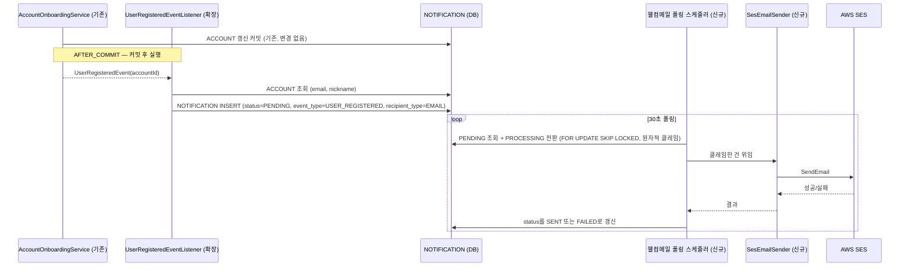
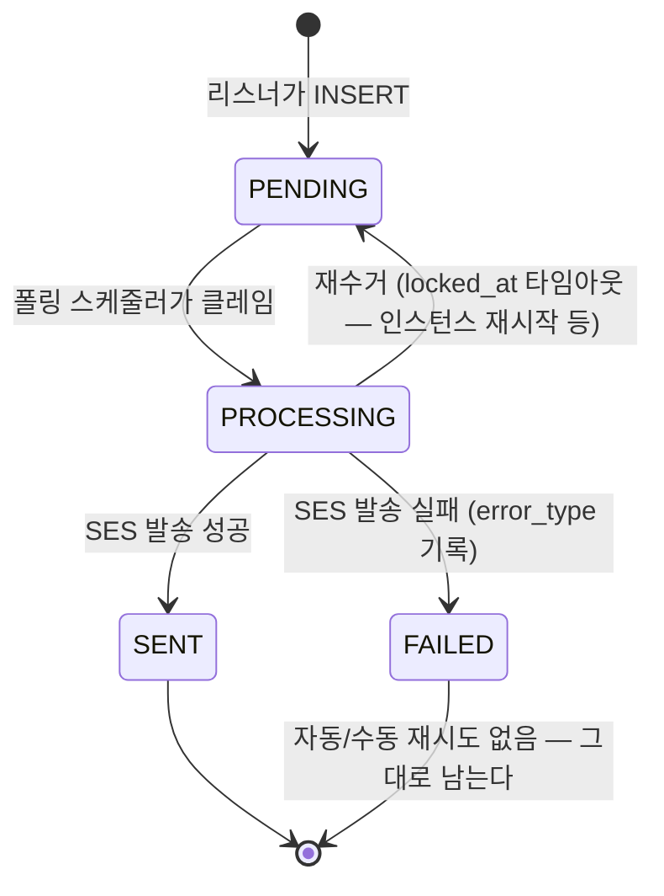

# 알림 — 회원가입 웰컴메일 (USER_REGISTERED · EMAIL)

> ERD: [NOTIFICATION](../../docs/erd/NOTIFICATION.md), [NOTIFICATION_TEMPLATE](../../docs/erd/NOTIFICATION_TEMPLATE.md)
> 관련: [user-onboarding/spec.md](../user-onboarding/spec.md) (트리거 쪽 계약)
> 생성일: 2026-09-12 · 상태: 구현중

## 범위

알림 시스템 전체(모집 시작·마감임박·신청접수·승인/거절·세션리마인드·출석경고, 디스코드, 묶어보내기,
자동 재시도, 참가자 수신설정 화면)는 이 스펙의 대상이 아니다. 백오피스는 **조회**(템플릿·발송 이력)만
이번 스펙에 포함하고 편집·재발송은 대상이 아니다.

이 스펙은 **회원가입 완료 → 웰컴메일 발송 1건**을 처음이자 유일한 구현 대상으로 다룬다. 다만 이 기능이
`NOTIFICATION`/`NOTIFICATION_TEMPLATE` 테이블을 새로 만드는 첫 사례이므로, 두 테이블의 스키마는 향후
다른 이벤트가 재사용할 수 있는 모양으로 정의한다. **재사용 가능하게 정의하는 것과 지금 그 기능을
구현하는 것은 다르다** — 예를 들어 재시도 체인용 컬럼은 이번 스키마에 넣지 않는다([뺀 것](#이번-스펙에서-뺀-것) 참고).

발송 자체는 이벤트 리스너 + 폴링 스케줄러로만 동작하는 백그라운드 기능이라 공개 API 가 없지만,
백오피스에서 템플릿·발송 이력을 **조회**할 수 있어야 한다는 요구가 있어 읽기 전용 API 2개는 이번
스펙에 포함한다 — [백오피스 — 알림 조회](#백오피스--알림-조회-읽기-전용).

| Method | Path | 설명 | 인증 | 상태 |
|--------|------|------|------|------|
| GET | `/back-office/notification-templates` | 알림 템플릿 목록 조회 | O (백오피스) | 구현중 |
| GET | `/back-office/notifications` | 발송 이력 조회 | O (백오피스) | 구현중 |

### 이 기능이 "알림(Notification)" 으로 추상화되고 이벤트 핸들러 방식으로 개발된다는 것의 확인

맞다 — 이 스펙이 이미 그 모양이다. 회원가입은 `UserRegisteredEvent` 를 발행하기만 하고, "누구에게
무엇을 어떻게 보낼지"는 전혀 모른다. 그 판단과 실제 발송은 전부 이 이벤트를 구독하는 알림 쪽
코드(리스너 → `NOTIFICATION` INSERT → 폴링 → 발송기)가 가진다. 다음 이벤트(모집 시작 등)를 추가할
때도 트리거 쪽은 이벤트 하나 더 발행하는 것으로 끝나고, 알림 쪽은 새 리스너 하나를 더 구독시키면
된다 — 알림 설계 문서의 "이벤트/채널 분리" 원칙 그대로다.

## 트리거 — 이미 있는 것

`UserRegisteredEvent`(`domain/account`)와 그걸 받는 `UserRegisteredEventListener`(`api/auth`)는
이미 구현돼 있다. 지금은 로그만 남긴다:

```java
@TransactionalEventListener(phase = TransactionPhase.AFTER_COMMIT)
public void onUserRegistered(UserRegisteredEvent event) {
    log.info("UserRegisteredEvent accountId={}", event.accountId());
}
```

이 스펙이 구현할 것은 **이 리스너를 확장해서 로그 대신 `NOTIFICATION` 행을 만드는 것**이다. 새 리스너를
따로 만들지, 이 메서드를 확장할지는 구현 단계 판단.

- **payload는 `accountId` 뿐** — [user-onboarding/spec.md §완료 처리와 이벤트](../user-onboarding/spec.md#완료-처리와-이벤트). 이름·이메일 등은 리스너가 `AccountRepository` 로 직접 읽는다.
- **ACCOUNT 당 정확히 1회** — 온보딩 완료 시점의 멱등 처리가 보장한다. 이 스펙에서 추가 중복 방지는 안 한다.
- **phase 는 `AFTER_COMMIT` 을 그대로 쓴다.** 알림 설계 문서 초안은 `BEFORE_COMMIT`(User INSERT 와 원자적 커밋)을 검토했지만, 이미 병합된 온보딩 스펙·코드가 `AFTER_COMMIT` 로 확정해 배포돼 있다 — ACCOUNT 트랜잭션이 이미 커밋된 뒤에 이벤트가 나가므로 이제 와서 `BEFORE_COMMIT` 으로 바꿔도 원자성을 얻지 못한다. 대신 이 선택이 만드는 실패 창구는 [실패 시 동작](#실패-시-동작)에 명시한다.

## 모듈 구조

새 Gradle 모듈 `notification` 을 추가한다 — **서버를 분리하는 것은 아니다.** 지금 배포되는
단위는 여전히 `:api` 하나뿐이고, `notification` 은 `:domain`/`:common` 처럼 `:api` 가 가져다 쓰는
라이브러리 모듈이다. 나중에 실제로 알림을 별도 서버로 떼어낼 가능성이 리드 회의에서 이미 언급된
상태라(알림 설계 이슈 코멘트), 그 경계를 지금부터 모듈로 그어 두면 그때 가서 패키지를 통째로 들어내는
정도로 끝난다.

```
backend/
├── api/            # 기존 그대로 — 컨트롤러(백오피스 조회 포함)·시큐리티
├── domain/         # 기존 그대로 — Account 등 핵심 도메인
├── notification/   # 신규 — NOTIFICATION·NOTIFICATION_TEMPLATE 엔티티+리포지토리,
│                   #        UserRegisteredEvent 리스너, 폴링 스케줄러, SES 발송기
└── common/         # 기존 그대로
```

- 의존 방향: `api → notification → domain → common` (기존 `api → domain → common` 은 그대로 유지)
- `notification` 이 `domain` 에 의존하는 이유: `UserRegisteredEvent` 타입과 닉네임 조회용
  `AccountRepository` 가 `domain` 에 있다. **이 의존이 있는 한 완전한 서버 분리는 아직 안 된 상태다** —
  진짜로 분리하려면 인프로세스 이벤트 대신 메시지 큐 등으로 이 결합을 끊어야 한다. 지금은 그 작업을 하지
  않는다는 것도 이 스펙의 결정이다.
- `api` 모듈에는 **백오피스 컨트롤러(REST 표현 계층)만** 남기고, 실제 조회 로직은 `notification` 모듈의
  서비스에 위임한다 — [module-structure.md](../../docs/backend-development-guide/module-structure.md) 의
  "컨트롤러는 api" 원칙과 충돌하지 않는다.
- 기존 `UserRegisteredEventListener`(`api/auth`, 지금은 로그만 남김)는 이 기능 범위에서는 폐기하고,
  같은 이벤트를 구독하는 리스너를 `notification` 모듈에 새로 둔다. `AccountOnboardingService` 쪽은
  변경이 없다 — 이벤트 발행자는 구독자가 몇 개든, 어느 모듈에 있든 알 필요가 없다.
- `docs/backend-development-guide/module-structure.md` 는 3모듈(레이어 기준) 구조만 설명한다 —
  이 문서 갱신은 구현 PR에서 같이 한다.

## 처리 흐름



클레임 쿼리는 알림 설계 문서에서 이미 확정한 것을 그대로 쓴다 — 두 스레드/인스턴스가 같은 순간에 폴링해도
`SELECT ... FOR UPDATE SKIP LOCKED` 로 서로 다른 행만 잠근다:

```sql
SELECT id, event_type, recipient_type, recipient_value, recipient_user_id, template_id, payload
FROM notification
WHERE status = 'PENDING'
  AND (scheduled_at IS NULL OR scheduled_at <= UTC_TIMESTAMP())
ORDER BY COALESCE(scheduled_at, created_at)
LIMIT 100
FOR UPDATE SKIP LOCKED;

UPDATE notification SET status = 'PROCESSING', locked_at = UTC_TIMESTAMP() WHERE id IN (:ids);
-- 여기서 COMMIT. SES 호출은 커밋 이후 별도로.
```

웰컴메일은 항상 `scheduled_at IS NULL`(즉시 발송)이라 이번 구현에서 `scheduled_at` 조건은 사실상
`TRUE` 로만 동작하지만, 컬럼과 쿼리는 시간 트리거형 이벤트(세션 리마인드 등)가 그대로 재사용할 수 있게
지금부터 이 모양으로 둔다.

- 클레임(SELECT+UPDATE)과 실제 SES 호출은 **반드시 다른 트랜잭션**이다 — 네트워크 호출을 트랜잭션 안에 넣지 않는다.
- 인덱스 초기 후보는 `(status, created_at)` — 없으면 폴링마다 풀스캔. 다만 이건 후보일 뿐, 최종 인덱스는
  구현 시 실제 데이터로 실행 계획(EXPLAIN)을 보고 정한다(리뷰 코멘트).
- **배치 크기 = 100** (확정). 폴링 주기(30초)보다 배치가 커서 밀리면 다음 폴링에서 나머지를 그대로 이어서 클레임하므로(SKIP LOCKED), 100건이 30초 안에 다 안 나가도 유실되지 않는다.

### 재수거(reclaim) 타임아웃 — 5분 권장

`PROCESSING` 인 채로 `locked_at` 이 **5분(300초)** 지난 행은 다시 `PENDING` 으로 되돌린다:

```sql
UPDATE notification
SET status = 'PENDING', locked_at = NULL
WHERE status = 'PROCESSING'
  AND locked_at < UTC_TIMESTAMP() - INTERVAL 5 MINUTE;
```

**근거**: 배치 100건을 순차로 SES 호출한다고 가정하면(발송기가 병렬화하지 않는 한) SES 호출 1건이
아무리 느려도 수백 ms~1초 수준이라 100건 전체가 끝나는 데 넉넉히 잡아도 1~2분이다. 5분은 그 위에
3배 안팎의 여유를 둔 값이라, 정상적으로 처리 중인 배치를 다른 인스턴스가 실수로 다시 채가는 일은 거의
없으면서도, 인스턴스가 죽어 멈춘 행은 최대 5분 안에 회수된다. 이 폴링 주기(30초)와 함께 애플리케이션
설정값으로 두어 운영 중에 조정 가능하게 한다 — 하드코딩하지 않는다.
- 재수거 쿼리는 클레임 쿼리 실행 **직전**(같은 폴링 사이클, 별도 트랜잭션)에 돌린다.

## 데이터 모델

### NOTIFICATION

| 컬럼 | 타입 | NULL | 설명 |
|---|---|---|---|
| ID | BIGINT PK | N | |
| EVENT_TYPE | VARCHAR(40) | N | 이번 구현에서 쓰는 값은 `USER_REGISTERED` 뿐. 다른 5종은 코드에 없음 |
| RECIPIENT_TYPE | VARCHAR(20) | N | 이번 구현에서 쓰는 값은 `EMAIL` 뿐. `DISCORD` 는 정의하지 않는다 |
| RECIPIENT_VALUE | VARCHAR(255) | N | 발송 시점 이메일 스냅샷 (나중에 회원이 이메일을 바꿔도 이 값은 그대로) |
| RECIPIENT_USER_ID | BIGINT FK→ACCOUNT | N | 웰컴메일은 항상 본인 수신이라 이번 구현에서는 NULL 이 나오지 않는다. 컬럼 자체는 nullable(운영 공용 발송 등 미래 대비) |
| TEMPLATE_ID | BIGINT FK→NOTIFICATION_TEMPLATE | N | |
| PAYLOAD | JSON | N | `{"nickname": "..."}`. 리스너가 INSERT 시점에 `ACCOUNT.NICKNAME` 을 읽어 스냅샷 (발송 시점에 다시 조회하지 않음 — RECIPIENT_VALUE 와 같은 이유) |
| STATUS | VARCHAR(20) | N | `PENDING`/`PROCESSING`/`SENT`/`FAILED` |
| LOCKED_AT | DATETIME | Y | PROCESSING 전환 시각. 재수거 판단 기준 |
| ERROR_TYPE | VARCHAR(30) | Y | FAILED 일 때만. `TEMPLATE_MISSING`/`INVALID_RECIPIENT`/`PROVIDER_ERROR`/`UNKNOWN`. 자동 재시도 판단에는 안 쓴다(이번 구현엔 자동 재시도가 없음) — 실패 원인을 나중에 사람이 보기 위한 값 |
| SCHEDULED_AT | DATETIME | Y | 이번 구현에서는 항상 NULL(즉시 발송). 시간 트리거형 이벤트를 위해 컬럼만 미리 둔다 |
| SENT_AT | DATETIME | Y | 발송 성공 시각 |
| CREATED_AT / UPDATED_AT | DATETIME | N | `BaseEntity` |

> **소스**: 신규 테이블 — 소스 컬럼 표기 대상 없음. PAYLOAD.nickname 의 소스는 `ACCOUNT.NICKNAME`(스냅샷, INSERT 시점).

### NOTIFICATION_TEMPLATE

문구를 코드/파일로 관리하면 문구 하나 고칠 때마다 PR·배포가 필요해진다는 이유로 DB 저장으로 정한다
(알림 설계 문서에서 이미 검토·확정). 백오피스에서 **조회는 이번 구현에 포함**하지만(아래
[백오피스 — 알림 조회](#백오피스--알림-조회-읽기-전용)), **편집 화면은 별도 기능** — 이번 구현은
마이그레이션으로 웰컴메일 템플릿 1행만 시딩한다.

| 컬럼 | 타입 | NULL | 설명 |
|---|---|---|---|
| ID | BIGINT PK | N | |
| EVENT_TYPE | VARCHAR(40) | N | `USER_REGISTERED` |
| CHANNEL | VARCHAR(20) | N | `EMAIL` |
| SUBJECT | VARCHAR(255) | N | |
| BODY | TEXT | N | `{{nickname}}` 플레이스홀더 포함 |
| UPDATED_AT | DATETIME | N | `BaseEntity` |
| UPDATED_BY_ADMIN_ID | BIGINT FK→ACCOUNT | Y | 편집 화면이 아직 없어 이번 구현에서는 항상 NULL(마이그레이션이 만든 행) |

- `UNIQUE(EVENT_TYPE, CHANNEL)`

### 상태 전이



`FAILED` 로 남은 건 이번 구현 범위에서는 **아무 것도 자동으로 하지 않는다** — 재시도 버튼도, 운영 알림도
없다. [이번 스펙에서 뺀 것](#이번-스펙에서-뺀-것) 참고.

## 백오피스 — 알림 조회 (읽기 전용)

"백오피스에서 템플릿과 발송 주소(수신처)를 볼 수 있어야 한다"는 요구를 읽기 전용 API 2개로 반영한다.
**편집·재발송은 이번 구현에 없다** — 둘 다 조회만.

인증은 기존 백오피스 로그인 플로우(`POST /auth/social-login`, `platform=BACK_OFFICE`)를 그대로 쓴다 —
이 스펙이 새 권한 체계를 만들지는 않는다. 다만 그 로그인의 인가 방식 자체가 지금의 이메일 allowlist에서
`ACCOUNT.SYSTEM_ROLE = ADMIN` 검사로 바뀔 예정이다(리뷰 코멘트, 이 스펙과 별개로 진행되는 변경) — 이
두 엔드포인트는 그 변경이 어떤 시점에 나가든 **그때의 백오피스 인가 방식을 그대로 따른다**는 것이
이번 결정이다. 스터디 캡틴용 별도 권한은 두지 않는다. 알림 설계 문서 원안(§1)의 "캡틴만 열람"은 이
스펙에서는 따르지 않는다 — 웰컴메일은 특정 스터디에 속하지 않는 계정 단위 알림이라 캡틴이 볼 이유가
약하다.

`SYSTEM_ROLE = ADMIN` 검사가 로그인 시점이 아니라 요청마다 걸리는 역할 검사로 바뀌면, "로그인은 됐지만
ADMIN이 아님"과 "토큰 자체가 없음/만료"를 구분해야 한다 — 아래 각 엔드포인트의 에러 응답에 `403
FORBIDDEN`을 추가했다.

### `GET /back-office/notification-templates`

- **인증**: 필요 (백오피스)
- **설명**: 등록된 알림 템플릿 전체 목록. 이번 구현에는 웰컴메일 1건뿐이지만, 다음 이벤트가 추가돼도
  같은 응답 모양을 그대로 쓴다
- **Query Parameters**: 없음 (템플릿 수가 몇 개 안 되므로 페이지네이션 없이 전체 반환)

```json
[
  {
    "id": 1,
    "eventType": "USER_REGISTERED",
    "channel": "EMAIL",
    "subject": "StudyClub++에 오신 걸 환영합니다",
    "body": "안녕하세요, {{nickname}}님...",
    "updatedAt": "2026-09-12T00:00:00Z",
    "updatedByAdminId": null
  }
]
```

| 필드 | 타입 | NULL | 설명 | 소스 |
|---|---|---|---|---|
| id | Long | N | | NOTIFICATION_TEMPLATE.ID |
| eventType | String | N | | NOTIFICATION_TEMPLATE.EVENT_TYPE |
| channel | String | N | | NOTIFICATION_TEMPLATE.CHANNEL |
| subject | String | N | | NOTIFICATION_TEMPLATE.SUBJECT |
| body | String | N | 플레이스홀더(`{{nickname}}`)가 그대로 포함된 원문 | NOTIFICATION_TEMPLATE.BODY |
| updatedAt | String | N | ISO-8601 UTC | NOTIFICATION_TEMPLATE.UPDATED_AT |
| updatedByAdminId | Long | Y | 편집 화면이 없어 이번 구현에서는 항상 `null` | NOTIFICATION_TEMPLATE.UPDATED_BY_ADMIN_ID |

**Error Responses**:

| 상태 | errorCode | 조건 |
|---|---|---|
| 401 | UNAUTHORIZED | 토큰 없음/만료 |
| 403 | FORBIDDEN | 로그인은 됐지만 백오피스 인가 조건(현재 allowlist, 추후 `SYSTEM_ROLE = ADMIN`)을 만족하지 않음 |

### `GET /back-office/notifications`

- **인증**: 필요 (백오피스)
- **설명**: 발송 이력 — 어떤 이벤트로, 어느 주소로, 어떤 상태로 나갔는지
- **Query Parameters**: `eventType`(선택), `status`(선택), `offset`(기본 0), `limit`(기본 20) 만 —
  기간(날짜 범위) 필터·정렬 옵션은 요구된 바 없어 이번 구현에 넣지 않는다

```jsonc
{
  "items": [
    {
      "id": 10,
      "eventType": "USER_REGISTERED",
      "recipientType": "EMAIL",
      "recipientValue": "h***@gmail.com",
      "status": "SENT",
      "templateId": 1,
      "sentAt": "2026-09-12T00:00:05Z",
      "createdAt": "2026-09-12T00:00:00Z"
    }
  ],
  "total": 1,
  "offset": 0,
  "limit": 20
}
```

| 필드 | 타입 | NULL | 설명 | 소스 |
|---|---|---|---|---|
| id | Long | N | | NOTIFICATION.ID |
| eventType | String | N | | NOTIFICATION.EVENT_TYPE |
| recipientType | String | N | | NOTIFICATION.RECIPIENT_TYPE |
| recipientValue | String | N | **마스킹됨** (`h***@gmail.com`) — [security-guide.md](../../docs/backend-development-guide/security-guide.md) 의 이메일 마스킹 규칙 그대로 | NOTIFICATION.RECIPIENT_VALUE, 계산: 마스킹 |
| status | String | N | `PENDING`/`PROCESSING`/`SENT`/`FAILED` | NOTIFICATION.STATUS |
| templateId | Long | N | | NOTIFICATION.TEMPLATE_ID |
| sentAt | String | Y | ISO-8601 UTC | NOTIFICATION.SENT_AT |
| createdAt | String | N | ISO-8601 UTC | NOTIFICATION.CREATED_AT |

**Error Responses**:

| 상태 | errorCode | 조건 |
|---|---|---|
| 401 | UNAUTHORIZED | 토큰 없음/만료 |
| 403 | FORBIDDEN | 로그인은 됐지만 백오피스 인가 조건(현재 allowlist, 추후 `SYSTEM_ROLE = ADMIN`)을 만족하지 않음 |

**결정 — `recipientValue` 마스킹 예외는 두지 않는다.** 운영진이 특정 회원 문의 대응 시 이메일 원문
대조가 필요해질 수 있다는 점은 알아두되, 이번 구현에서는 고려하지 않는다 — 필요해지면 별도 스펙에서
"본인 확인 후 원문 조회" 같은 형태로 다룬다.

### 프론트엔드 사용처

- 아직 없음 — `back-office-front` 쪽 화면은 후속. 이 절은 API 계약만 정의한다.

## 웰컴메일 콘텐츠

- 트리거: `USER_REGISTERED`, 채널: `EMAIL`, 발송 시점: 즉시(`scheduled_at = NULL`)
- 제목: `StudyClub++에 오신 걸 환영합니다`
- 본문은 알림 이벤트 카탈로그 문서의 초안을 그대로 쓰되, **`{{name}}` 을 `{{nickname}}` 으로 바꾼다** — 이 서비스는 실명(`NAME`) 컬럼을 두지 않기로 이미 결정했고([user-onboarding/spec.md](../user-onboarding/spec.md)), 화면에 보여줄 이름은 `ACCOUNT.NICKNAME` 하나뿐이다.
- 마케팅 수신 동의 여부와 무관하게 발송 — 가입 완료를 알리는 트랜잭션 메일이라 `ACCOUNT_CONSENT.MARKETING` 을 확인하지 않는다(이벤트 카탈로그 문서의 코멘트로 이미 확정: 홍보 문구를 최소화하고 정보 안내용으로 유지).

```
안녕하세요, {{nickname}}님.

StudyClub++ 회원가입이 완료되었습니다.
가입을 환영합니다!

StudyClub++ 바로가기

이 메일은 회원님의 가입 요청에 따라 가입 완료 사실을 안내하기 위해 발송되었습니다.

직접 가입하지 않으셨거나 계정 관련 문의가 있다면 support@studyclub-plusplus.com으로 연락해 주세요.

감사합니다.
StudyClub++ 드림
```

렌더링은 `{{nickname}}` 문자열 치환 하나뿐이라 별도 템플릿 엔진 라이브러리 없이 `String.replace` 로
충분하다고 본다. 두 번째 이벤트(변수 여러 개·조건부 문구)가 생기면 그때 라이브러리 도입을 재검토한다.

## 메일 발송 자격증명 (환경 설정)

SES 자격증명·발신 도메인은 notification 모듈의 `src/main/resources/notification.yml` 에
`mail` 하위로 **용도별 5개 카테고리**를 미리 정의해
두고, 값은 전부 env var 로 주입한다(PUBLIC 레포 — 레포에 평문 금지, [AGENT.md](../../AGENT.md)):

```yaml
mail:
  auth:
    configuration-set-name: ${MAIL_AUTH_CONFIGURATION_SET_NAME:}
    region: ${MAIL_AUTH_REGION:}
    sub-domain: ${MAIL_AUTH_SUB_DOMAIN:}
    from-address: ${MAIL_AUTH_FROM_ADDRESS:}
    access-key-id: ${MAIL_AUTH_ACCESS_KEY_ID:}
    secret-access-key: ${MAIL_AUTH_SECRET_ACCESS_KEY:}
  news:
    configuration-set-name: ${MAIL_NEWS_CONFIGURATION_SET_NAME:}
    region: ${MAIL_NEWS_REGION:}
    sub-domain: ${MAIL_NEWS_SUB_DOMAIN:}
    from-address: ${MAIL_NEWS_FROM_ADDRESS:}
    access-key-id: ${MAIL_NEWS_ACCESS_KEY_ID:}
    secret-access-key: ${MAIL_NEWS_SECRET_ACCESS_KEY:}
  notify:
    configuration-set-name: ${MAIL_NOTIFY_CONFIGURATION_SET_NAME:}
    region: ${MAIL_NOTIFY_REGION:}
    sub-domain: ${MAIL_NOTIFY_SUB_DOMAIN:}
    from-address: ${MAIL_NOTIFY_FROM_ADDRESS:}
    access-key-id: ${MAIL_NOTIFY_ACCESS_KEY_ID:}
    secret-access-key: ${MAIL_NOTIFY_SECRET_ACCESS_KEY:}
  order:
    configuration-set-name: ${MAIL_ORDER_CONFIGURATION_SET_NAME:}
    region: ${MAIL_ORDER_REGION:}
    sub-domain: ${MAIL_ORDER_SUB_DOMAIN:}
    from-address: ${MAIL_ORDER_FROM_ADDRESS:}
    access-key-id: ${MAIL_ORDER_ACCESS_KEY_ID:}
    secret-access-key: ${MAIL_ORDER_SECRET_ACCESS_KEY:}
  cs:
    configuration-set-name: ${MAIL_CS_CONFIGURATION_SET_NAME:}
    region: ${MAIL_CS_REGION:}
    sub-domain: ${MAIL_CS_SUB_DOMAIN:}
    from-address: ${MAIL_CS_FROM_ADDRESS:}
    access-key-id: ${MAIL_CS_ACCESS_KEY_ID:}
    secret-access-key: ${MAIL_CS_SECRET_ACCESS_KEY:}
```

- 카테고리별로 `region` · `sub-domain`(예: `notify.studyclub-plusplus.com`) · `from-address` · SES
  발송용 `access-key-id`/`secret-access-key` 를 따로 둔다 — 카테고리마다 다른 AWS 리전·발신
  서브도메인·IAM 자격증명을 쓸 수 있게 하기 위해서다(**결정 — 리전도 카테고리마다 달라질 수 있게
  설계**. 공통값 하나로 묶지 않는다). 값은 기존 `google.client-secret: ${GOOGLE_CLIENT_SECRET:}` 과
  같은 방식으로 env var 참조만 남기고 커밋하지 않는다.
- **이번 구현이 실제로 쓰는 건 `mail.notify.*` 뿐이다.** 웰컴메일은 "알림(notify)" 카테고리로 분류한다.
  `auth`/`news`/`order`/`cs` 는 값도, 이걸 읽는 코드도 이번 PR 에는 없다 — 나중에 다른 발송 기능(가입
  인증메일, 뉴스레터, 주문, CS)이 생겼을 때 같은 스키마를 그대로 재사용하기 위해 이름만 먼저 정의해
  두는 것이다. `SesEmailSender` 는 `mail.notify.region`/`access-key-id`/`secret-access-key` 로 SES
  클라이언트를 구성하고 `mail.notify.from-address` 로 발신한다.
- SES 발신 도메인의 실제 인증(DKIM 등록 등)은 AWS 콘솔에서 하는 운영 작업이라 이 스펙 범위 밖이다 —
  구현 전에 `mail.notify.sub-domain` 이 SES 에서 인증 완료된 상태여야 한다.
- **결정 — 로컬 개발 환경도 별도 목킹 없이 실제 SES 로 발송한다.** `mail.notify.*` 환경변수가 제대로
  채워져 있으면(로컬이든 운영이든) 그대로 SES 를 호출한다. 값이 비어 있으면(로컬에 `.env` 를 안 채운
  경우 등) SES 호출 시점에 에러가 나고 그 `NOTIFICATION` 행은 `FAILED` 로 남는 것으로 충분하다 — 이걸
  막으려는 별도 no-op/모킹 모드는 만들지 않는다.
- AWS SDK(SES) 의존성 추가는 [AGENT.md](../../AGENT.md) 의 "외부 라이브러리 임의 추가 금지 — 합의
  필수" 대상 — 구현 PR 리뷰에서 확인한다.

API의 `application.yml`은 `spring.config.import: classpath:notification.yml`로 모듈 설정을 읽는다.
`notification.polling.*` 기본값도 같은 파일에서 관리한다. 로컬의 실제 값은
`spring.config.additional-location`으로 읽는 외부 `secrets/application-local.yml`에서 덮어쓴다.

### SES configuration set

`mail.{category}.configuration-set-name`으로 카테고리별 구성 세트 이름을 지정한다.
값이 있으면 SES `SendEmail` 요청의 `ConfigurationSetName`에 전달한다.
미설정·빈 문자열·공백만 있는 값은 요청에서 생략하여 SES 발신 identity의 기본 설정을 따른다.
구성 세트 생성과 이벤트 수집 대상 설정은 인프라에서 관리한다.
참고: [SES SendEmail](https://docs.aws.amazon.com/ses/latest/APIReference/API_SendEmail.html).

## 실패 시 동작

`AFTER_COMMIT` 리스너 안에서 `NOTIFICATION` INSERT 가 실패하면(예: 그 순간 DB 커넥션 문제):

- 생성 서비스는 `REQUIRES_NEW` 로 새 트랜잭션을 연다. 기본 `REQUIRED` 는 AFTER_COMMIT 에 남은 기존 자원에 참여해 INSERT 가 커밋되지 않을 수 있다.
- ACCOUNT 트랜잭션은 이미 커밋된 뒤라 롤백되지 않는다 — 회원가입 자체는 그대로 성공한다.
- `@TransactionalEventListener(AFTER_COMMIT)` 는 커밋 성공 후 `afterCompletion` 경로에서 실행된다. 일반 `TransactionSynchronization.afterCommit()` 과는 다르며, 리스너 예외는 호출자에게 전파되지 않는다. 구현은 수신자 정보가 포함될 수 있는 예외 전문 대신 계정 ID와 예외 종류만 로그로 남긴다.
- 이 경우 그 회원은 **웰컴메일을 영영 못 받는다** — `NOTIFICATION` 행 자체가 안 생겼으니 폴링도, 나중에 만들 재시도 버튼도 대상을 못 찾는다.

이 위험은 알림 설계 문서가 `BEFORE_COMMIT` 으로 막으려던 바로 그 문제이지만, 위에서 설명했듯 이미
`AFTER_COMMIT` 이 확정·배포돼 있어 이번 스펙에서는 되돌리지 않는다.

**결정 — 이 유실 위험은 MVP 로 받아들인다.** 웰컴메일은 "못 받아도 서비스 이용에 지장 없는" 안내성
메일이고, 이 실패 창구를 없애려면 다시 `BEFORE_COMMIT`(또는 아웃박스를 진짜로 원자적으로 만드는 다른
방법)으로 돌아가야 하는데 그건 이미 배포된 온보딩 쪽 결정을 건드리는 별도 작업이다. 실패를 감지하는
운영 알림도 별도로 만들지 않는다(알림 설계 문서에서 이미 검토 후 안 붙이기로 확정한 것과 같은 결).

## 이번 스펙에서 뺀 것

알림 설계 문서(§1 이미 정해진 내용)에 있지만 이번 구현에는 없는 것과 이유:

| 뺀 것 | 이유 |
|---|---|
| `ORIGIN`/`ROOT_NOTIFICATION_ID`/`FINAL_STATUS`/`RETRY_COUNT`/`TRIGGERED_BY_ADMIN_ID` 컬럼 | 재시도(자동·수동) 자체를 이번에 구현하지 않는다 — "웰컴메일은 자동 재시도 없이, 필요하면 MVP 이후 추가"(알림 설계 이슈 코멘트). 재시도 기능을 실제로 만들 때 컬럼을 추가한다 |
| `NotificationSender` 전략 인터페이스 | 지금 구현체가 `SesEmailSender` 하나뿐이라 인터페이스를 두면 과잉 추상화([ddd-guide.md](../../docs/backend-development-guide/ddd-guide.md) 안티패턴 참고). 디스코드 발송기가 실제로 추가될 때 도입 |
| 디스코드 채널 | "지금은 메일만, 추후 고려"(코멘트) |
| FR-05 묶어 보내기(다이제스트) | 웰컴메일은 수신자가 매번 다른 개인이라 그룹 크기가 항상 1 — 적용 대상 자체가 없다 |
| 참가자 수신설정 화면 | 웰컴메일은 수신거부 대상이 아닌 안내 메일 — 별도 스펙 |
| 백오피스 **편집**(템플릿 수정, 재발송 버튼) | 조회는 이번 구현에 포함([백오피스 — 알림 조회](#백오피스--알림-조회-읽기-전용))했지만 편집·재발송은 별도 스펙 — 재시도 자체가 아직 없어서 재발송 버튼도 걸 대상이 없다 |
| 자동 재수집형 실패 알림(디스코드 운영 알림 등) | 알림 설계 문서에서도 검토 후 안 붙이기로 확정 |

## 미확정

없음 — 이번 스펙에 있던 모든 [NEEDS CLARIFICATION] 항목을 확정했다. 각 섹션의 "결정 —" 문단 참고.

## 한계 / 후속

- 나머지 5개 알림 이벤트(모집 시작·마감임박·신청접수·승인/거절·세션리마인드·출석경고), 디스코드 채널, 자동/수동 재시도, 묶어 보내기, 참가자 수신설정 화면 — 전부 별도 스펙.
- 백오피스 **조회**(템플릿 목록·발송 이력)는 이번 스펙에 포함하지만, **편집**(템플릿 수정·재발송 버튼)은 별도 스펙 — 재시도 기능이 없는 상태에서는 재발송 버튼을 만들 수 없다.
- 이 스펙 이후 두 번째 이벤트를 구현할 때 `NotificationSender` 전략 패턴·`RecipientResolver` 도입, 그리고 `notification` 모듈이 아직 `domain` 에 직접 의존하는 부분(진짜 서버 분리 시 끊어야 할 지점)을 재검토한다(알림 설계 문서 참고).
