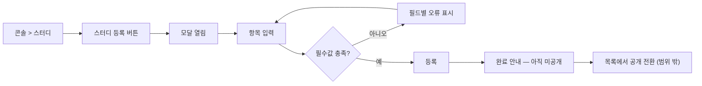

# 스터디 등록 (운영 콘솔) — 구현 스펙

> 기준 프로토타입: 운영 콘솔 › 스터디 관리 — https://playground.studyclub-plusplus.com/proto/console/studies
> 원본: PRD「스터디 등록」. 이 문서는 PRD 범위 안에서만 작성했고, PRD에 없던 결정은 협의로 확정해 반영했다 (현재 미확정 없음 → 11. 결정 사항).

---

## 1. 목적과 범위

운영자(캡틴)가 운영 콘솔의 「스터디 등록」 모달로 스터디를 등록한다. **등록 결과는 항상 미공개**이며, 공개 전환은 목록에서 별도로 한다.

### 인수 기준 (Acceptance Criteria)

| ID | 기준 |
| --- | --- |
| AC-1 | 제목·한 줄 소개·주제 세 필수 항목을 채우면 등록된다 |
| AC-2 | 등록한 스터디는 사용자 사이트(공개 API)에 노출되지 않는다. 운영 콘솔 조회 응답에는 포함된다 |
| AC-3 | 마감일을 지정하면 카드에 마감일이 표시되고, 그날이 지나면 「모집 마감」으로 바뀐다 |
| AC-4 | 마감일을 비우면(또는 상시 모집) 마감 없이 계속 모집한다 |
| AC-5 | 고른 주제가 목록에서 구분된다. 한 스터디가 여러 주제(최대 3)에 걸칠 수 있다 |

### 범위 밖 (각각 별도 Story)

공개 전환 · 신청 폼 연결 · 신청 접수 · 반 편성 · 등록 후 수정·삭제 · 주차별 커리큘럼·후기·통계 입력

---

## 2. 사용자 흐름



---

## 3. 데이터 모델

### 3.1 `study`

| 필드 | 타입 | 필수 | 제약 | null 의 의미 |
| --- | --- | --- | --- | --- |
| `title` | string | 필수 | 1~60자 | — |
| `summary` | string | 필수 | 비어 있으면 불가. 하드 상한 없음 (권장 25자는 경고만) | — |
| `description` | text | 선택 | 별도 길이 상한 없음.  **마크다운 허용.** 원문 그대로 저장, 렌더링(상세 페이지)은 별도 Story이나 렌더 시 sanitize 필요 | 상세 설명 없음 |
| `topics` | enum(11)[] | 필수 | 고정 목록, 1~3개 | — |
| `deadline` | date | 선택 | 오늘(KST) 이후 날짜만 등록 가능 | 마감 없이 계속 모집 (상시 모집) |
| `schedule` | string | 선택 | 자유 텍스트, 날짜 형식 강제 없음. 별도 길이 상한 없음 | 카드에 일정 미표시 |
| `published` | boolean | 필수 | **등록 시 항상 `false`**. 등록 API 입력으로 받지 않는다 | — |
| `created_by` | FK(Account) | 필수 | 등록한 운영자(Account). 서버가 인증 정보에서 채움 (요청 바디로 받지 않음) | — |

- 모집 상태는 **컬럼으로 저장하지 않는다** (→ 6. 계산 규칙).
- 필드명 `study.recruitment.deadline` 은 응답 JSON 상의 경로 표기다. 저장 컬럼은 `deadline`.
- 기존 상태: 저장 테이블 없음. `Study.java` 11줄, 목록 API는 하드코딩 2건 반환. → 테이블/엔티티 신설 필요.
- **STUDY에 공개 여부 필드(`published`)를 추가한다. 기본값은 미공개(`false`).**

### 3.2 주제 (Topic) 고정 목록 — 11종

기획이 정하고 API enum이 따라간다. 공용 패키지에 상수 목록을 두고 **등록 폼·카드·필터가 같은 값을 참조**한다.

| # | 라벨 |
| --- | --- |
| 1 | AI · ML |
| 2 | 알고리즘 |
| 3 | 데이터 |
| 4 | 소프트웨어 개발 |
| 5 | 커리어 |
| 6 | 북클럽 |
| 7 | 어학 |
| 8 | 라이프스타일 |
| 9 | 기획 · PM |
| 10 | 비즈니스 |
| 11 | 기타 |

- 표시 순서는 **등록 빈도 기준**이며 분류 우선순위와 별개로 관리한다. 위 표 순서(PRD 나열 순서)를 표시 순서로 쓰고, 코드값 명명은 구현 재량이다.
- API·목록 간에는 **라벨이 아닌 코드(enum 값)** 를 주고받는다.
- `topics`의 **첫 번째 원소가 대표 주제**이며 목록 카드의 색·아이콘을 결정한다 → 배열 순서를 보존해야 한다(선택 순서 유지).

---

## 4. 화면 명세 — 「스터디 등록」 모달

### 4.1 모달 공통 (#1)

- 제목 「스터디 등록」, 부제 없음.
- 닫기: 배경 클릭 · `Esc` · 「취소」.
- 포커스: 열릴 때 **한 번만** 첫 입력 요소로 이동. 입력 중에는 포커스를 옮기지 않는다.
- 열려 있는 동안 배경 스크롤 잠금.
- Tab 순환이 모달 안에 갇힌다 (focus trap).
- 모든 입력 항목이 **한 화면에** 들어와야 한다.
- 구현: 디자인 시스템 공용 모달 부품 사용.

### 4.2 필드 명세

| # | 필드 | 필수 | 동작 / 정책 | 데이터 |
| --- | --- | --- | --- | --- |
| 2 | 제목 | ✔ | 비어 있으면 등록 불가. **60자 초과 시 오류(하드 상한)**. 예시 「AI 논문 스터디」 | `title` |
| 2-1 | 제목 글자수 카운터 | — | `현재/권장` 형식 (`0/24`). 24자 초과 시 권장 범위 이탈 알림. **경고일 뿐 등록을 막지 않음**. 초과 시 카드에서 제목이 잘릴 수 있음 | — |
| 3 | 한 줄 소개 | ✔ | 비어 있으면 등록 불가. 글자수 하드 상한 없음(PRD 명시 값만 검증). 목록 카드에 노출, 길면 잘릴 수 있음. 예시 「AI 논문을 함께 읽고 토론합니다.」 | `summary` |
| 3-1 | 한 줄 소개 카운터 | — | `현재/권장` 형식 (`0/25`). 25자 초과 시 권장 범위 이탈 알림. **경고일 뿐 등록을 막지 않음**. 권장 이내면 카드에 온전히 노출 | — |
| 4 | 주제 | ✔ | 11종 중 선택. **1~3개**. 3개 선택 시 미선택 항목은 **비활성(누를 수 없음)**. 자유 입력 없음. 선택/미선택이 한눈에 구분되고 선택 개수 표시 | `topics` |
| 4-1 | 개수 안내 | — | 「최대 3개」 | — |
| 5 | 상세 설명 | 선택 | 목표·진행 방식·준비물·대상. **마크다운 입력 허용.** 스터디 상세 페이지에서 사용, **목록 카드에는 미노출** | `description` |
| 6 | 진행 일정 | 선택 | 자유 텍스트, 날짜 형식 강제 없음. 모집 마감일과 별개 개념(「언제 모이느냐」 vs 「언제까지 신청받느냐」). 요일·시간 기반 회차는 **반**이 가짐(별도 Story). 미설정 시 목록에 일정 미표시 | `schedule` |
| 6-1 | 일정 안내 | — | 「비우면 신청 시 가능한 시간을 받습니다」. 이 칸의 유무가 신청 화면을 가른다(있으면 참여 가능 확인, 없으면 가능한 시간 수집) — **신청 화면 구현은 범위 밖, 데이터만 정확히 저장** | — |
| 7 | 모집 마감일 | 선택 | 비우면 마감 없이 계속 모집. 이 값 하나로 모집 상태가 정해짐 (→ 6) | `deadline` (nullable) |
| 7-1 | 상시 모집 | — | 마감일 바로 옆에 배치. **선택 시 마감일 칸 잠김 + 기입값 삭제**. 해제 시 마감일 칸 재활성(값은 빈 상태). 마감일과 상시 모집은 동시에 설정될 수 없음 | (UI 상태. 저장은 `deadline = null`) |
| 8 | 취소 | — | 모달 닫기, 입력값 폐기. 작성 중 이탈 경고 등 세부 UX는 UI 작업에서 정한다 | — |
| 9 | 등록 | — | 주액션. 아래 4.3 참조 | `POST /api/studies` |

> **공개일 입력 없음.** 등록 폼에 공개일/예약 공개를 두지 않는다. 공개 여부는 신청 폼 연결 여부로 사람이 판단하며, 공개는 목록의 「공개 설정」에서 켠다 (신청 폼이 없으면 켤 수 없음 — 별도 Story).

### 4.3 등록 버튼 동작 (#9)

1. 클라이언트 검증 → 실패 시 해당 필드에 오류 표시, **저장 요청 안 함**.
2. 검증 통과 → `POST /api/studies` 호출, 처리중 상태 진입.
3. 성공 → 완료 화면으로 전환.
4. 실패 → 4.4의 실패 처리.

검토·승인 단계는 없다. 등록 결과는 늘 미공개다.

### 4.4 상태별 화면

| 상태 | 화면 | 카피 |
| --- | --- | --- |
| 기본 | 모든 입력 항목이 한 화면에 | — |
| 검증 실패 | 해당 필드에 오류 표시와 문구. **초점은 첫 오류 필드로** | 「제목을 입력하세요.」 / 「한 줄 소개를 입력하세요.」 / 「주제를 하나 이상 고르세요.」 / 「60자 이내로 입력하세요.」 |
| 처리중 | 등록이 진행 중임을 표시. **등록·취소 모두 비활성** (중복 제출 차단) | — |
| 완료 | 본문이 안내문으로 교체, **닫는 수단 하나만** 남음 | 「등록되었습니다. 아직 사이트에 보이지 않습니다 — 목록에서 공개를 켜세요.」 |
| 서버 실패 (400/403/500) | 화면은 **입력값 유지**. 400은 필드별 오류 매핑. 403·500의 화면/문구는 UI 작업에서 정한다 | UI 작업 |

### 4.5 오류 문구 매핑

| 조건 | 필드 | 문구 |
| --- | --- | --- |
| `title` 비어 있음 | 제목 | 제목을 입력하세요. |
| `title` > 60자 | 제목 | 60자 이내로 입력하세요. |
| `summary` 비어 있음 | 한 줄 소개 | 한 줄 소개를 입력하세요. |
| `topics` 0개 | 주제 | 주제를 하나 이상 고르세요. |

---

## 5. API 명세

### 5.1 `POST /api/studies` — 스터디 등록 (**미구현**)

- 권한: 스터디 개설 권한 = **캡틴 전원**. **서버에서 검증.**
- 요청 바디(제안 형태 — 필드명은 3.1 기준):

```json
{
  "title": "AI 논문 스터디",
  "summary": "AI 논문을 함께 읽고 토론합니다.",
  "topics": ["<TOPIC_CODE>", "<TOPIC_CODE>"],
  "description": "…",
  "schedule": "…",
  "deadline": "2026-08-25"
}
```

- `published`는 요청 바디에서 **받지 않는다** (보내더라도 무시하고 `false`로 저장).
- `deadline` 미전송/`null` = 상시 모집.
- 서버 검증: `title`·`summary`·`topics` 필수 · `title` ≤ 60자 · `topics`는 11종 enum 중 1~3개.
- 처리: `published = false`로 레코드 생성 → **목록 캐시 무효화**.
- 응답:

| 코드 | 의미 | 비고 |
| --- | --- | --- |
| 201 | 생성 성공 (Created) | 생성된 스터디 반환 (`published: false` 포함) |
| 400 | 검증 실패 (과거 마감일 포함) | **필드별 오류** 포함 |
| 403 | 권한 없음 | |
| 500 | 저장 실패 | 화면은 입력값 유지 |

### 5.2 조회

| 메서드 | 경로 | 권한 | 검증 위치 |
| --- | --- | --- | --- |
| GET | `/api/studies` | 공개 — **공개된(`published = true`) 건만** | — |
| — | 미공개 건 조회 (운영 콘솔용) | 운영 콘솔 접근 권한 | **서버** |

- **완료 정의**: 등록한 스터디가 **운영 콘솔 조회 응답에 포함**된다. 공개 API에는 포함되지 않는다.
- 기존 하드코딩 2건 응답은 **제거**하고 저장소(DB) 기반 조회로 대체한다. 시드 이관은 하지 않는다.

---

## 6. 계산 규칙 (저장하지 않는 값)

세 값 모두 아래 **단일 위치에서만 계산**하고 모든 화면이 공유한다. 화면별로 따로 계산하지 않는다.

| 값 | 식 | 단일 정의 위치 |
| --- | --- | --- |
| 모집 상태 | `deadline` 없음(null) 또는 `deadline` ≥ 오늘 → **모집중**, 그 외 → **모집 마감** | `lib/recruit.ts` |
| 공개 여부 | `published == false` → 미공개, 그 외 공개 | 공개 사이트 데이터 진입점 |
| 주제 표시 | `topics` → 고정 매핑. 목록으로 넘길 때는 **라벨이 아니라 코드** | 주제 매핑 모듈 |

- 「오늘」은 **KST(Asia/Seoul) 날짜 기준**이다. 마감일 당일까지 모집중, 다음 날부터 모집 마감.
- 등록 시 `deadline`이 오늘 이전이면 서버가 400으로 거절한다 (필드 오류: 마감일).
- 등록 시 모집 상태를 입력받지 않는다.

### 모집 상태 판정표

| 마감일 | 상태 | 카드 신청 수단 | 카드 날짜 표기 |
| --- | --- | --- | --- |
| 오늘 이후 (≥ 오늘) | 모집중 | 「신청하기」 가능 | 마감 2026-08-25 (`마감 YYYY-MM-DD`) |
| 미설정 (상시) | 모집중 | 「신청하기」 가능 | 표기 없음 |
| 지남 (< 오늘) | 모집 마감 | 「모집 마감」 (신청 불가) | 표기 없음 |

---

## 7. 구현 가이드 (모듈 배치)

| 대상 | 위치 / 방식 |
| --- | --- |
| 주제 상수 목록 | **공용 패키지**에 두고 등록 폼·카드·필터가 동일 참조. 백엔드 enum과 값 동기화 |
| 모집 상태 계산 | `lib/recruit.ts` 한 곳 |
| 공개 여부 필터 | 공개 사이트 데이터 진입점 한 곳 |
| 주제 표시 매핑 | 주제 매핑 모듈 (코드 → 라벨/색/아이콘) |
| 모달 | 디자인 시스템 공용 모달 부품 |
| 백엔드 | `Study` 도메인 확장(현재 11줄) + 저장 테이블 신설 + `published` 컬럼(default false) |

---

## 8. 검증 규칙 요약

| 규칙 | 클라이언트 | 서버 |
| --- | --- | --- |
| title 필수 | ✔ | ✔ |
| title ≤ 60자 | ✔ (하드) | ✔ |
| title > 24자 | 경고만 | — |
| summary 필수 | ✔ | ✔ |
| summary > 25자 | 경고만 | — |
| topics 1~3개 | ✔ (4번째 선택 UI로 차단) | ✔ |
| topics 11종 enum | UI 선택지 제한 | ✔ |
| deadline 오늘(KST) 이후 | ✔ | ✔ |
| deadline ↔ 상시 모집 상호 배타 | ✔ (UI) | 저장은 `deadline = null` |
| published | 입력 없음 | 항상 `false` |
| 권한 | — | ✔ (**서버 기준**) |

---

## 9. 테스트 시나리오

**등록 성공**
1. 제목·한 줄 소개·주제 1개만 입력 → 등록 성공, 완료 안내 표시.
2. 등록 직후 운영 콘솔 조회 응답에 포함되고 `published = false`. 공개 `GET /api/studies`에는 없음. (AC-1, AC-2)
3. 선택 항목(상세 설명·일정·마감일) 모두 비워도 성공. (AC-4)

**검증 실패**
4. 제목 공란 → 「제목을 입력하세요.」, 초점 제목 필드, 요청 미전송.
5. 제목 61자 → 「60자 이내로 입력하세요.」. 60자 → 통과.
6. 제목 25~60자 → 카운터 경고, 등록은 가능. 한 줄 소개 26자 이상도 동일.
7. 주제 0개 → 「주제를 하나 이상 고르세요.」
8. 여러 필드 동시 오류 → 모든 필드에 오류 표시, 초점은 **첫** 오류 필드.
9. 서버 직접 호출: 주제 4개, 미정의 enum, 제목 61자 → 400 + 필드별 오류.
10. 요청 바디에 `published: true` 전송 → 저장값은 `false`.

**주제 UI**
11. 3개 선택 시 나머지 8개 비활성. 하나 해제하면 다시 활성. 선택 개수 표시 갱신.
12. 첫 번째로 고른 주제가 목록 카드 색·아이콘의 기준. (AC-5)

**마감일 / 상시 모집**
13. 마감일 입력 후 상시 모집 선택 → 마감일 칸 잠기고 값 삭제. 해제 → 재활성, 값 빈 상태.
14. 마감일 = 오늘 → 모집중. 어제 → 모집 마감. null → 모집중, 날짜 표기 없음. (AC-3, AC-4)
15. 마감일 지정 시 카드에 `마감 YYYY-MM-DD` 표기, 지난 뒤에는 표기 없이 「모집 마감」.

**모달 동작**
16. 배경 클릭 · Esc · 취소로 닫힘, 입력값 폐기.
17. 열릴 때만 첫 입력으로 포커스, 타이핑 중 포커스 이동 없음. Tab 순환이 모달 안에 한정. 배경 스크롤 잠금.
18. 처리중 등록·취소 비활성, 더블클릭해도 요청 1회.
19. 완료 후 본문이 안내문으로 교체되고 닫는 수단 하나만 존재.

**권한 / 장애**
20. 캡틴이 아닌 계정 → 403 (서버). 캡틴 계정은 모두 등록 가능.
21. 저장 500 → 입력값 유지.

---

## 10. 구현 요건 체크리스트 (미구현 항목)

- [ ] 스터디 저장 테이블 신설 (`published` 기본값 false)
- [ ] `Study` 도메인 확장, 하드코딩 목록 API 대체
- [ ] `POST /api/studies` + 서버 권한 검증 + 서버 입력 검증
- [ ] 등록 성공 시 목록 캐시 무효화
- [ ] 운영 콘솔용 미공개 포함 조회 경로 (접근 권한 서버 검증)
- [ ] 공개 `GET /api/studies`에서 `published = true`만 반환
- [ ] 주제 상수(11종) 공용 패키지 + 백엔드 enum 동기화
- [ ] `lib/recruit.ts` 모집 상태 계산
- [ ] 등록 모달 (필드·카운터·상시 모집 토글·상태별 화면)
- (UI 작업) 처리 실패·권한 없음 화면, 작성 중 이탈 UX는 UI 담당에서 정의

---

## 11. 결정 사항 및 미확정

미확정 항목 없음. 주요 결정은 다음과 같다.

- 상세 설명: 마크다운 허용 (렌더 시 sanitize)
- 등록 권한: 캡틴 전원, 서버 검증
- `created_by`: Account 참조, 서버가 인증 정보로 채움
- 성공 응답: 201 Created
- 글자수 검증: PRD 명시값만 (제목 60자 하드 / 24자 경고, 소개 25자 경고)
- 주제 표시 순서: PRD 나열 순서, 코드값 명명은 구현 재량
- 기존 하드코딩 목록 2건: 제거, 저장소 기반 조회로 대체
- 「오늘」 기준: KST 날짜, 마감일 당일까지 모집중, 과거 마감일 등록은 400
- `description`·`schedule`: 별도 길이 상한 없음
- UI 작업으로 이관: 작성 중 이탈 경고, 403/500 화면·문구